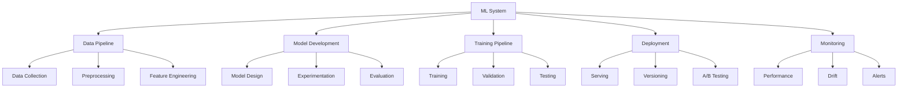
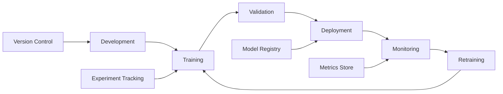
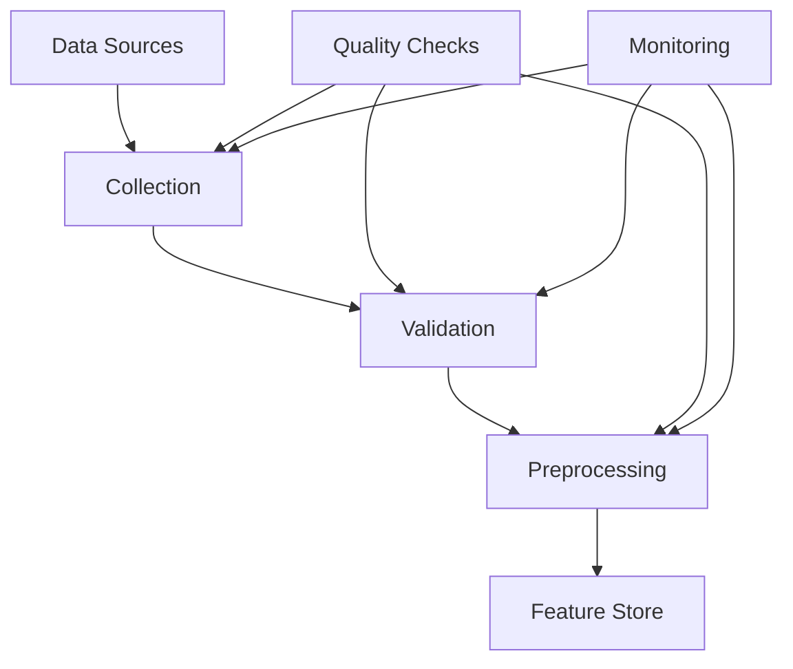
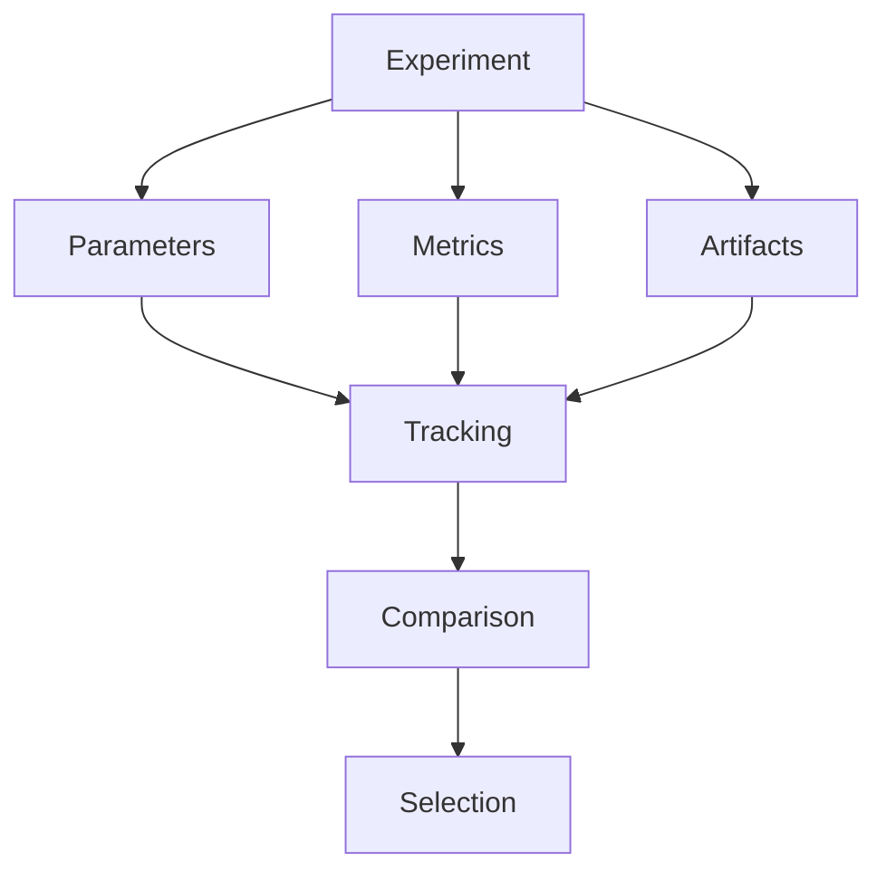
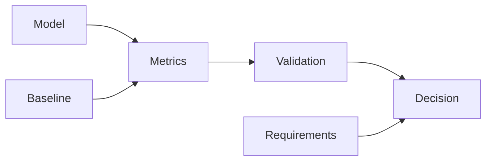

# Enterprise AI/ML Development Checklist

A comprehensive guide for implementing and maintaining enterprise-grade AI/ML systems.

## Purpose

This checklist helps organizations implement robust AI/ML practices focusing on model development, deployment, monitoring, and maintenance.

## Rationale

Each section addresses critical AI/ML development concerns:

### ML System Architecture



#### Real-World Example

A financial services company improved fraud detection accuracy by 35% and reduced false positives by 60% through implementing robust model monitoring and continuous training pipelines.

### MLOps Pipeline



#### Case Study: MLOps Success

An e-commerce platform reduced model deployment time from weeks to hours and improved recommendation accuracy by 25% through implementing automated MLOps pipelines.

## Implementation Guide

### Data Pipeline Architecture



1. Data Management

   - Data collection
   - Data validation
   - Feature engineering
   - Version control

2. Model Development

   - Experiment tracking
   - Hyperparameter tuning
   - Model evaluation
   - Version control

3. Testing Strategy
   - Unit tests
   - Integration tests
   - Model tests
   - Performance tests

### Model Development

#### 1. Experiment Tracking



#### 2. Model Evaluation



## Best Practices

### 1. Model Development

- Experiment tracking
- Version control
- Documentation
- Testing

### 2. Performance

- Model optimization
- Inference optimization
- Batch processing
- Hardware utilization

### 3. Monitoring

- Model performance
- Data drift
- Concept drift
- Resource usage

### 4. Ethics & Fairness

## Security Controls

- Protect training and inference data privacy
- Monitor for adversarial attacks and model drift
- Control access to models and datasets
- Document model decisions for explainability
- Scan dependencies and environments for vulnerabilities
- Implement data and model versioning with access controls

- Implement adversarial robustness testing for models
- Monitor for model extraction and evasion attacks
- Use differential privacy and federated learning for sensitive data
- Integrate AI/ML security testing in CI/CD pipelines
- Conduct regular penetration testing of AI/ML endpoints
- Implement security test cases for model APIs and data pipelines

#### Compliance Evidence Collection

- Store model audit logs and compliance reports securely
- Automate evidence collection for AI/ML regulatory compliance (GDPR, HIPAA, etc.)
- Document remediation actions and incident response steps

#### Incident Response Testing

- Schedule regular incident response simulations for AI/ML model breaches
- Review and update AI/ML incident playbooks based on test outcomes

## Automation Examples

### 1. Model Testing

```python
def test_model_performance():
    model = load_model('model.h5')
    X_test, y_test = load_test_data()

    predictions = model.predict(X_test)
    metrics = calculate_metrics(y_test, predictions)

    assert metrics['accuracy'] >= 0.95
    assert metrics['f1_score'] >= 0.90
```

### 2. Data Validation

```python
def validate_dataset(df: pd.DataFrame) -> ValidationResult:
    # Schema validation
    schema = DataFrameSchema({
        'feature_1': Column(float, Check.in_range(-1, 1)),
        'feature_2': Column(str, Check.isin(['A', 'B', 'C'])),
        'target': Column(int, Check.in_range(0, 1))
    })

    try:
        schema.validate(df)
        return ValidationResult(valid=True)
    except SchemaError as e:
        return ValidationResult(valid=False, errors=str(e))
```

## Model Development

### 1. Training Pipeline

```python
class ModelTrainer:
    def __init__(self, config: TrainingConfig):
        self.config = config
        self.mlflow.set_experiment(config.experiment_name)

    def train(self, data: Dataset) -> Model:
        with mlflow.start_run():
            # Log parameters
            mlflow.log_params(self.config.to_dict())

            # Train model
            model = self._train_model(data)

            # Log metrics
            metrics = self.evaluate(model, data.validation)
            mlflow.log_metrics(metrics)

            # Save model
            mlflow.pytorch.log_model(model, 'model')

            return model

    def _train_model(self, data: Dataset) -> Model:
        model = create_model(self.config)

        for epoch in range(self.config.epochs):
            for batch in data.train_loader:
                loss = self._train_step(model, batch)

                if self.should_log(epoch):
                    mlflow.log_metric('train_loss', loss)

        return model
```

### 2. Model Serving

```python
class ModelServer:
    def __init__(self, model_uri: str):
        self.model = mlflow.pyfunc.load_model(model_uri)
        self.preprocessor = load_preprocessor()

    async def predict(
        self,
        inputs: List[Dict[str, Any]]
    ) -> List[Prediction]:
        # Preprocess inputs
        features = self.preprocessor.transform(inputs)

        # Make predictions
        predictions = self.model.predict(features)

        # Post-process outputs
        return self.format_predictions(predictions)

    def format_predictions(
        self,
        predictions: np.ndarray
    ) -> List[Prediction]:
        return [
            Prediction(
                label=self.classes[pred.argmax()],
                confidence=float(pred.max())
            )
            for pred in predictions
        ]
```

## Model Monitoring

### 1. Performance Monitoring

```python
class ModelMonitor:
    def __init__(self, model_id: str):
        self.metrics = PrometheusMetrics()
        self.model_id = model_id

    def record_prediction(
        self,
        prediction: Prediction,
        actual: Optional[str] = None
    ):
        # Record latency
        self.metrics.prediction_latency.observe(
            prediction.latency
        )

        # Record prediction distribution
        self.metrics.prediction_distribution.labels(
            prediction.label
        ).inc()

        # Record accuracy if actual is provided
        if actual is not None:
            self.metrics.prediction_accuracy.labels(
                prediction.label,
                actual
            ).inc()

    def record_data_metrics(self, features: pd.DataFrame):
        # Record feature statistics
        for column in features.columns:
            stats = features[column].describe()
            self.metrics.feature_statistics.labels(
                column
            ).observe(stats)
```

### 2. Drift Detection

```python
class DriftDetector:
    def __init__(
        self,
        reference_data: pd.DataFrame,
        drift_threshold: float = 0.05
    ):
        self.reference_stats = self._compute_stats(reference_data)
        self.threshold = drift_threshold

    def detect_drift(
        self,
        current_data: pd.DataFrame
    ) -> DriftReport:
        current_stats = self._compute_stats(current_data)

        # Compute KL divergence
        drift_scores = {
            feature: compute_kl_divergence(
                self.reference_stats[feature],
                current_stats[feature]
            )
            for feature in self.reference_stats.keys()
        }

        # Detect drift
        drifted_features = {
            feature: score
            for feature, score in drift_scores.items()
            if score > self.threshold
        }

        return DriftReport(
            has_drift=len(drifted_features) > 0,
            drifted_features=drifted_features
        )
```

## Model Governance

### 1. Model Documentation

```python
@dataclass
class ModelCard:
    """Documentation for trained models following Google's Model Card approach."""

    # Model details
    name: str
    version: str
    type: str
    description: str

    # Training details
    training_data: DatasetInfo
    evaluation_data: DatasetInfo
    metrics: Dict[str, float]

    # Usage
    intended_use: List[str]
    limitations: List[str]
    ethical_considerations: List[str]

    # Technical details
    model_architecture: str
    input_format: Dict[str, str]
    output_format: Dict[str, str]
    performance_tradeoffs: List[str]
```

### 2. Fairness Assessment

```python
class FairnessAnalyzer:
    def analyze_fairness(
        self,
        predictions: pd.DataFrame,
        sensitive_features: List[str]
    ) -> FairnessReport:
        metrics = {}

        for feature in sensitive_features:
            # Compute demographic parity
            metrics[f'{feature}_parity'] = self.demographic_parity(
                predictions,
                feature
            )

            # Compute equal opportunity
            metrics[f'{feature}_equal_opp'] = self.equal_opportunity(
                predictions,
                feature
            )

            # Compute disparate impact
            metrics[f'{feature}_impact'] = self.disparate_impact(
                predictions,
                feature
            )

        return FairnessReport(metrics=metrics)
```

## Resources

- [MLOps Principles](https://ml-ops.org/)
- [Model Cards](https://modelcards.withgoogle.com/about)
- [Responsible AI Practices](https://ai.google/responsibilities/responsible-ai-practices/)
- [ML Testing Guide](https://developers.google.com/machine-learning/testing-debugging)
