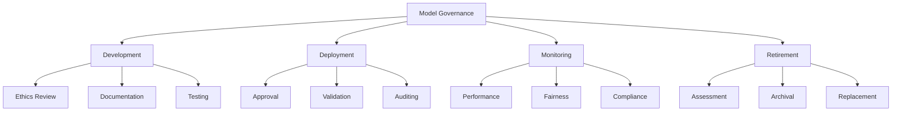
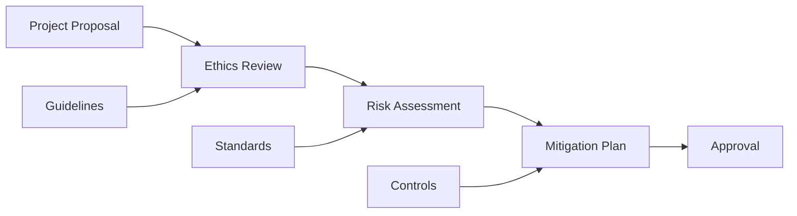
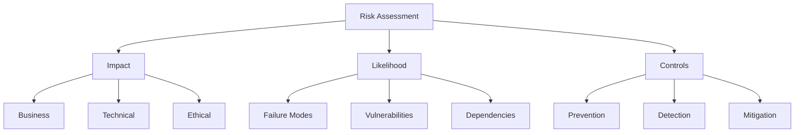

# Model Governance Guide

A comprehensive guide for implementing responsible AI practices and model governance in enterprise AI/ML systems.

## Governance Framework

### Model Lifecycle Governance



## 1. Model Development Governance

### Ethics Review Process



### Documentation Requirements

```python
@dataclass
class ModelDocumentation:
    """Comprehensive model documentation requirements."""

    # Basic Information
    model_name: str
    version: str
    purpose: str
    owner: str

    # Development Details
    training_data: DatasetInfo
    validation_data: DatasetInfo
    test_data: DatasetInfo

    # Model Architecture
    architecture: str
    hyperparameters: Dict[str, Any]
    dependencies: List[str]

    # Performance
    metrics: Dict[str, float]
    limitations: List[str]
    assumptions: List[str]

    # Ethics & Fairness
    ethical_considerations: List[str]
    fairness_metrics: Dict[str, float]
    bias_assessment: BiasReport

    # Deployment
    requirements: SystemRequirements
    monitoring_plan: MonitoringPlan
    maintenance_plan: MaintenancePlan
```

## 2. Model Risk Management

### Risk Assessment Framework



### Risk Controls Implementation

```python
class RiskControl:
    def __init__(self, risk_type: str, severity: str):
        self.risk_type = risk_type
        self.severity = severity
        self.controls = []

    def add_control(self, control: Control):
        """Add a control measure."""
        self.controls.append(control)

    def validate_controls(self) -> ValidationReport:
        """Validate all control measures."""
        return ValidationReport(
            [control.validate() for control in self.controls]
        )

    def monitor_controls(self) -> MonitoringReport:
        """Monitor control effectiveness."""
        return MonitoringReport(
            [control.monitor() for control in self.controls]
        )
```

## 3. Model Fairness & Ethics

### Fairness Assessment

```python
class FairnessAssessment:
    def __init__(self, model: Model, dataset: Dataset):
        self.model = model
        self.dataset = dataset
        self.metrics = {}

    def assess_demographic_parity(
        self,
        protected_attribute: str
    ) -> float:
        """Calculate demographic parity."""
        groups = self.dataset.group_by(protected_attribute)
        predictions = self.model.predict(self.dataset)

        return calculate_demographic_parity(groups, predictions)

    def assess_equal_opportunity(
        self,
        protected_attribute: str,
        positive_outcome: Any
    ) -> float:
        """Calculate equal opportunity difference."""
        groups = self.dataset.group_by(protected_attribute)
        predictions = self.model.predict(self.dataset)

        return calculate_equal_opportunity(
            groups,
            predictions,
            positive_outcome
        )

    def generate_fairness_report(self) -> FairnessReport:
        """Generate comprehensive fairness report."""
        return FairnessReport(
            metrics=self.metrics,
            recommendations=self.generate_recommendations()
        )
```

### Bias Mitigation

```python
class BiasMitigation:
    def __init__(self, model: Model, dataset: Dataset):
        self.model = model
        self.dataset = dataset

    def mitigate_preprocessing(
        self,
        technique: str = 'reweighting'
    ) -> Dataset:
        """Apply preprocessing bias mitigation."""
        if technique == 'reweighting':
            return self.apply_reweighting()
        elif technique == 'resampling':
            return self.apply_resampling()

        raise ValueError(f'Unknown technique: {technique}')

    def mitigate_inprocessing(
        self,
        constraint: str = 'demographic_parity'
    ) -> Model:
        """Apply inprocessing bias mitigation."""
        if constraint == 'demographic_parity':
            return self.apply_demographic_parity_constraint()
        elif constraint == 'equal_opportunity':
            return self.apply_equal_opportunity_constraint()

        raise ValueError(f'Unknown constraint: {constraint}')
```

## 4. Model Monitoring & Compliance

### Performance Monitoring

```python
class ModelMonitor:
    def __init__(self, model: Model, config: MonitoringConfig):
        self.model = model
        self.config = config
        self.metrics = MetricsCollector()

    def monitor_performance(self) -> PerformanceReport:
        """Monitor model performance metrics."""
        metrics = {
            'accuracy': self.calculate_accuracy(),
            'latency': self.measure_latency(),
            'throughput': self.measure_throughput()
        }

        return PerformanceReport(
            metrics=metrics,
            thresholds=self.config.thresholds,
            violations=self.check_violations(metrics)
        )

    def monitor_drift(self) -> DriftReport:
        """Monitor data and concept drift."""
        return DriftReport(
            data_drift=self.detect_data_drift(),
            concept_drift=self.detect_concept_drift(),
            recommendations=self.generate_drift_recommendations()
        )
```

### Compliance Auditing

```python
class ComplianceAuditor:
    def __init__(self, model: Model, requirements: List[Requirement]):
        self.model = model
        self.requirements = requirements

    def audit_compliance(self) -> AuditReport:
        """Perform compliance audit."""
        results = []

        for requirement in self.requirements:
            result = self.check_requirement(requirement)
            results.append(result)

        return AuditReport(
            results=results,
            summary=self.generate_summary(results),
            recommendations=self.generate_recommendations(results)
        )

    def check_requirement(
        self,
        requirement: Requirement
    ) -> RequirementCheck:
        """Check individual requirement compliance."""
        evidence = self.collect_evidence(requirement)
        compliance = self.evaluate_compliance(
            requirement,
            evidence
        )

        return RequirementCheck(
            requirement=requirement,
            compliance=compliance,
            evidence=evidence
        )
```

## 5. Model Documentation

### Model Cards

```python
@dataclass
class ModelCard:
    """Model card following Google's Model Card approach."""

    # Model Details
    name: str
    version: str
    type: str
    description: str

    # Intended Use
    primary_uses: List[str]
    out_of_scope_uses: List[str]

    # Factors
    relevant_factors: List[str]
    evaluation_factors: List[str]

    # Metrics
    performance_measures: List[str]
    decision_thresholds: Dict[str, float]

    # Evaluation Data
    datasets: List[DatasetInfo]
    validation_methods: List[str]

    # Training Data
    training_dataset: DatasetInfo
    training_process: str

    # Quantitative Analyses
    performance_metrics: Dict[str, float]
    fairness_metrics: Dict[str, float]

    # Ethical Considerations
    ethical_risks: List[str]
    mitigation_strategies: List[str]

    # Caveats and Recommendations
    caveats: List[str]
    recommendations: List[str]
```

### Documentation Templates

```markdown
# Model Documentation Template

## Overview

- Model Name: [Name]
- Version: [Version]
- Purpose: [Purpose]
- Owner: [Owner]

## Development

- Training Data: [Description]
- Validation Data: [Description]
- Test Data: [Description]

## Architecture

- Model Type: [Type]
- Framework: [Framework]
- Dependencies: [Dependencies]

## Performance

- Metrics: [Metrics]
- Limitations: [Limitations]
- Assumptions: [Assumptions]

## Ethics & Fairness

- Considerations: [Considerations]
- Metrics: [Metrics]
- Bias Assessment: [Assessment]

## Deployment

- Requirements: [Requirements]
- Monitoring: [Plan]
- Maintenance: [Plan]
```

## Resources

- [Google AI Principles](https://ai.google/principles/)
- [Microsoft Responsible AI Standards](https://www.microsoft.com/en-us/ai/responsible-ai)
- [IBM AI Ethics Guidelines](https://www.ibm.com/artificial-intelligence/ethics)
- [NIST AI Risk Management Framework](https://www.nist.gov/itl/ai-risk-management-framework)
