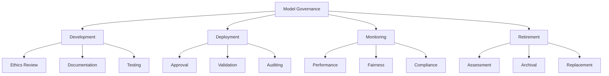
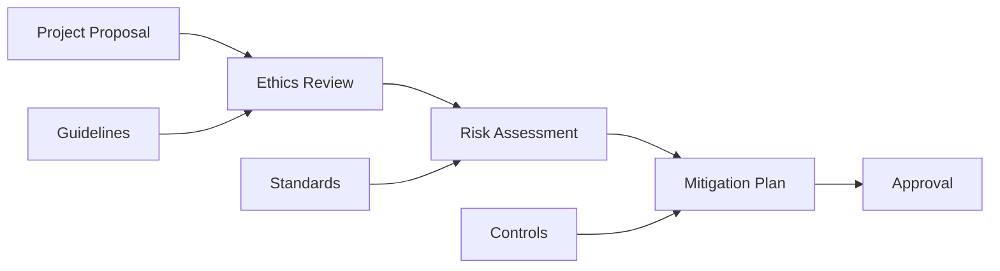
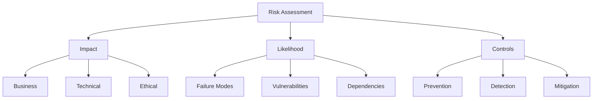
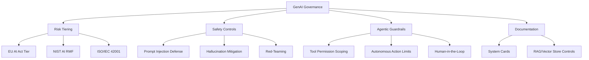

# Model Governance Guide

A comprehensive guide for implementing responsible AI practices and model governance in enterprise AI/ML systems. Governance requirements differ for classical/predictive ML models (Sections 1-5 below) and generative AI/LLM systems (Section 6) — a fraud-detection classifier and a customer-facing chatbot built on a foundation model carry different risks and need different controls, even though both fall under "AI governance."

## Governance Framework

### Model Lifecycle Governance


```mermaid
graph TD
    A[Model Governance] --> B[Development]
    A --> C[Deployment]
    A --> D[Monitoring]
    A --> E[Retirement]

    B --> B1[Ethics Review]
    B --> B2[Documentation]
    B --> B3[Testing]

    C --> C1[Approval]
    C --> C2[Validation]
    C --> C3[Auditing]

    D --> D1[Performance]
    D --> D2[Fairness]
    D --> D3[Compliance]

    E --> E1[Assessment]
    E --> E2[Archival]
    E --> E3[Replacement]
```

## 1. Model Development Governance

### Ethics Review Process


```mermaid
graph LR
    A[Project Proposal] --> B[Ethics Review]
    B --> C[Risk Assessment]
    C --> D[Mitigation Plan]
    D --> E[Approval]

    F[Guidelines] --> B
    G[Standards] --> C
    H[Controls] --> D
```

### Documentation Requirements

```python
@dataclass
class ModelDocumentation:
    """Comprehensive model documentation requirements."""

    # Basic Information
    model_name: str
    version: str
    purpose: str
    owner: str

    # Development Details
    training_data: DatasetInfo
    validation_data: DatasetInfo
    test_data: DatasetInfo

    # Model Architecture
    architecture: str
    hyperparameters: Dict[str, Any]
    dependencies: List[str]

    # Performance
    metrics: Dict[str, float]
    limitations: List[str]
    assumptions: List[str]

    # Ethics & Fairness
    ethical_considerations: List[str]
    fairness_metrics: Dict[str, float]
    bias_assessment: BiasReport

    # Deployment
    requirements: SystemRequirements
    monitoring_plan: MonitoringPlan
    maintenance_plan: MaintenancePlan
```

## 2. Model Risk Management

### Risk Assessment Framework


```mermaid
graph TD
    A[Risk Assessment] --> B[Impact]
    A --> C[Likelihood]
    A --> D[Controls]

    B --> B1[Business]
    B --> B2[Technical]
    B --> B3[Ethical]

    C --> C1[Failure Modes]
    C --> C2[Vulnerabilities]
    C --> C3[Dependencies]

    D --> D1[Prevention]
    D --> D2[Detection]
    D --> D3[Mitigation]
```

### Risk Controls Implementation

```python
class RiskControl:
    def __init__(self, risk_type: str, severity: str):
        self.risk_type = risk_type
        self.severity = severity
        self.controls = []

    def add_control(self, control: Control):
        """Add a control measure."""
        self.controls.append(control)

    def validate_controls(self) -> ValidationReport:
        """Validate all control measures."""
        return ValidationReport(
            [control.validate() for control in self.controls]
        )

    def monitor_controls(self) -> MonitoringReport:
        """Monitor control effectiveness."""
        return MonitoringReport(
            [control.monitor() for control in self.controls]
        )
```

## 3. Model Fairness & Ethics

### Fairness Assessment

```python
class FairnessAssessment:
    def __init__(self, model: Model, dataset: Dataset):
        self.model = model
        self.dataset = dataset
        self.metrics = {}

    def assess_demographic_parity(
        self,
        protected_attribute: str
    ) -> float:
        """Calculate demographic parity."""
        groups = self.dataset.group_by(protected_attribute)
        predictions = self.model.predict(self.dataset)

        return calculate_demographic_parity(groups, predictions)

    def assess_equal_opportunity(
        self,
        protected_attribute: str,
        positive_outcome: Any
    ) -> float:
        """Calculate equal opportunity difference."""
        groups = self.dataset.group_by(protected_attribute)
        predictions = self.model.predict(self.dataset)

        return calculate_equal_opportunity(
            groups,
            predictions,
            positive_outcome
        )

    def generate_fairness_report(self) -> FairnessReport:
        """Generate comprehensive fairness report."""
        return FairnessReport(
            metrics=self.metrics,
            recommendations=self.generate_recommendations()
        )
```

### Bias Mitigation

```python
class BiasMitigation:
    def __init__(self, model: Model, dataset: Dataset):
        self.model = model
        self.dataset = dataset

    def mitigate_preprocessing(
        self,
        technique: str = 'reweighting'
    ) -> Dataset:
        """Apply preprocessing bias mitigation."""
        if technique == 'reweighting':
            return self.apply_reweighting()
        elif technique == 'resampling':
            return self.apply_resampling()

        raise ValueError(f'Unknown technique: {technique}')

    def mitigate_inprocessing(
        self,
        constraint: str = 'demographic_parity'
    ) -> Model:
        """Apply inprocessing bias mitigation."""
        if constraint == 'demographic_parity':
            return self.apply_demographic_parity_constraint()
        elif constraint == 'equal_opportunity':
            return self.apply_equal_opportunity_constraint()

        raise ValueError(f'Unknown constraint: {constraint}')
```

## 4. Model Monitoring & Compliance

### Performance Monitoring

```python
class ModelMonitor:
    def __init__(self, model: Model, config: MonitoringConfig):
        self.model = model
        self.config = config
        self.metrics = MetricsCollector()

    def monitor_performance(self) -> PerformanceReport:
        """Monitor model performance metrics."""
        metrics = {
            'accuracy': self.calculate_accuracy(),
            'latency': self.measure_latency(),
            'throughput': self.measure_throughput()
        }

        return PerformanceReport(
            metrics=metrics,
            thresholds=self.config.thresholds,
            violations=self.check_violations(metrics)
        )

    def monitor_drift(self) -> DriftReport:
        """Monitor data and concept drift."""
        return DriftReport(
            data_drift=self.detect_data_drift(),
            concept_drift=self.detect_concept_drift(),
            recommendations=self.generate_drift_recommendations()
        )
```

### Compliance Auditing

```python
class ComplianceAuditor:
    def __init__(self, model: Model, requirements: List[Requirement]):
        self.model = model
        self.requirements = requirements

    def audit_compliance(self) -> AuditReport:
        """Perform compliance audit."""
        results = []

        for requirement in self.requirements:
            result = self.check_requirement(requirement)
            results.append(result)

        return AuditReport(
            results=results,
            summary=self.generate_summary(results),
            recommendations=self.generate_recommendations(results)
        )

    def check_requirement(
        self,
        requirement: Requirement
    ) -> RequirementCheck:
        """Check individual requirement compliance."""
        evidence = self.collect_evidence(requirement)
        compliance = self.evaluate_compliance(
            requirement,
            evidence
        )

        return RequirementCheck(
            requirement=requirement,
            compliance=compliance,
            evidence=evidence
        )
```

## 5. Model Documentation

### Model Cards

```python
@dataclass
class ModelCard:
    """Model card following Google's Model Card approach."""

    # Model Details
    name: str
    version: str
    type: str
    description: str

    # Intended Use
    primary_uses: List[str]
    out_of_scope_uses: List[str]

    # Factors
    relevant_factors: List[str]
    evaluation_factors: List[str]

    # Metrics
    performance_measures: List[str]
    decision_thresholds: Dict[str, float]

    # Evaluation Data
    datasets: List[DatasetInfo]
    validation_methods: List[str]

    # Training Data
    training_dataset: DatasetInfo
    training_process: str

    # Quantitative Analyses
    performance_metrics: Dict[str, float]
    fairness_metrics: Dict[str, float]

    # Ethical Considerations
    ethical_risks: List[str]
    mitigation_strategies: List[str]

    # Caveats and Recommendations
    caveats: List[str]
    recommendations: List[str]
```

### Documentation Templates

```markdown
# Model Documentation Template

## Overview

- Model Name: [Name]
- Version: [Version]
- Purpose: [Purpose]
- Owner: [Owner]

## Development

- Training Data: [Description]
- Validation Data: [Description]
- Test Data: [Description]

## Architecture

- Model Type: [Type]
- Framework: [Framework]
- Dependencies: [Dependencies]

## Performance

- Metrics: [Metrics]
- Limitations: [Limitations]
- Assumptions: [Assumptions]

## Ethics & Fairness

- Considerations: [Considerations]
- Metrics: [Metrics]
- Bias Assessment: [Assessment]

## Deployment

- Requirements: [Requirements]
- Monitoring: [Plan]
- Maintenance: [Plan]
```

## 6. Generative AI & LLM Governance

Classical model governance (Sections 1-5) assumes a model that outputs a bounded prediction from a fixed label space. Generative AI systems — LLMs, RAG pipelines, and autonomous agents built on top of them — produce open-ended text, can call tools, and can be manipulated through their input in ways a classifier cannot. They need their own governance layer, on top of (not instead of) the classical controls.

### GenAI Governance Lifecycle


```mermaid
graph TD
    A[GenAI Governance] --> B[Risk Tiering]
    A --> C[Safety Controls]
    A --> D[Agentic Guardrails]
    A --> E[Documentation]

    B --> B1[EU AI Act Tier]
    B --> B2[NIST AI RMF]
    B --> B3[ISO/IEC 42001]

    C --> C1[Prompt Injection Defense]
    C --> C2[Hallucination Mitigation]
    C --> C3[Red-Teaming]

    D --> D1[Tool Permission Scoping]
    D --> D2[Autonomous Action Limits]
    D --> D3[Human-in-the-Loop]

    E --> E1[System Cards]
    E --> E2[RAG/Vector Store Controls]
```

### Prompt Injection & Jailbreak Defense

```python
class PromptInjectionGuard:
    """Enforces an instruction hierarchy between trusted and untrusted content."""

    def __init__(self, system_prompt: str, jailbreak_classifier: JailbreakClassifier):
        self.system_prompt = system_prompt
        self.jailbreak_classifier = jailbreak_classifier

    def build_context(
        self,
        user_input: str,
        retrieved_documents: List[str]
    ) -> LLMContext:
        """Assemble a prompt where system instructions are architecturally
        privileged over untrusted user/retrieved content."""
        risk = self.jailbreak_classifier.score(user_input)

        if risk.is_high_risk:
            self.log_and_block(user_input, risk)
            raise BlockedInputError(risk.reason)

        return LLMContext(
            system=self.system_prompt,          # trusted, never overridden
            retrieved=self.sanitize(retrieved_documents),  # untrusted, quarantined
            user=user_input                       # untrusted
        )

    def sanitize(self, documents: List[str]) -> List[str]:
        """Strip or neutralize embedded instructions in retrieved content
        before it reaches the model context."""
        return [strip_instruction_patterns(doc) for doc in documents]
```

### RAG Evaluation & Vector Store Access Control

```python
class RAGEvaluator:
    def __init__(self, eval_set: List[RAGExample]):
        self.eval_set = eval_set  # query, expected_context, expected_answer triples

    def evaluate(self, rag_pipeline: RAGPipeline) -> RAGEvalReport:
        """Score retrieval and end-to-end answer quality against a held-out set."""
        results = []
        for example in self.eval_set:
            retrieved = rag_pipeline.retrieve(example.query)
            answer = rag_pipeline.generate(example.query, retrieved)

            results.append(RAGResult(
                retrieval_recall=self.recall_at_k(retrieved, example.expected_context),
                groundedness=self.groundedness_score(answer, retrieved),
                correctness=self.compare(answer, example.expected_answer)
            ))

        return RAGEvalReport(results=results)


class VectorStoreAccessControl:
    def query(self, requester: Principal, query_vector, filters: dict):
        """Filter retrieval results to only what the requester is entitled to see,
        before the results ever reach the prompt context."""
        acl_filters = self.build_acl_filters(requester)
        return self.index.search(query_vector, filters={**filters, **acl_filters})
```

### Agentic AI Guardrails

```python
class AgentToolGuardrail:
    """Scopes tool access per agent role and gates high-impact actions
    behind human approval."""

    def __init__(self, agent_role: str, allowed_tools: List[str], approval_threshold: str):
        self.agent_role = agent_role
        self.allowed_tools = set(allowed_tools)  # explicit allowlist, not a denylist
        self.approval_threshold = approval_threshold

    def authorize_tool_call(self, tool_name: str, action: AgentAction) -> AuthorizationResult:
        if tool_name not in self.allowed_tools:
            return AuthorizationResult(allowed=False, reason="tool not in agent's allowlist")

        if action.risk_level >= self.approval_threshold:
            return AuthorizationResult(
                allowed=False,
                requires_human_approval=True,
                reason=f"{action.risk_level} action requires human-in-the-loop checkpoint"
            )

        self.audit_log.record(self.agent_role, tool_name, action)
        return AuthorizationResult(allowed=True)
```

### AI Risk Tiering (EU AI Act / NIST AI RMF / ISO 42001)

```python
@dataclass
class AISystemRiskProfile:
    """Per-system risk classification, reviewed whenever use case or
    deployment context changes."""

    system_name: str
    eu_ai_act_tier: str  # "Unacceptable" | "High" | "GPAI" | "Limited" | "Minimal"
    conformity_assessment_required: bool
    nist_rmf_functions_implemented: List[str]  # subset of Govern/Map/Measure/Manage
    iso42001_aims_scope: bool  # in scope of the org's AI Management System
    last_reviewed: date
    reviewer: str
```

### Governance Checklist Summary

| Topic | Classical ML | Generative AI / LLM |
| --- | --- | --- |
| Adversarial testing | Evasion / data poisoning red-team | Jailbreak / harmful-output red-team |
| Documentation | Model Cards | Foundation Model / System Cards |
| Access control | Model & training-data access control | Vector database & retrieval access control |
| Autonomy risk | Automated retraining guardrails | Agentic AI tool-use & action guardrails |
| Regulatory tiering | Sector-specific compliance (GDPR, HIPAA) | EU AI Act tiering, NIST AI RMF, ISO/IEC 42001 |

## Resources

- [Google AI Principles](https://ai.google/principles/)
- [Microsoft Responsible AI Standards](https://www.microsoft.com/en-us/ai/responsible-ai)
- [IBM AI Ethics Guidelines](https://www.ibm.com/artificial-intelligence/ethics)
- [NIST AI Risk Management Framework](https://www.nist.gov/itl/ai-risk-management-framework)
- [NIST Generative AI Profile (NIST-AI-600-1)](https://www.nist.gov/itl/ai-risk-management-framework)
- [EU AI Act (Regulation (EU) 2024/1689)](https://artificialintelligenceact.eu/)
- [ISO/IEC 42001:2023 - AI Management System](https://www.iso.org/standard/81230.html)
- [OWASP Top 10 for LLM Applications](https://owasp.org/www-project-top-10-for-large-language-model-applications/)
- [MITRE ATLAS - Adversarial Threat Landscape for AI Systems](https://atlas.mitre.org/)
