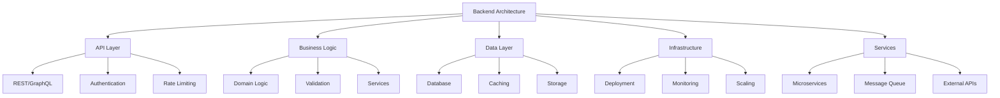
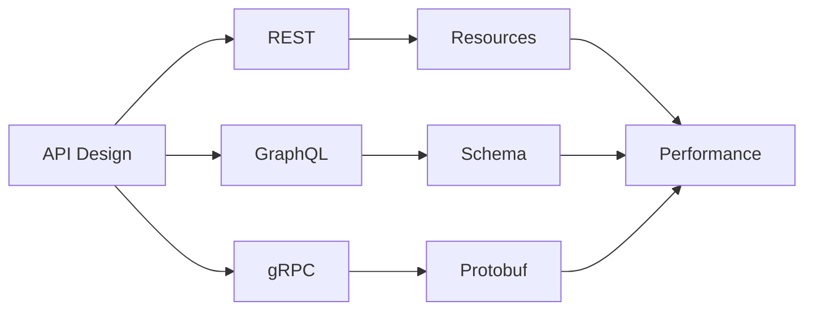
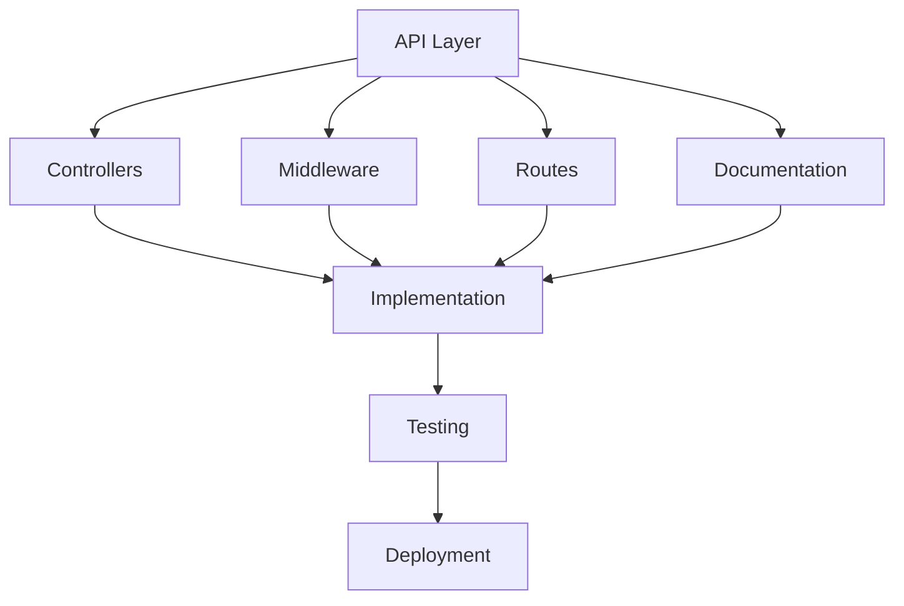
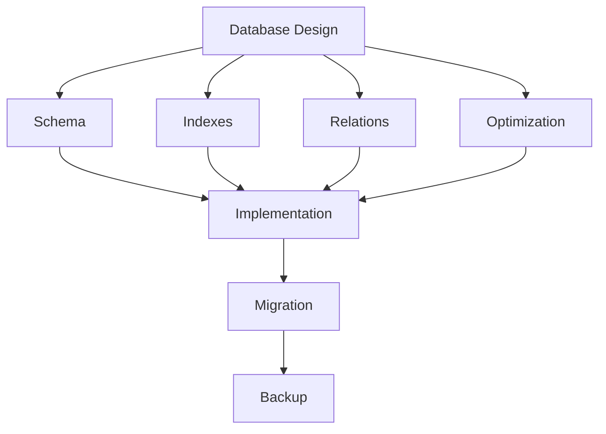
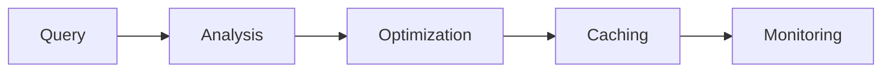

# Enterprise Backend Development Checklist

A comprehensive guide for implementing and maintaining enterprise-grade backend systems.

## Purpose

This checklist helps organizations implement robust backend practices focusing on scalability, reliability, security, and maintainability.

## Rationale

Each section addresses critical backend development concerns:

### Backend Architecture



#### Real-World Example

A financial services company improved API response times by 95% and achieved 99.99% uptime through implementing robust caching strategies and microservices architecture.

### API Design



#### Case Study: API Success

An e-commerce platform reduced server load by 70% and improved client satisfaction through implementing GraphQL and efficient caching strategies.

## Implementation Guide

### API Architecture



1. API Design

   - RESTful principles
   - GraphQL schema
   - Version control
   - Documentation

2. Authentication

   - JWT implementation
   - OAuth2 flow
   - API keys
   - Rate limiting

3. Testing Strategy
   - Unit tests
   - Integration tests
   - Load tests
   - Security tests

### Database Design

#### 1. Schema Design



#### 2. Query Optimization



## Best Practices

### 1. Code Organization

- Clean architecture
- Domain-driven design
- SOLID principles
- Design patterns

### 2. Performance

- Caching strategies
- Query optimization
- Connection pooling
- Async operations

### 3. Security

- Input validation
- Authentication
- Authorization
- Data encryption

### 4. Monitoring

- Metrics collection
- Error tracking
- Performance monitoring
- Health checks

## Automation Examples

### 1. API Testing

```typescript
describe('UserAPI', () => {
  it('creates a user successfully', async () => {
    const user = {
      name: 'John Doe',
      email: 'john@example.com',
    };

    const response = await request(app).post('/api/users').send(user);

    expect(response.status).toBe(201);
    expect(response.body.name).toBe(user.name);
  });
});
```

### 2. Load Testing

```typescript
import { check } from 'k6';
import http from 'k6/http';

export const options = {
  vus: 100,
  duration: '30s',
};

export default function () {
  const response = http.get('http://api.example.com/users');
  check(response, {
    'status is 200': (r) => r.status === 200,
    'response time < 200ms': (r) => r.timings.duration < 200,
  });
}
```

## API Implementation

### 1. REST API

```typescript
@Controller('users')
export class UserController {
  constructor(private userService: UserService) {}

  @Get()
  async findAll(@Query() query: UserQueryDto): Promise<User[]> {
    return this.userService.findAll(query);
  }

  @Post()
  @UseGuards(AuthGuard)
  async create(@Body() user: CreateUserDto): Promise<User> {
    return this.userService.create(user);
  }

  @Put(':id')
  @UseGuards(AuthGuard)
  async update(@Param('id') id: string, @Body() user: UpdateUserDto): Promise<User> {
    return this.userService.update(id, user);
  }
}
```

### 2. GraphQL API

```typescript
@ObjectType()
class User {
  @Field()
  id: string;

  @Field()
  name: string;

  @Field()
  email: string;
}

@Resolver(User)
class UserResolver {
  constructor(private userService: UserService) {}

  @Query(() => [User])
  async users(@Args() args: UserQueryArgs): Promise<User[]> {
    return this.userService.findAll(args);
  }

  @Mutation(() => User)
  @UseGuards(AuthGuard)
  async createUser(@Args('input') input: CreateUserInput): Promise<User> {
    return this.userService.create(input);
  }
}
```

## Database Operations

### 1. Query Optimization

```typescript
// Optimized query with joins
const getUserWithPosts = async (userId: string): Promise<UserWithPosts> => {
  return await prisma.user.findUnique({
    where: { id: userId },
    include: {
      posts: {
        select: {
          id: true,
          title: true,
          createdAt: true,
        },
      },
    },
  });
};

// Optimized batch operation
const createUsers = async (users: CreateUserDto[]): Promise<User[]> => {
  return await prisma.user.createMany({
    data: users,
    skipDuplicates: true,
  });
};
```

### 2. Caching Strategy

```typescript
class CacheManager {
  private redis: Redis;

  async get<T>(key: string): Promise<T | null> {
    const cached = await this.redis.get(key);
    return cached ? JSON.parse(cached) : null;
  }

  async set<T>(key: string, value: T, ttl: number = 3600): Promise<void> {
    await this.redis.set(key, JSON.stringify(value), 'EX', ttl);
  }

  async invalidate(pattern: string): Promise<void> {
    const keys = await this.redis.keys(pattern);
    if (keys.length) {
      await this.redis.del(keys);
    }
  }
}
```

## Error Handling

### 1. Global Error Handler

```typescript
@Catch()
export class GlobalExceptionFilter implements ExceptionFilter {
  catch(exception: unknown, host: ArgumentsHost) {
    const ctx = host.switchToHttp();
    const response = ctx.getResponse<Response>();

    const error = this.normalizeError(exception);

    response.status(error.status).json({
      statusCode: error.status,
      message: error.message,
      timestamp: new Date().toISOString(),
      path: ctx.getRequest().url,
    });
  }

  private normalizeError(error: unknown): NormalizedError {
    if (error instanceof HttpException) {
      return {
        status: error.getStatus(),
        message: error.message,
      };
    }

    return {
      status: 500,
      message: 'Internal server error',
    };
  }
}
```

### 2. Domain Errors

```typescript
export class DomainError extends Error {
  constructor(
    message: string,
    public readonly code: string,
    public readonly details?: Record<string, any>
  ) {
    super(message);
    this.name = this.constructor.name;
  }
}

export class ValidationError extends DomainError {
  constructor(details: Record<string, string[]>) {
    super('Validation failed', 'VALIDATION_ERROR', details);
  }
}
```

## Monitoring & Logging

### 1. Metrics Collection

```typescript
class MetricsCollector {
  private metrics: PrometheusMetrics;

  recordLatency(route: string, method: string, duration: number) {
    this.metrics.httpRequestDuration.labels(route, method).observe(duration);
  }

  recordError(route: string, errorType: string) {
    this.metrics.errors.labels(route, errorType).inc();
  }
}
```

### 2. Structured Logging

```typescript
class Logger {
  info(message: string, context?: Record<string, any>) {
    this.log('info', message, context);
  }

  error(error: Error, context?: Record<string, any>) {
    this.log('error', error.message, {
      ...context,
      stack: error.stack,
      name: error.name,
    });
  }

  private log(level: string, message: string, context?: Record<string, any>) {
    console.log(
      JSON.stringify({
        timestamp: new Date().toISOString(),
        level,
        message,
        ...context,
      })
    );
  }
}
```

## Resources

- [Clean Architecture](https://blog.cleancoder.com/uncle-bob/2012/08/13/the-clean-architecture.html)
- [REST API Design](https://github.com/microsoft/api-guidelines)
- [GraphQL Best Practices](https://graphql.org/learn/best-practices/)
- [Database Design](https://www.postgresql.org/docs/current/ddl.html)
- [Security Best Practices](https://owasp.org/www-project-api-security/)
