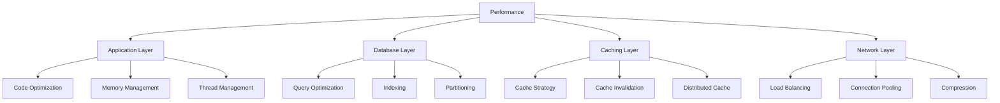
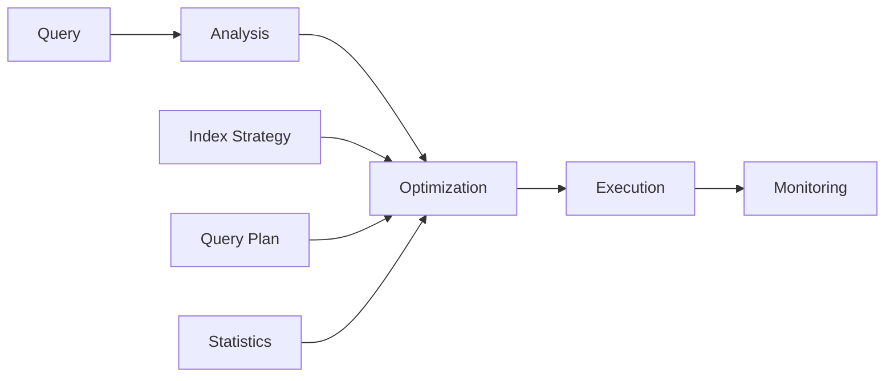
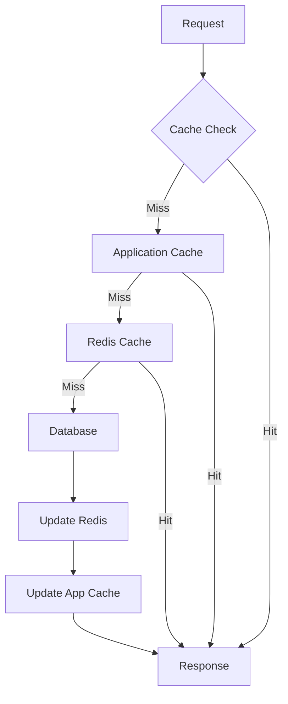
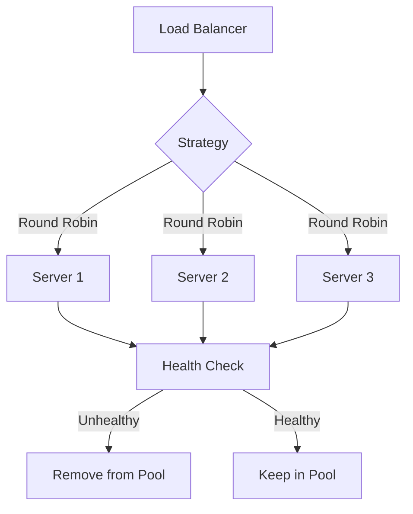
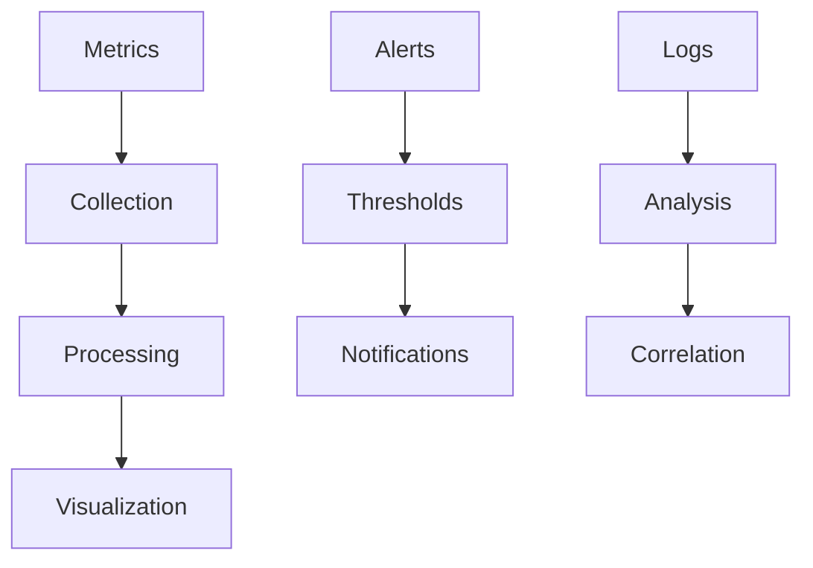

# Backend Performance Optimization Guide

A comprehensive guide for optimizing performance in enterprise backend systems.

## Performance Optimization Framework

### System Architecture



## 1. Application Layer Optimization

### Code Performance

```typescript
// ✅ Optimized async operations
async function fetchUserData(userIds: string[]) {
  const promises = userIds.map((id) => userService.findById(id));
  return Promise.all(promises);
}

// ❌ Unoptimized sequential operations
async function fetchUserData(userIds: string[]) {
  const users = [];
  for (const id of userIds) {
    users.push(await userService.findById(id));
  }
  return users;
}
```

### Memory Management

```typescript
class MemoryOptimizedService {
  private readonly batchSize = 1000;

  async processLargeDataset<T>(
    items: T[],
    processor: (batch: T[]) => Promise<void>
  ): Promise<void> {
    for (let i = 0; i < items.length; i += this.batchSize) {
      const batch = items.slice(i, i + this.batchSize);
      await processor(batch);

      // Allow garbage collection between batches
      await new Promise((resolve) => setTimeout(resolve, 0));
    }
  }
}
```

### Thread Pool Management

```typescript
class WorkerPool {
  private workers: Worker[] = [];
  private queue: Task[] = [];

  constructor(size: number) {
    for (let i = 0; i < size; i++) {
      this.workers.push(new Worker("./worker.js"));
    }
  }

  async execute(task: Task): Promise<Result> {
    const worker = await this.getAvailableWorker();
    return worker.execute(task);
  }
}
```

## 2. Database Optimization

### Query Optimization



### Index Strategy

```sql
-- ✅ Optimized composite index
CREATE INDEX idx_users_email_status ON users(email, status);

-- Queries that benefit
SELECT * FROM users
WHERE email = ? AND status = ?;

-- ❌ Unoptimized multiple single-column indexes
CREATE INDEX idx_users_email ON users(email);
CREATE INDEX idx_users_status ON users(status);
```

### Query Examples

```typescript
// ✅ Optimized query with specific selections
const getUserProfile = async (userId: string): Promise<UserProfile> => {
  return await prisma.user.findUnique({
    where: { id: userId },
    select: {
      id: true,
      name: true,
      email: true,
      profile: {
        select: {
          avatar: true,
          bio: true,
        },
      },
    },
  });
};

// ❌ Unoptimized query fetching unnecessary data
const getUserProfile = async (userId: string): Promise<User> => {
  return await prisma.user.findUnique({
    where: { id: userId },
    include: {
      profile: true,
      posts: true,
      comments: true,
    },
  });
};
```

## 3. Caching Strategy

### Multi-Level Caching



### Cache Implementation

```typescript
class CacheManager {
  private readonly localCache: Map<string, CacheEntry>;
  private readonly redis: Redis;

  async get<T>(key: string): Promise<T | null> {
    // Check local cache
    const localEntry = this.localCache.get(key);
    if (localEntry && !this.isExpired(localEntry)) {
      return localEntry.value as T;
    }

    // Check Redis
    const redisEntry = await this.redis.get(key);
    if (redisEntry) {
      const value = JSON.parse(redisEntry);
      this.localCache.set(key, {
        value,
        timestamp: Date.now(),
      });
      return value as T;
    }

    return null;
  }

  async set<T>(key: string, value: T, ttl: number = 3600): Promise<void> {
    // Update Redis
    await this.redis.set(key, JSON.stringify(value), "EX", ttl);

    // Update local cache
    this.localCache.set(key, {
      value,
      timestamp: Date.now(),
    });
  }
}
```

### Cache Invalidation

```typescript
class CacheInvalidator {
  private readonly patterns: Map<string, string[]>;

  async invalidate(pattern: string): Promise<void> {
    // Get all related keys
    const keys = this.patterns.get(pattern) || [];

    // Invalidate in Redis
    await this.redis.del(keys);

    // Invalidate in local cache
    keys.forEach((key) => this.localCache.delete(key));

    // Remove pattern
    this.patterns.delete(pattern);
  }

  async invalidateAll(): Promise<void> {
    // Clear Redis
    await this.redis.flushdb();

    // Clear local cache
    this.localCache.clear();

    // Clear patterns
    this.patterns.clear();
  }
}
```

## 4. Load Balancing

### Strategy Implementation



### Health Checks

```typescript
class HealthChecker {
  private readonly servers: Server[] = [];

  async checkHealth(server: Server): Promise<boolean> {
    try {
      const response = await axios.get(`${server.url}/health`, { timeout: 5000 });
      return response.status === 200;
    } catch (error) {
      return false;
    }
  }

  async monitorHealth(): Promise<void> {
    setInterval(async () => {
      for (const server of this.servers) {
        const isHealthy = await this.checkHealth(server);
        if (!isHealthy) {
          await this.removeFromPool(server);
        }
      }
    }, 30000); // Check every 30 seconds
  }
}
```

## 5. Performance Monitoring

### Metrics Collection

```typescript
class PerformanceMonitor {
  private readonly metrics: PrometheusMetrics;

  recordLatency(route: string, duration: number) {
    this.metrics.httpRequestDuration.labels(route).observe(duration);
  }

  recordDatabaseQuery(query: string, duration: number) {
    this.metrics.databaseQueryDuration.labels(query).observe(duration);
  }

  recordCacheHit(key: string) {
    this.metrics.cacheHits.labels(key).inc();
  }

  recordCacheMiss(key: string) {
    this.metrics.cacheMisses.labels(key).inc();
  }
}
```

### Performance Dashboard



## Resources

- [Database Optimization](https://use-the-index-luke.com/)
- [Caching Best Practices](https://redis.io/topics/cache-best-practices)
- [Node.js Performance](https://nodejs.org/en/docs/guides/dont-block-the-event-loop/)
- [System Design Primer](https://github.com/donnemartin/system-design-primer)
