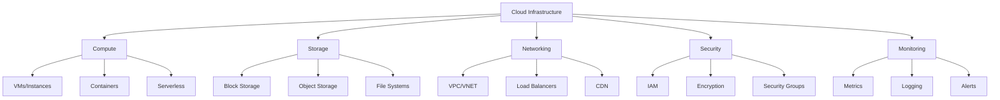
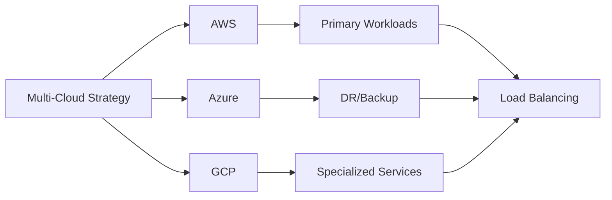
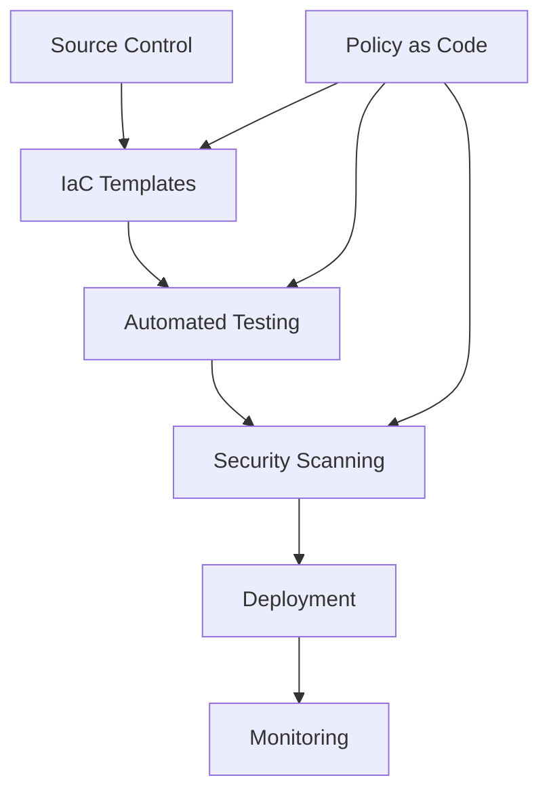
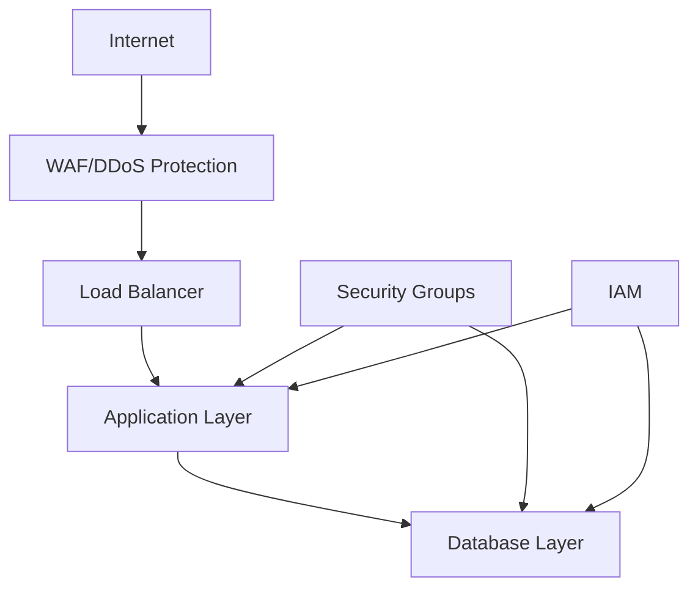
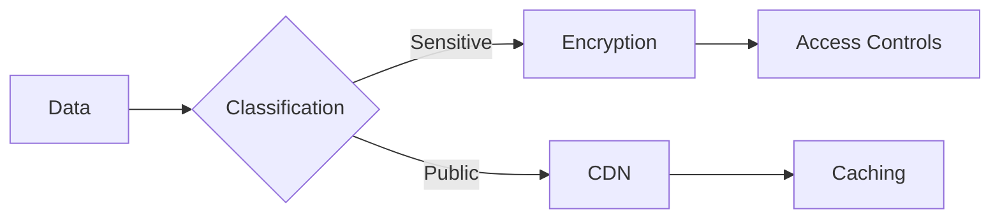
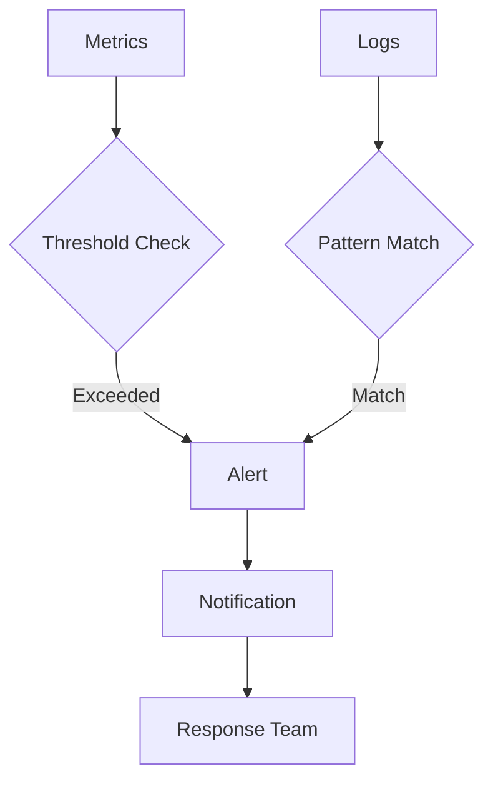
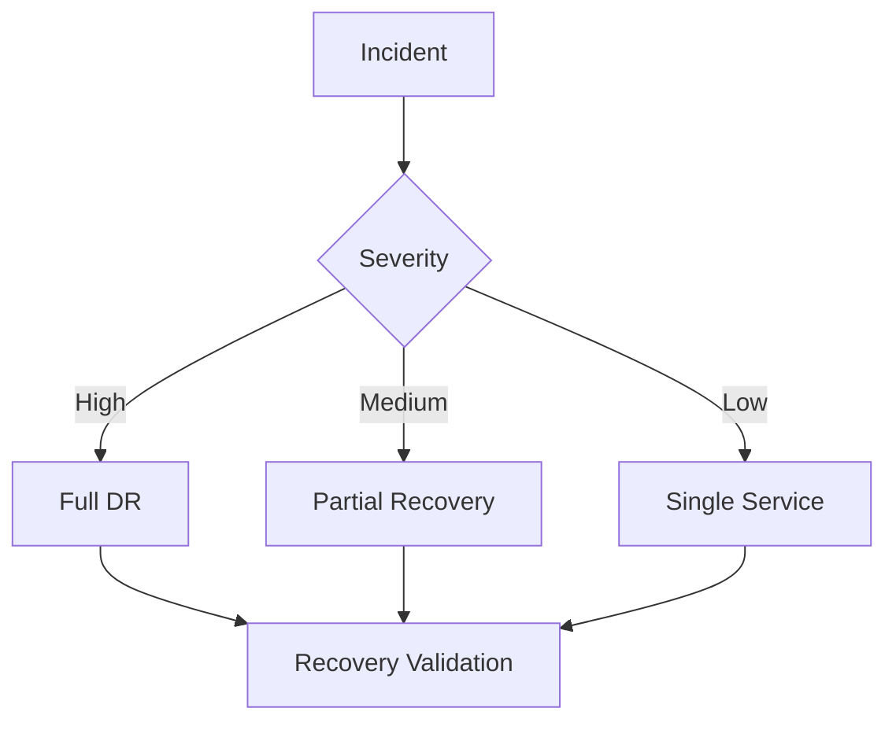
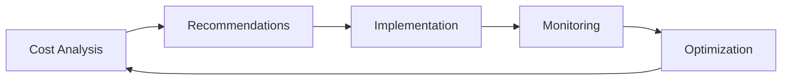

# Enterprise Cloud Infrastructure Checklist

A comprehensive guide for implementing and maintaining enterprise-grade cloud infrastructure.

## Purpose

This checklist helps organizations build and maintain secure, scalable, and cost-effective cloud infrastructure across multiple providers while following industry best practices.

## Rationale

Each section addresses critical cloud infrastructure concerns:

### Cloud Architecture



#### Real-World Example

A global e-commerce company reduced infrastructure costs by 45% through implementing auto-scaling and right-sizing instances, while maintaining 99.99% availability during peak shopping seasons.

### Multi-Cloud Strategy



#### Case Study: High Availability

A financial services provider achieved 99.999% uptime by implementing a multi-region, multi-cloud architecture with automated failover capabilities.

## Implementation Guide

### Infrastructure as Code



1. Resource Management

   - Use infrastructure as code
   - Implement version control
   - Automate deployments
   - Enable drift detection

2. Security Controls

   - Identity management
   - Network security
   - Data protection
   - Compliance monitoring

3. Cost Management
   - Resource tagging
   - Budget alerts
   - Usage optimization
   - Waste elimination

### Cloud Security Architecture

#### 1. Network Security



#### 2. Data Protection



## Best Practices

### 1. Resource Organization

- Logical resource grouping
- Consistent naming conventions
- Proper tagging strategy
- Environment separation

### 2. Network Design

- Network segmentation
- Traffic flow control
- Service endpoints
- Private connectivity

### 3. Security Controls

- Identity management
- Access controls
- Data encryption
- Security monitoring

### 4. Cost Optimization

- Resource right-sizing
- Reserved instances
- Auto-scaling
- Waste elimination

## Automation Examples

### 1. Resource Provisioning

```terraform
# Example Terraform configuration
resource "aws_vpc" "main" {
  cidr_block = "10.0.0.0/16"

  tags = {
    Name = "main-vpc"
    Environment = "production"
  }
}

resource "aws_subnet" "private" {
  vpc_id     = aws_vpc.main.id
  cidr_block = "10.0.1.0/24"
}
```

### 2. Security Policy

```hcl
# Example security policy
resource "aws_security_group" "web" {
  name        = "web-sg"
  description = "Web tier security group"
  vpc_id      = aws_vpc.main.id

  ingress {
    from_port   = 443
    to_port     = 443
    protocol    = "tcp"
    cidr_blocks = ["0.0.0.0/0"]
  }
}
```

## Monitoring & Alerting

### 1. Key Metrics

- Resource utilization
- Performance metrics
- Cost metrics
- Security events

### 2. Alerting Strategy



## Disaster Recovery

### 1. Backup Strategy

- Regular snapshots
- Cross-region replication
- Retention policies
- Recovery testing

### 2. Recovery Procedures



## Cost Management

### 1. Cost Optimization



### 2. Budget Controls

- Cost allocation
- Budget alerts
- Spending limits
- Usage quotas

## Compliance & Governance

### 1. Policy Enforcement

- Resource compliance
- Security standards
- Access reviews
- Audit logging

### 2. Documentation

- Architecture diagrams
- Configuration details
- Change history
- Incident records

## Resources

- [AWS Well-Architected Framework](https://aws.amazon.com/architecture/well-architected/)
- [Azure Cloud Adoption Framework](https://docs.microsoft.com/azure/cloud-adoption-framework/)
- [Google Cloud Architecture Framework](https://cloud.google.com/architecture/framework)
- [Cloud Security Alliance](https://cloudsecurityalliance.org/)
