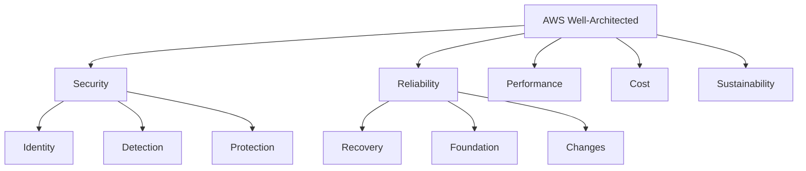
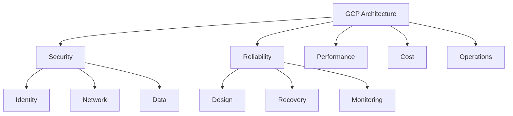
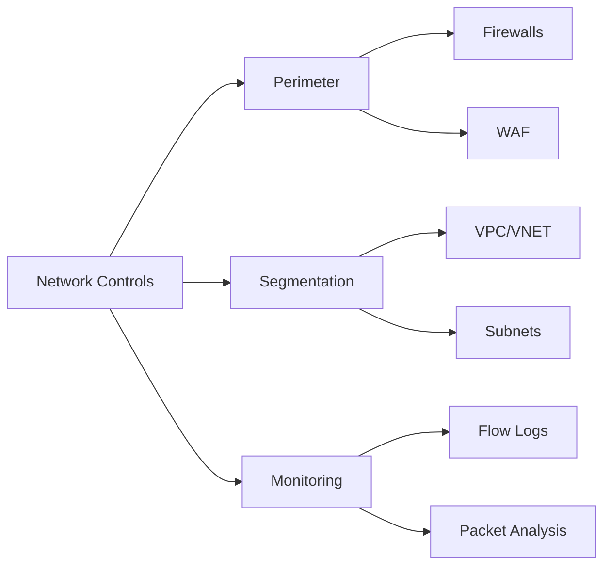
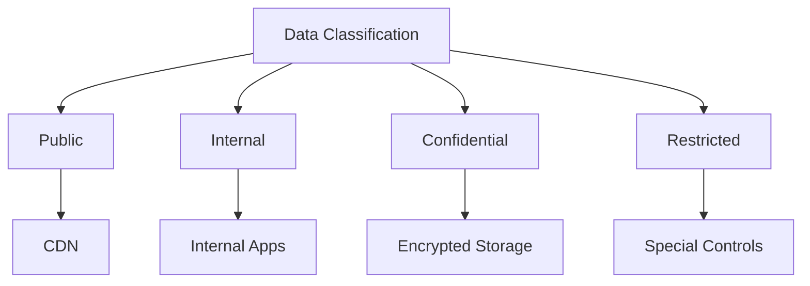
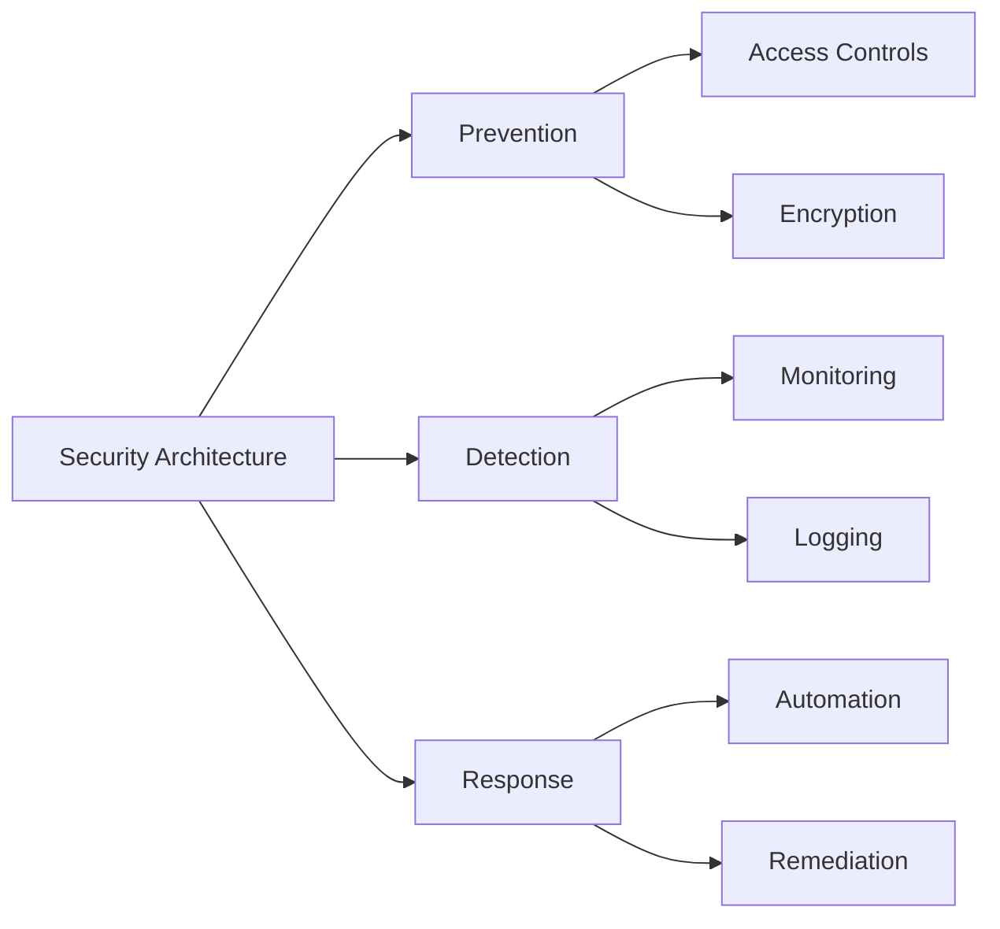
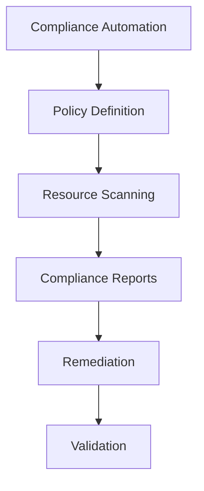

# Cloud Infrastructure Compliance Mapping

This document maps cloud infrastructure controls to various compliance frameworks and cloud provider-specific security standards.

## Overview

This mapping helps organizations understand how cloud infrastructure controls align with compliance requirements across different frameworks and cloud providers.

## Compliance Frameworks Coverage

| Framework                  | Coverage | Last Updated |
| -------------------------- | -------- | ------------ |
| ISO 27017 (Cloud Security) | 92%      | 2024-02-13   |
| CSA CCM 4.0                | 95%      | 2024-02-13   |
| NIST 800-53                | 88%      | 2024-02-13   |
| CIS Benchmarks             | 94%      | 2024-02-13   |
| SOC 2                      | 90%      | 2024-02-13   |

## Cloud Provider Security Standards

### AWS Well-Architected Framework

### Azure Well-Architected Framework

### GCP Architecture Framework

## Detailed Control Mapping

### Identity & Access Management

#### Cloud IAM Implementation

- **ISO 27017**: 9.2.1 - User registration and de-registration
- **CSA CCM**: IAM-02 - Identity & Access Management
- **NIST 800-53**: AC-2 - Account Management
- **AWS**: IAM.1 - Identity foundation
- **Azure**: Microsoft.Security/IAMControls
- **GCP**: Security Command Center/IAM recommendations

#### Multi-Factor Authentication

- **ISO 27017**: 9.4.2 - Secure log-on procedures
- **CSA CCM**: IAM-10 - Multi-Factor Authentication
- **NIST 800-53**: IA-2(1) - Multi-factor authentication
- **AWS**: IAM.4 - MFA enforcement
- **Azure**: Microsoft.Security/mfaEnabled
- **GCP**: Security Command Center/mfaStatus

### Network Security

#### Network Segmentation

- **ISO 27017**: 13.1.3 - Segregation in networks
- **CSA CCM**: IVS-09 - Segmentation
- **NIST 800-53**: SC-7 - Boundary Protection
- **AWS**: NET.1 - Network protection
- **Azure**: Microsoft.Network/networkSecurityGroups
- **GCP**: Security Command Center/networkSegmentation

#### Cloud Network Controls

### Data Protection

#### Encryption Implementation

- **ISO 27017**: 10.1.1 - Policy on cryptographic controls
- **CSA CCM**: EKM-02 - Encryption
- **NIST 800-53**: SC-13 - Cryptographic Protection
- **AWS**: SEC.2 - Data protection
- **Azure**: Microsoft.Security/dataEncryption
- **GCP**: Security Command Center/encryption

#### Data Classification

### Cloud Security Architecture

#### Security Controls Implementation

### Compliance Automation

#### Automated Compliance Checks

## Implementation Guidelines

### Documentation Requirements

Each control implementation should include:

1. Technical specifications
2. Implementation evidence
3. Testing procedures
4. Audit trails
5. Review schedules

### Audit Preparation

For each framework:

1. Maintain current mapping documentation
2. Keep evidence organized by control
3. Regular control testing
4. Gap analysis
5. Remediation tracking

## Cloud Provider Specific Controls

### AWS Controls Matrix

| Control Area | AWS Service | Compliance Mapping | Implementation |
| ------------ | ----------- | ------------------ | -------------- |
| Identity     | IAM         | ISO 27017 9.2.1    | Roles/Policies |
| Network      | VPC         | CSA CCM IVS-09     | Segmentation   |
| Encryption   | KMS         | NIST SC-13         | Key Management |
| Monitoring   | CloudWatch  | SOC 2 CC7.2        | Logging/Alerts |

### Azure Controls Matrix

| Control Area | Azure Service | Compliance Mapping | Implementation |
| ------------ | ------------- | ------------------ | -------------- |
| Identity     | Azure AD      | ISO 27017 9.2.1    | RBAC           |
| Network      | VNET          | CSA CCM IVS-09     | NSGs           |
| Encryption   | Key Vault     | NIST SC-13         | Key Management |
| Monitoring   | Monitor       | SOC 2 CC7.2        | Insights       |

### GCP Controls Matrix

| Control Area | GCP Service | Compliance Mapping | Implementation |
| ------------ | ----------- | ------------------ | -------------- |
| Identity     | IAM         | ISO 27017 9.2.1    | Roles          |
| Network      | VPC         | CSA CCM IVS-09     | Firewall Rules |
| Encryption   | KMS         | NIST SC-13         | Key Management |
| Monitoring   | Operations  | SOC 2 CC7.2        | Logging        |

## Resources

- [CSA Cloud Controls Matrix](https://cloudsecurityalliance.org/research/cloud-controls-matrix/)
- [ISO/IEC 27017](https://www.iso.org/standard/43757.html)
- [NIST Cloud Computing Standards](https://www.nist.gov/cloud)
- [CIS Benchmarks](https://www.cisecurity.org/cis-benchmarks/)
