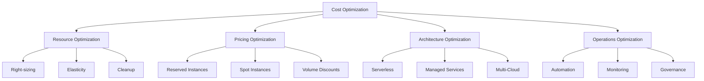
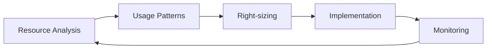
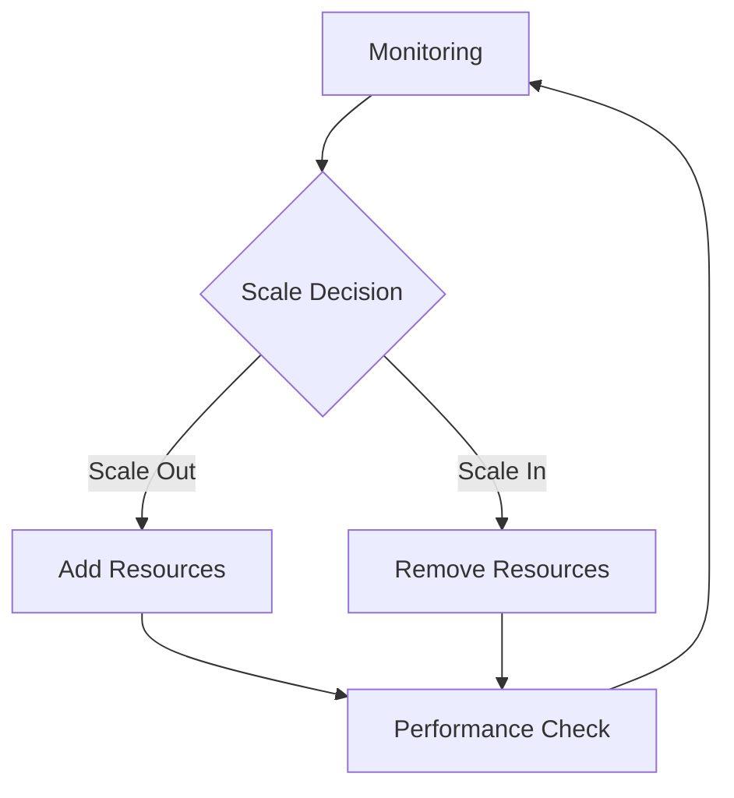
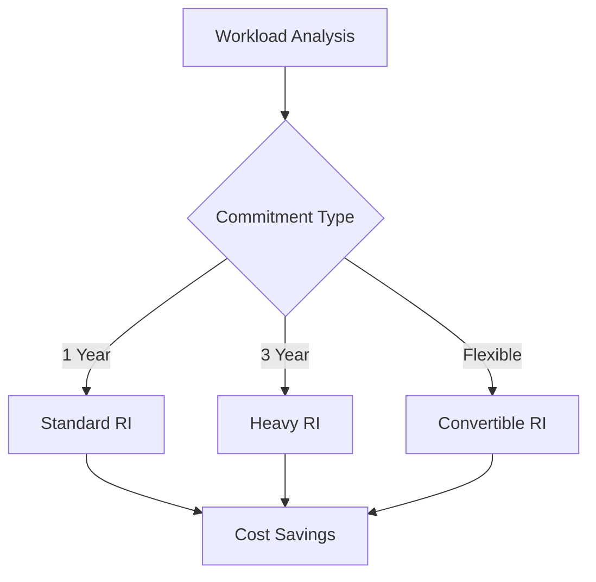
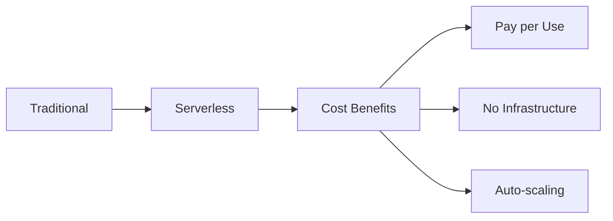
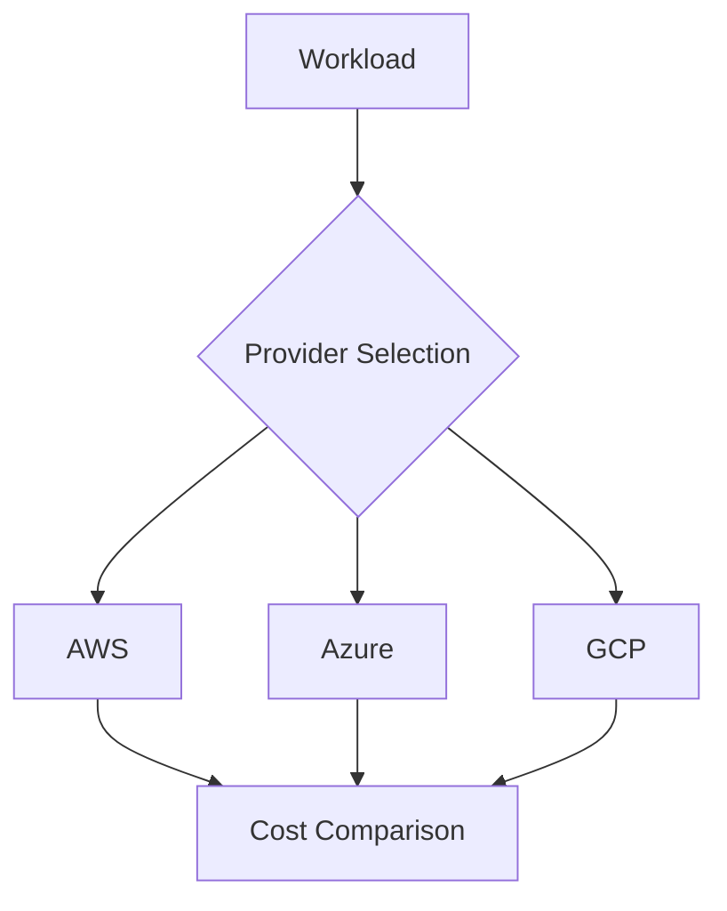
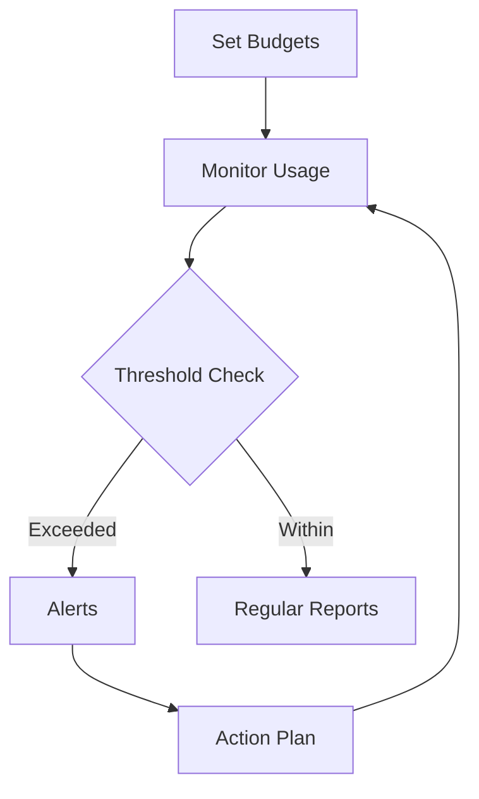

# Cloud Cost Optimization Guide

A comprehensive guide for optimizing costs across cloud infrastructure while maintaining performance and reliability.

## Cost Optimization Framework

## Cost Optimization Strategies

### 1. Resource Optimization

#### Right-sizing Resources

##### Implementation Steps:
1. Collect metrics
   - CPU utilization
   - Memory usage
   - I/O patterns
   - Network traffic

2. Analyze patterns
   - Peak usage
   - Average usage
   - Usage trends
   - Seasonal variations

3. Right-size resources
   - Instance types
   - Storage volumes
   - Database instances
   - Container resources

#### Auto-scaling Implementation

### 2. Pricing Optimization

#### Reserved Instances Strategy

| Commitment Type | Savings | Flexibility | Best For |
|----------------|---------|-------------|-----------|
| 1 Year Standard | 40-60% | Low | Stable workloads |
| 3 Year Standard | 60-80% | Low | Long-term workloads |
| Convertible | 30-50% | High | Variable workloads |

#### Spot Instance Usage
- Identify interruptible workloads
- Set maximum price limits
- Implement failover mechanisms
- Use spot fleet for diversity

### 3. Architecture Optimization

#### Serverless Adoption

#### Multi-Cloud Strategy

### 4. Cost Monitoring & Controls

#### Budget Implementation

#### Tagging Strategy
| Tag Category | Purpose | Example |
|--------------|---------|---------|
| Cost Center | Billing allocation | cost_center=marketing |
| Environment | Resource grouping | environment=production |
| Project | Project tracking | project=website |
| Owner | Resource ownership | owner=team_name |

## Provider-Specific Optimizations

### AWS Cost Optimization

#### EC2 Optimization
1. Right-sizing strategies
   - Use AWS Compute Optimizer
   - Implement Auto Scaling
   - Leverage EC2 Fleet

2. Storage optimization
   - S3 lifecycle policies
   - EBS volume optimization
   - Use S3 storage classes

#### AWS Cost Tools
- AWS Cost Explorer
- AWS Budgets
- AWS Cost Anomaly Detection
- AWS Purchase Order Management

### Azure Cost Optimization

#### VM Optimization
1. Right-sizing strategies
   - Use Azure Advisor
   - Implement VM Scale Sets
   - Use B-series VMs

2. Storage optimization
   - Blob lifecycle management
   - Managed disk optimization
   - Use storage tiers

#### Azure Cost Tools
- Azure Cost Management
- Azure Advisor
- Azure Budgets
- Azure Reserved Instances

### GCP Cost Optimization

#### Compute Optimization
1. Right-sizing strategies
   - Use GCP Recommender
   - Implement Managed Instance Groups
   - Use Preemptible VMs

2. Storage optimization
   - Object lifecycle management
   - Persistent disk optimization
   - Use storage classes

#### GCP Cost Tools
- Cloud Billing
- Recommender
- Committed Use Discounts
- Budget Alerts

## Implementation Roadmap

### Phase 1: Assessment
1. Analyze current costs
2. Identify optimization opportunities
3. Set cost reduction targets
4. Define KPIs

### Phase 2: Implementation
1. Implement tagging
2. Configure monitoring
3. Apply right-sizing
4. Implement automation

### Phase 3: Optimization
1. Regular reviews
2. Continuous optimization
3. Cost awareness training
4. Process improvement

## Best Practices

### 1. Governance
- Implement cost policies
- Define approval processes
- Set up cost allocation
- Regular audits

### 2. Automation
- Automated scaling
- Scheduled operations
- Resource cleanup
- Cost reporting

### 3. Monitoring
- Real-time monitoring
- Cost anomaly detection
- Usage tracking
- Performance metrics

## Cost Optimization Tools

### 1. Cloud Provider Tools
- AWS Cost Explorer
- Azure Cost Management
- GCP Cost Management

### 2. Third-Party Tools
- CloudHealth
- Cloudability
- ParkMyCloud
- CloudCheckr

## Resources

- [AWS Cost Optimization](https://aws.amazon.com/aws-cost-management/)
- [Azure Cost Optimization](https://azure.microsoft.com/solutions/cost-optimization/)
- [GCP Cost Optimization](https://cloud.google.com/cost-management)
- [FinOps Foundation](https://www.finops.org/)
