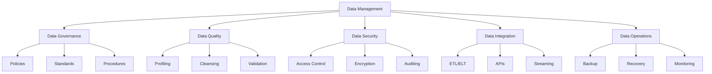
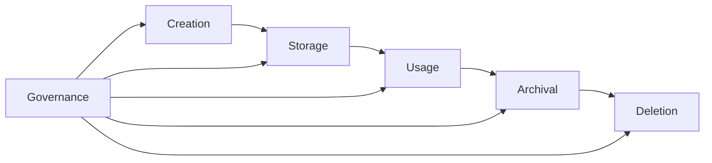
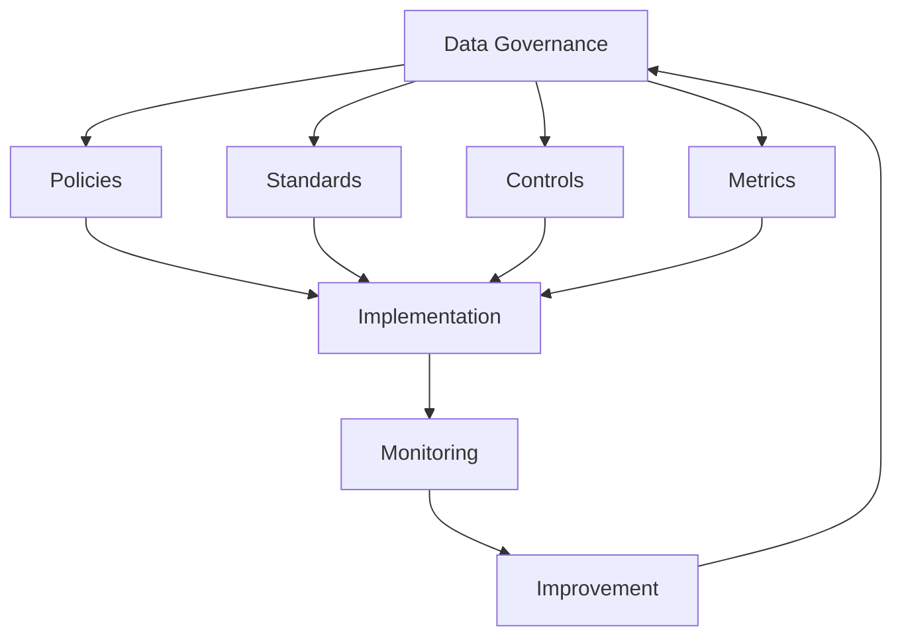
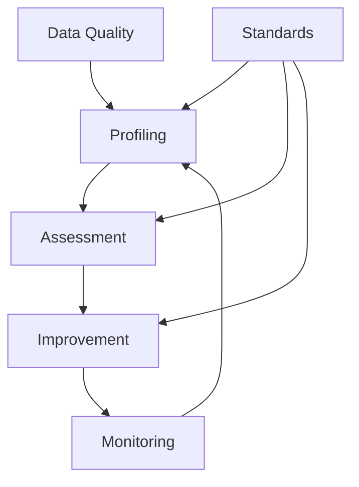
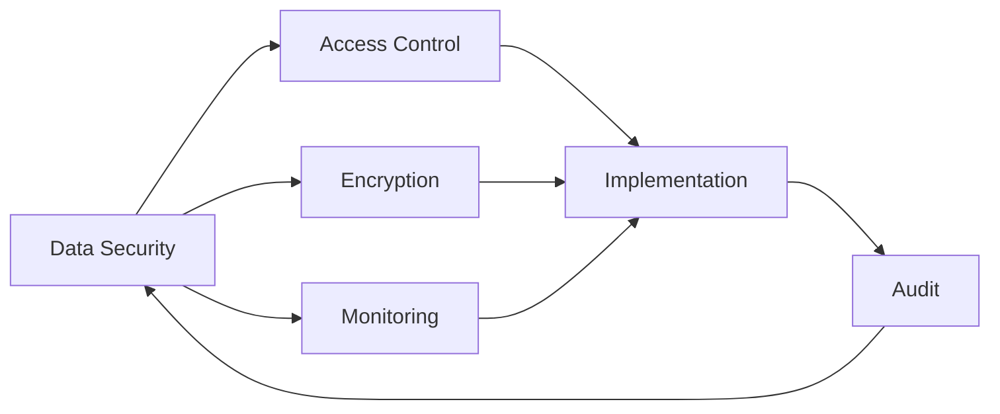
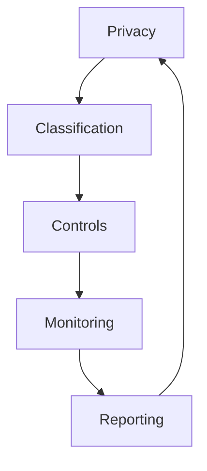
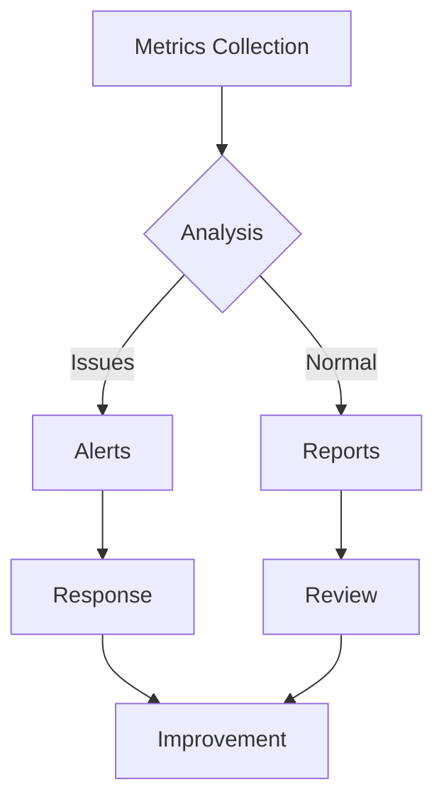

# Enterprise Data Management Checklist

A comprehensive guide for implementing and maintaining enterprise-grade data management practices.

## Purpose

This checklist helps organizations implement robust data management practices focusing on data governance, quality, security, and lifecycle management.

## Rationale

Each section addresses critical data management concerns:

### Data Architecture



#### Real-World Example

A healthcare provider improved data quality by 95% and reduced data-related incidents by 80% through implementing automated data quality checks and governance procedures.

### Data Lifecycle Management



#### Case Study: Data Governance Success

A financial services company reduced regulatory reporting time by 60% by implementing automated data governance controls and quality checks.

## Implementation Guide

### Data Governance Framework



1. Policy Development

   - Data classification
   - Access control
   - Retention policies
   - Privacy requirements

2. Standards Implementation

   - Data quality standards
   - Metadata standards
   - Integration standards
   - Security standards

3. Control Framework
   - Access controls
   - Quality controls
   - Process controls
   - Audit controls

### Data Quality Management

#### 1. Data Quality Framework



#### 2. Quality Dimensions

- Accuracy
- Completeness
- Consistency
- Timeliness
- Validity
- Uniqueness

### Data Security Implementation

#### 1. Security Controls



#### 2. Privacy Controls



## Best Practices

### 1. Data Governance

- Clear ownership
- Documented procedures
- Regular reviews
- Compliance monitoring

### 2. Data Quality

- Automated profiling
- Quality metrics
- Remediation processes
- Continuous monitoring

### 3. Data Security

- Access controls
- Encryption
- Audit logging
- Incident response

### 4. Data Operations

- Backup procedures
- Recovery testing
- Performance monitoring
- Capacity planning

## Automation Examples

### 1. Data Quality Checks

```python
def check_data_quality(dataset):
    """
    Automated data quality validation
    """
    quality_metrics = {
        'completeness': check_completeness(dataset),
        'accuracy': check_accuracy(dataset),
        'consistency': check_consistency(dataset),
        'timeliness': check_timeliness(dataset)
    }
    return quality_metrics
```

### 2. Data Validation

```python
def validate_data(data, rules):
    """
    Data validation against business rules
    """
    validation_results = {
        'passed': [],
        'failed': [],
        'warnings': []
    }
    return validation_results
```

## Monitoring & Metrics

### 1. Key Metrics

- Data quality scores
- Process compliance
- Security incidents
- System performance

### 2. Monitoring Strategy



## Data Lifecycle Management

### 1. Creation & Ingestion

- Data standards
- Validation rules
- Quality checks
- Source tracking

### 2. Storage & Management

- Classification
- Protection
- Optimization
- Archival

### 3. Usage & Distribution

- Access control
- Monitoring
- Performance
- Integration

### 4. Retention & Disposal

- Retention rules
- Archival process
- Disposal procedures
- Compliance checks

## Compliance Requirements

### 1. Regulatory Compliance

- GDPR
- CCPA
- HIPAA
- SOX

### 2. Industry Standards

- ISO 27001
- COBIT
- ITIL
- DAMA-DMBOK

## Tools & Technologies

### 1. Data Management Tools

- Data catalogs
- Quality tools
- ETL/ELT tools
- Monitoring tools

### 2. Security Tools

- Access control
- Encryption
- Monitoring
- Audit tools

## Resources

- [DAMA International](https://www.dama.org/)
- [Data Management Association](https://www.dama.org/cpages/body-of-knowledge)
- [Data Governance Institute](http://www.datagovernance.com/)
- [Enterprise Data Management Council](https://edmcouncil.org/)
