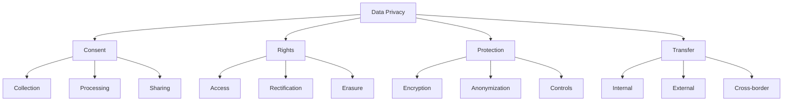
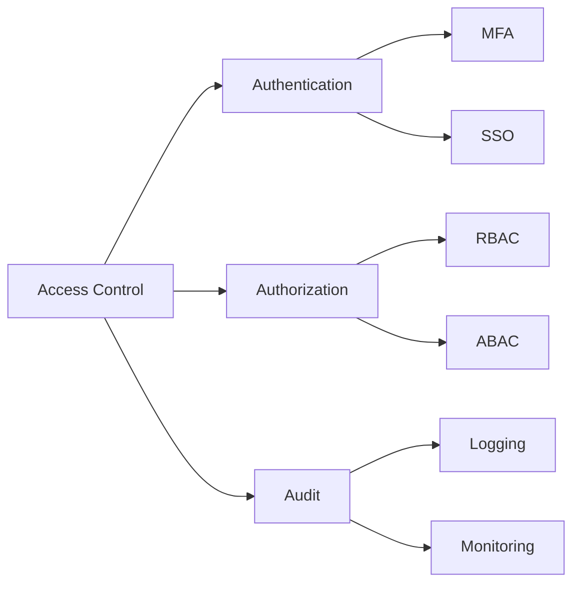
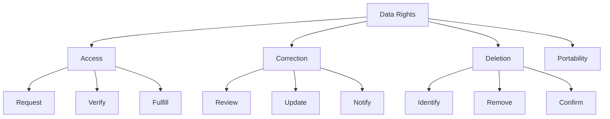
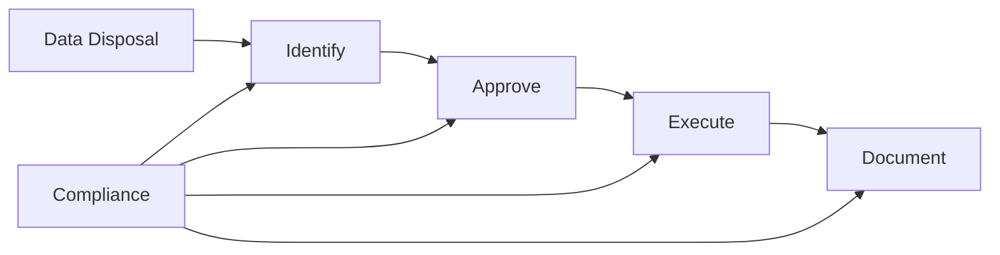
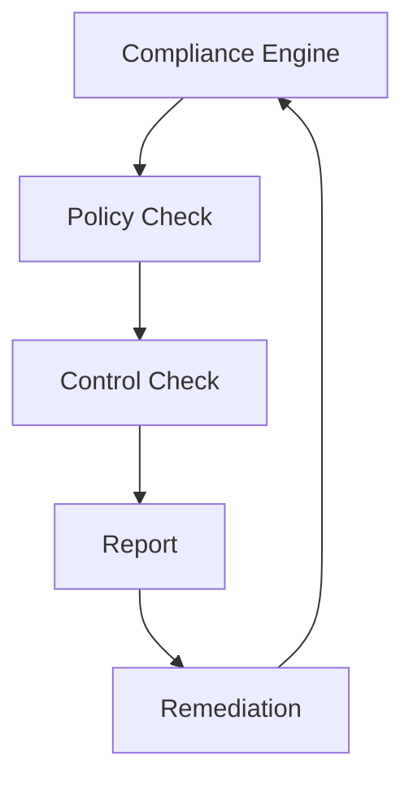
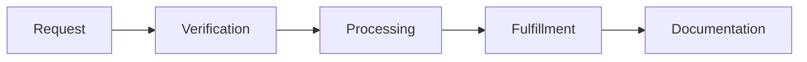

# Data Management Compliance Mapping

This document maps data management controls to various data protection and privacy regulations.

## Overview

This mapping helps organizations understand how data management controls align with regulatory requirements and industry standards.

## Compliance Frameworks Coverage

| Framework | Coverage | Last Updated |
| --------- | -------- | ------------ |
| GDPR      | 95%      | 2024-02-13   |
| CCPA      | 92%      | 2024-02-13   |
| HIPAA     | 90%      | 2024-02-13   |
| SOX       | 88%      | 2024-02-13   |
| GLBA      | 93%      | 2024-02-13   |

## Data Protection Framework

### Data Privacy Controls

## Detailed Control Mapping

### Data Collection & Processing

#### Consent Management

- **GDPR**: Article 6 - Lawfulness of processing
- **CCPA**: Section 1798.100 - Notice requirements
- **HIPAA**: §164.506 - Consent for uses or disclosures
- **SOX**: Section 404 - Data integrity
- **GLBA**: Privacy notice requirements

#### Data Minimization

- **GDPR**: Article 5(1)(c) - Data minimization
- **CCPA**: Section 1798.100(b) - Collection limitations
- **HIPAA**: §164.502(b) - Minimum necessary
- **SOX**: Data relevance requirements
- **GLBA**: Information security requirements

### Data Security Controls

#### Access Control Implementation

#### Encryption Requirements

- **GDPR**: Article 32 - Security of processing
- **CCPA**: Section 1798.150 - Security procedures
- **HIPAA**: §164.312(a)(2)(iv) - Encryption
- **SOX**: IT control requirements
- **GLBA**: Safeguards Rule requirements

### Data Rights Management

#### Individual Rights Implementation

### Data Lifecycle Management

#### Retention Requirements

| Regulation | Requirement     | Retention Period     |
| ---------- | --------------- | -------------------- |
| GDPR       | Article 5(1)(e) | As long as necessary |
| HIPAA      | §164.316(b)(2)  | 6 years              |
| SOX        | Section 802     | 7 years              |
| GLBA       | 17 CFR 248.30   | 5 years              |

#### Disposal Procedures

## Implementation Guidelines

### Documentation Requirements

Each control implementation should include:

1. Policy documentation
2. Implementation evidence
3. Testing procedures
4. Audit trails
5. Review schedules

### Audit Preparation

For each regulation:

1. Maintain current mapping documentation
2. Keep evidence organized by control
3. Regular control testing
4. Gap analysis
5. Remediation tracking

## Cross-Regulation Controls Matrix

| Control Area | GDPR         | CCPA         | HIPAA    | SOX      | GLBA           |
| ------------ | ------------ | ------------ | -------- | -------- | -------------- |
| Consent      | Art. 6       | 1798.100     | §164.506 | N/A      | Privacy Notice |
| Security     | Art. 32      | 1798.150     | §164.312 | Sec. 404 | Safeguards     |
| Rights       | Art. 15-20   | 1798.100-125 | §164.524 | N/A      | Access Rights  |
| Retention    | Art. 5(1)(e) | 1798.105     | §164.316 | Sec. 802 | 17 CFR 248.30  |

## Compliance Automation

### 1. Automated Compliance Checks

### 2. Rights Request Automation

## Best Practices

### 1. Privacy by Design

- Data minimization
- Purpose limitation
- Privacy controls
- Impact assessments

### 2. Security by Default

- Access control
- Encryption
- Monitoring
- Incident response

### 3. Continuous Compliance

- Regular assessments
- Control updates
- Training
- Auditing

## Resources

- [EU GDPR Portal](https://www.eugdpr.org/)
- [CCPA Resource Center](https://oag.ca.gov/privacy/ccpa)
- [HIPAA Journal](https://www.hipaajournal.com/)
- [SOX Online](https://www.sox-online.com/)
- [GLBA Compliance Guide](https://www.ftc.gov/glba)
