# Data Quality Management Guide

A comprehensive guide for implementing and maintaining enterprise-grade data quality controls.

## Data Quality Framework

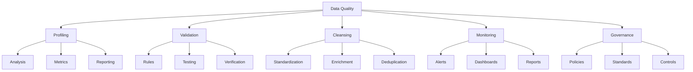

## Data Quality Dimensions

### 1. Completeness

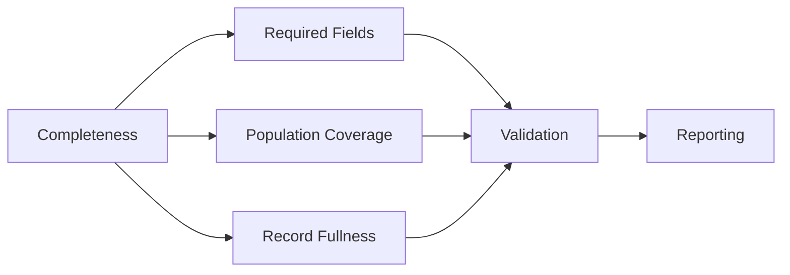

#### Implementation:

1. Define required fields
2. Set completeness thresholds
3. Implement validation rules
4. Monitor completeness metrics

### 2. Accuracy

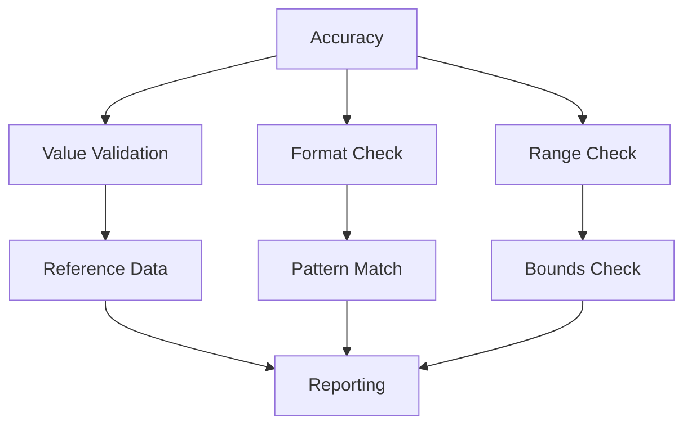

#### Validation Rules:

```python
def validate_accuracy(data):
    rules = {
        'numeric': check_numeric_bounds,
        'dates': check_date_validity,
        'categorical': check_valid_categories,
        'text': check_text_patterns
    }
    return apply_rules(data, rules)
```

### 3. Consistency

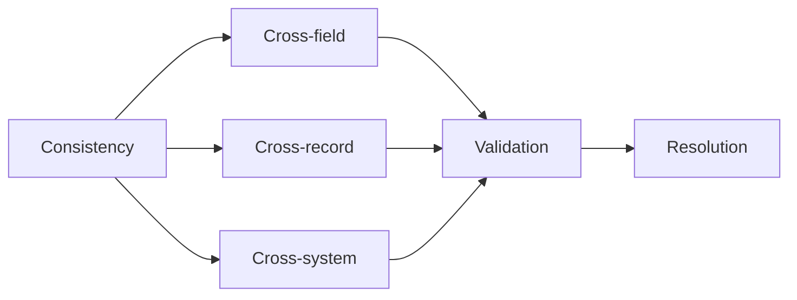

### 4. Timeliness

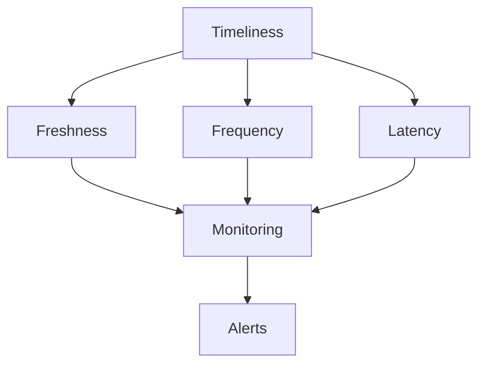

## Quality Control Implementation

### 1. Data Profiling

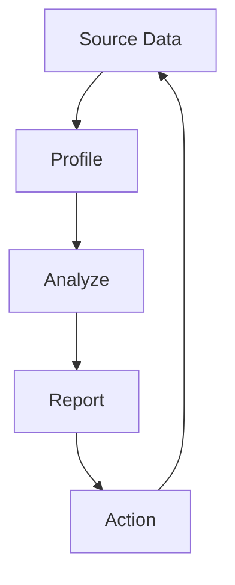

#### Profiling Metrics:

- Value distributions
- Pattern analysis
- Relationship discovery
- Anomaly detection
- Quality scoring

### 2. Data Validation Framework

#### Rule Implementation

```python
class ValidationRule:
    def __init__(self, name, condition, severity):
        self.name = name
        self.condition = condition
        self.severity = severity

    def validate(self, data):
        return {
            'rule': self.name,
            'result': self.condition(data),
            'severity': self.severity
        }
```

#### Validation Pipeline

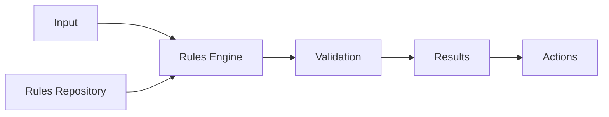

### 3. Data Cleansing

#### Cleansing Workflow

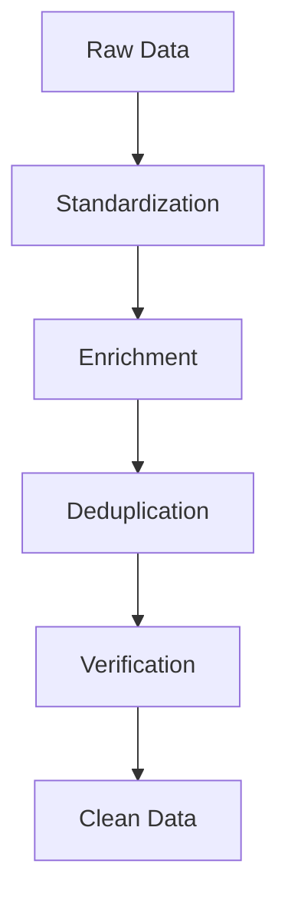

#### Cleansing Rules:

1. Standardization

   - Case normalization
   - Format standardization
   - Value normalization
   - Unit conversion

2. Enrichment

   - Reference data lookup
   - Derived values
   - Missing value imputation
   - External data integration

3. Deduplication
   - Exact matching
   - Fuzzy matching
   - Record linkage
   - Merge/purge

## Monitoring & Reporting

### 1. Quality Metrics Dashboard

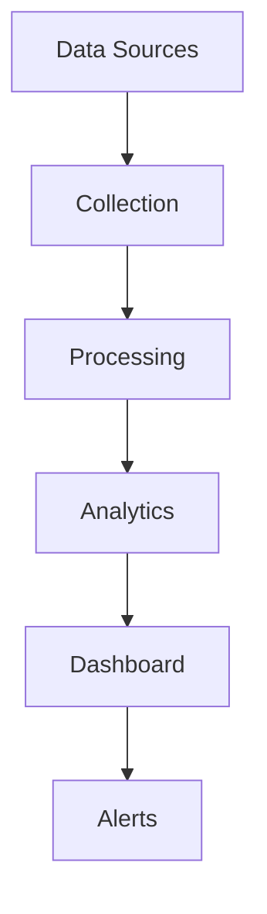

### 2. Quality Scorecards

| Dimension    | Metric               | Target | Current | Trend |
| ------------ | -------------------- | ------ | ------- | ----- |
| Completeness | % Required Fields    | 99.9%  | 99.5%   | ↑     |
| Accuracy     | % Valid Values       | 99.5%  | 99.2%   | ↗    |
| Consistency  | % Consistent Records | 99.0%  | 98.8%   | →     |
| Timeliness   | Avg. Latency (min)   | < 5    | 4.2     | ↓     |

## Implementation Strategy

### Phase 1: Assessment

1. Profile existing data
2. Define quality requirements
3. Identify gaps
4. Set priorities

### Phase 2: Implementation

1. Develop rules
2. Build validation
3. Create workflows
4. Deploy monitoring

### Phase 3: Operation

1. Execute controls
2. Monitor results
3. Handle exceptions
4. Report status

## Best Practices

### 1. Governance

- Clear ownership
- Documented standards
- Regular reviews
- Change control

### 2. Process Integration

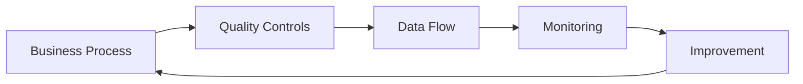

### 3. Automation

- Automated validation
- Scheduled profiling
- Automated cleansing
- Automated reporting

### 4. Exception Management

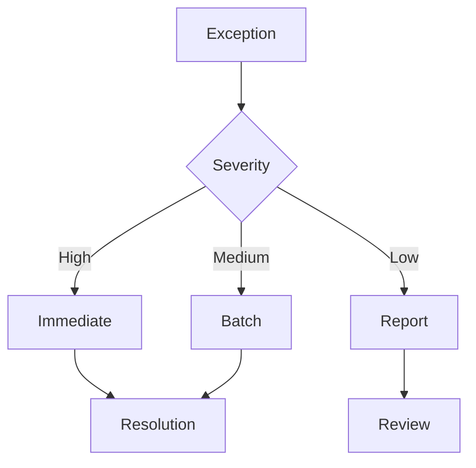

## Tools & Technologies

### 1. Data Quality Tools

- Profiling tools
- Validation engines
- Cleansing tools
- Monitoring systems

### 2. Integration Tools

- ETL/ELT platforms
- Data pipelines
- API integration
- Streaming platforms

## Resources

- [DAMA DMBOK](https://www.dama.org/cpages/body-of-knowledge)
- [ISO 8000](https://www.iso.org/standard/50798.html)
- [Data Quality Pro](https://www.dataqualitypro.com/)
- [Data Quality Campaign](https://dataqualitycampaign.org/)
