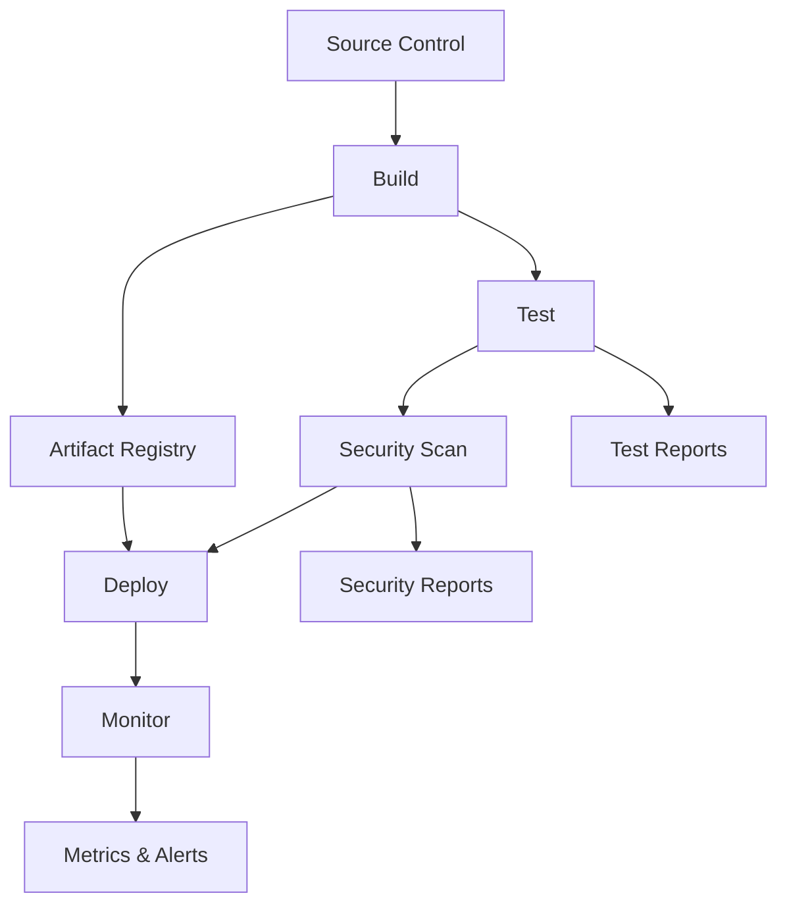
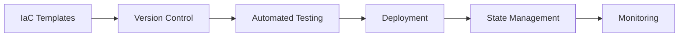
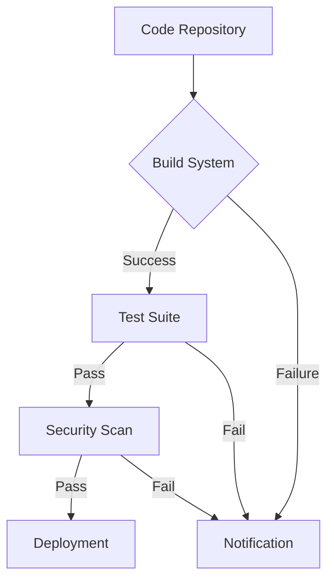
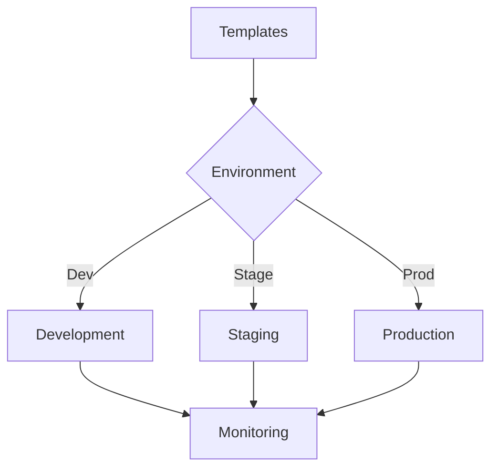
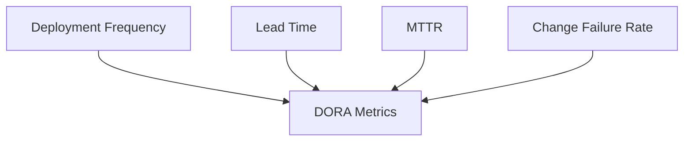
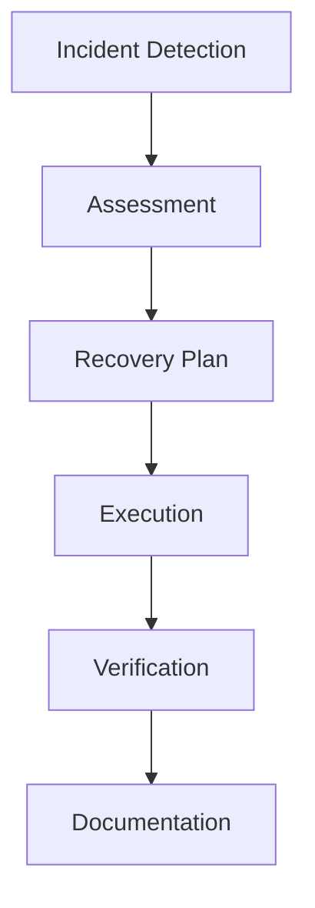

# Enterprise DevOps Checklist

A comprehensive guide for implementing and maintaining enterprise-grade DevOps practices.

## Purpose

This checklist helps organizations implement robust DevOps practices focusing on automation, continuous integration/delivery, infrastructure as code, and monitoring.

## Rationale

Each section addresses key DevOps concerns:

### CI/CD Pipeline



#### Real-World Example

A financial services company reduced deployment time from 2 weeks to 2 hours by implementing automated CI/CD pipelines, resulting in 300% increase in deployment frequency and 80% reduction in deployment-related incidents.

### Infrastructure as Code



#### Case Study: Cloud Migration Success

A retail company implemented infrastructure as code for their cloud migration, reducing infrastructure provisioning time from weeks to hours and achieving 99.99% uptime.

## Implementation Guide

### Automated Pipeline Implementation



1. Source Control

   - Branch protection rules
   - Code review requirements
   - Automated linting
   - Commit message standards

2. Build Automation

   - Containerized builds
   - Dependency management
   - Build caching
   - Artifact versioning

3. Testing Strategy
   - Unit tests
   - Integration tests
   - Performance tests
   - Security tests

### Infrastructure Management

#### 1. Infrastructure as Code



#### 2. Configuration Management


## Automation Scripts

### 1. Pipeline Validation

```bash
#!/bin/bash
# Validates CI/CD pipeline configuration
# Usage: ./validate_pipeline.sh [config_file]

check_pipeline_config() {
    echo "Validating pipeline configuration..."
}

check_integrations() {
    echo "Checking required integrations..."
}
```

### 2. Infrastructure Validation

```python
def validate_infrastructure(env):
    """
    Automated infrastructure validation
    Supports: AWS, Azure, GCP
    """
    validation_status = {
        'passed': [],
        'failed': [],
        'warnings': []
    }
    return validation_status
```

## Best Practices

### 1. Version Control

- Branch protection rules
- Code review requirements
- Automated testing gates
- Documentation requirements

### 2. Continuous Integration

- Automated builds
- Test automation
- Security scanning
- Quality gates

### 3. Continuous Delivery

- Automated deployments
- Environment promotion
- Rollback procedures
- Feature flags

### 4. Infrastructure Management

- Infrastructure as Code
- Configuration management
- Secret management
- Access control

### 5. Monitoring & Observability

- Metrics collection
- Log aggregation
- Tracing
- Alerting

## Training & Documentation

### 1. Team Training

- DevOps principles
- Tool-specific training
- Security awareness
- Best practices

### 2. Documentation Requirements

- Architecture diagrams
- Runbooks
- Troubleshooting guides
- Recovery procedures

## Metrics & KPIs

### 1. Deployment Metrics



### 2. Performance Metrics

- Response time
- Error rates
- Resource utilization
- Cost efficiency

## Disaster Recovery

### 1. Backup Procedures

- Database backups
- Configuration backups
- Code repository mirrors
- Artifact backups

### 2. Recovery Procedures



## Security Integration

### 1. Security Scanning


### 2. Compliance Automation


### Actionable Security Controls

- Integrate security testing into CI/CD pipelines (SAST, DAST)
- Scan dependencies for vulnerabilities
- Use secrets management in build and deploy processes
- Enforce branch protection and code review for security
- Monitor pipeline logs for suspicious activity

## Resources

- [DevOps Handbook](https://itrevolution.com/book/the-devops-handbook/)
- [Google SRE Book](https://sre.google/sre-book/table-of-contents/)
- [AWS Well-Architected](https://aws.amazon.com/architecture/well-architected/)
- [Azure Architecture Center](https://docs.microsoft.com/azure/architecture/)
