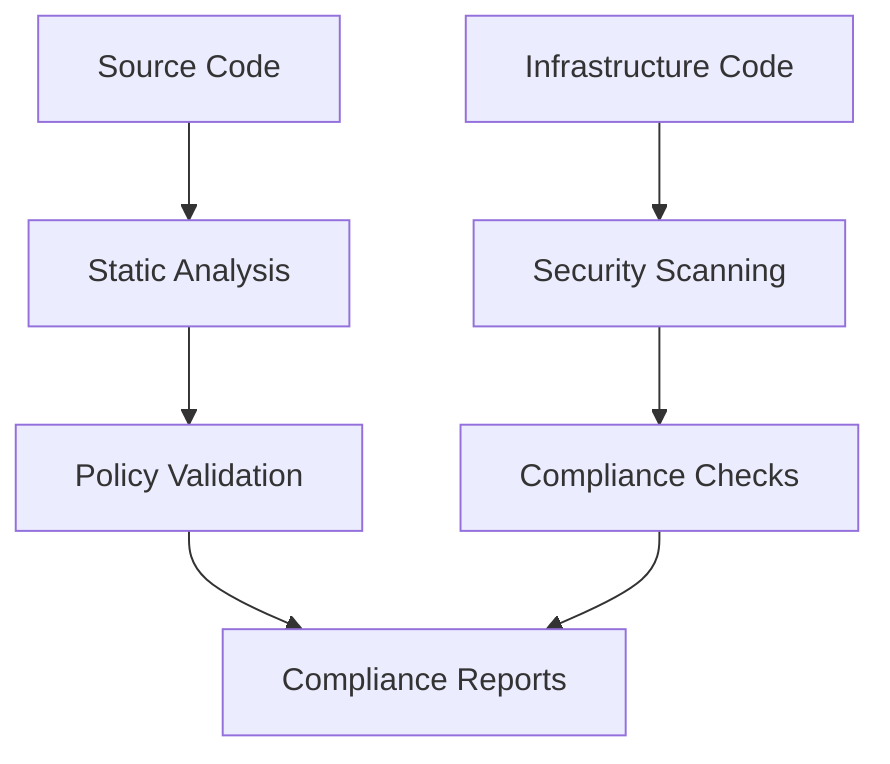
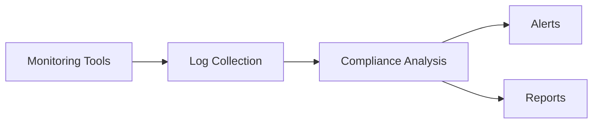
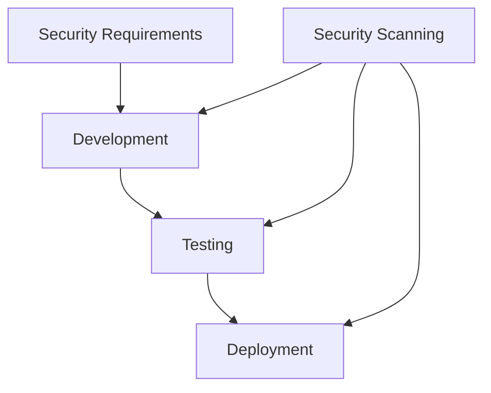
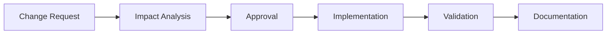

# DevOps Practices Compliance Mapping

This document maps DevOps practices to various compliance frameworks and industry standards.

## Overview

This mapping helps organizations understand how implementing DevOps practices helps meet compliance requirements and industry standards.

## Compliance Frameworks Coverage

| Framework | Coverage | Last Updated |
|-----------|----------|--------------|
| ISO/IEC 27001 | 85% | 2024-02-13 |
| NIST 800-53 | 90% | 2024-02-13 |
| SOC 2 | 88% | 2024-02-13 |
| ITIL 4 | 95% | 2024-02-13 |
| COBIT 2019 | 87% | 2024-02-13 |

## Detailed Mapping

### Continuous Integration/Continuous Delivery (CI/CD)

#### Source Control Management
- **ISO 27001**: A.12.1.2 - Change management
- **NIST 800-53**: CM-3 - Configuration change control
- **SOC 2**: CC8.1 - Change management policies and procedures
- **ITIL 4**: Change enablement practice
- **COBIT 2019**: BAI06 - Managed IT changes

#### Automated Testing
- **ISO 27001**: A.14.2.8 - System security testing
- **NIST 800-53**: SA-11 - Developer testing
- **SOC 2**: CC7.1 - Quality assurance procedures
- **ITIL 4**: Service validation and testing practice
- **COBIT 2019**: BAI07 - Managed solution testing

### Infrastructure as Code

#### Configuration Management
- **ISO 27001**: A.12.1.2 - Change management
- **NIST 800-53**: CM-2 - Baseline configuration
- **SOC 2**: CC7.2 - Infrastructure change management
- **ITIL 4**: Service configuration management practice
- **COBIT 2019**: BAI10 - Managed configuration

#### Security Controls
- **ISO 27001**: A.13.1.1 - Network controls
- **NIST 800-53**: SC-7 - Boundary protection
- **SOC 2**: CC6.1 - Secure infrastructure
- **ITIL 4**: Information security management practice
- **COBIT 2019**: DSS05 - Managed security services

### Monitoring and Observability

#### System Monitoring
- **ISO 27001**: A.12.4.1 - Event logging
- **NIST 800-53**: AU-2 - Audit events
- **SOC 2**: CC7.2 - System monitoring
- **ITIL 4**: Service monitoring practice
- **COBIT 2019**: DSS01 - Managed operations

#### Performance Monitoring
- **ISO 27001**: A.12.1.3 - Capacity management
- **NIST 800-53**: CP-2 - Contingency plan
- **SOC 2**: CC7.1 - System operations
- **ITIL 4**: Service performance management practice
- **COBIT 2019**: BAI04 - Managed availability and capacity

## Implementation Guidelines

### Documentation Requirements

Each DevOps practice should include:
1. Process documentation
2. Implementation evidence
3. Testing procedures
4. Audit trails
5. Review schedules

### Audit Preparation

For each framework:
1. Maintain current mapping documentation
2. Keep evidence organized by control
3. Regular control testing
4. Gap analysis
5. Remediation tracking

## Compliance Validation Tools

### 1. Automated Compliance Checks


### 2. Continuous Compliance Monitoring


## Gap Analysis Template

```markdown
| Practice | Framework Requirement | Current Status | Gap | Remediation Plan |
|----------|---------------------|----------------|-----|------------------|
| CI/CD    | ISO 27001 A.12.1.2 | Partial        | Missing change approval | Q2 2024 Implementation |
```

## Best Practices Alignment

### 1. DevSecOps Integration


### 2. Change Management


## Compliance Metrics

### 1. Key Performance Indicators
- Change success rate
- Deployment frequency
- Mean time to recover
- Security incident rate
- Audit findings resolution time

### 2. Compliance Reporting
- Automated compliance reports
- Control effectiveness metrics
- Risk assessment results
- Incident response metrics
- Training completion rates

## Resources

- [NIST DevSecOps Framework](https://www.nist.gov)
- [ISO/IEC 27001 Standards](https://www.iso.org)
- [ITIL 4 Framework](https://www.axelos.com/itil)
- [COBIT 2019 Framework](https://www.isaca.org/cobit)
- [SOC 2 Compliance](https://www.aicpa.org)

## Continuous Improvement

### 1. Regular Reviews
- Monthly control assessments
- Quarterly framework updates
- Annual comprehensive review
- Incident-driven updates
- Stakeholder feedback integration

### 2. Training Requirements
- DevSecOps principles
- Compliance awareness
- Tool-specific training
- Incident response procedures
- Audit preparation

## Appendix: Common Controls Matrix

| Control Category | ISO 27001 | NIST 800-53 | SOC 2 | ITIL 4 | COBIT 2019 |
|-----------------|-----------|-------------|--------|---------|-------------|
| Change Management | A.12.1.2 | CM-3 | CC8.1 | Change Enablement | BAI06 |
| Security Testing | A.14.2.8 | SA-11 | CC7.1 | Service Validation | BAI07 |
| Monitoring | A.12.4.1 | AU-2 | CC7.2 | Service Monitoring | DSS01 |
| Access Control | A.9.2.3 | AC-2 | CC6.1 | Access Management | DSS05 |
| Incident Management | A.16.1.1 | IR-4 | CC7.3 | Service Desk | DSS02 |
