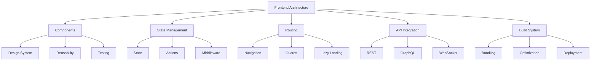
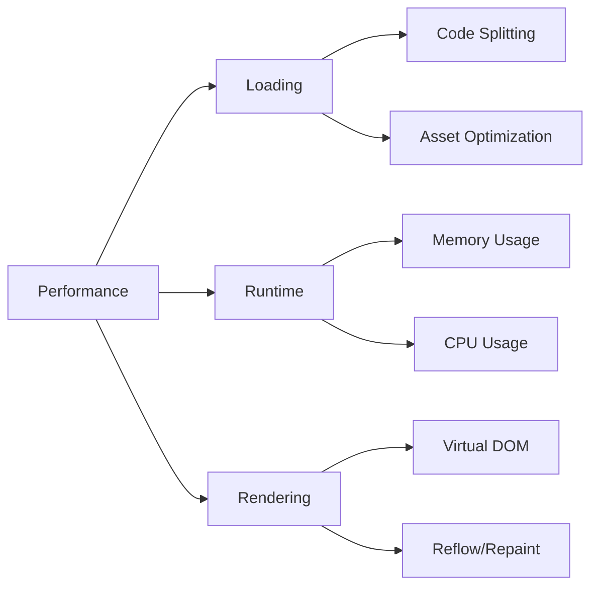
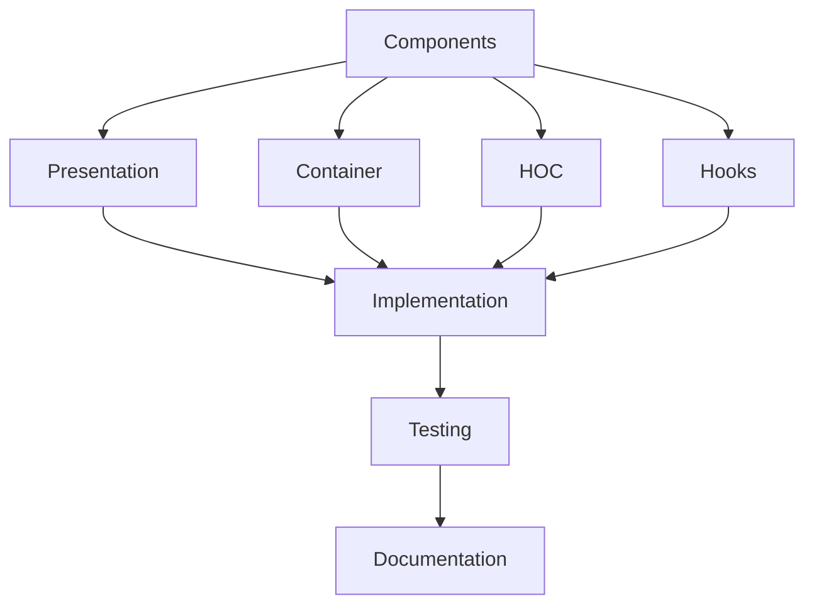
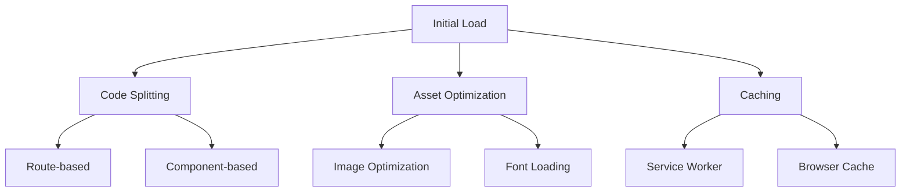
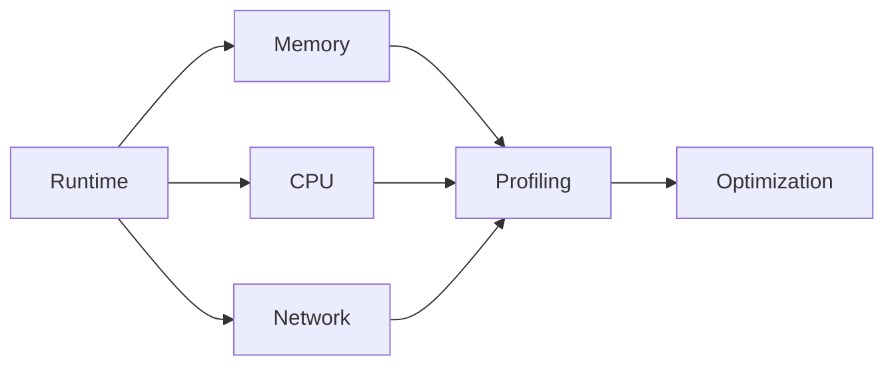
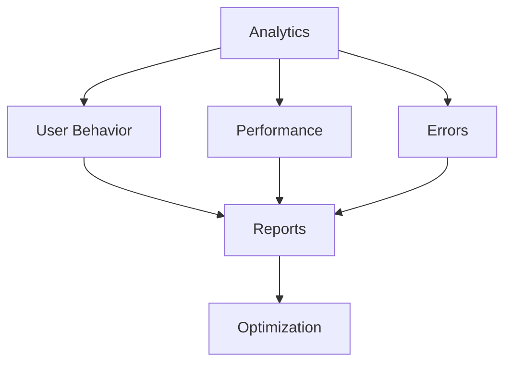
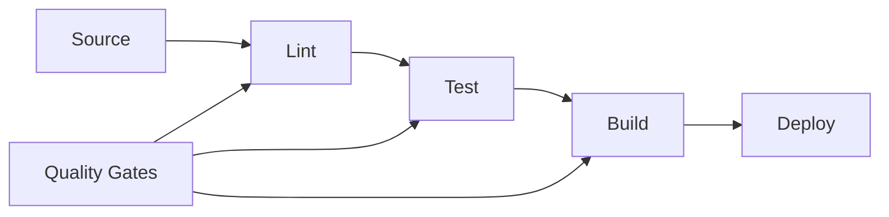
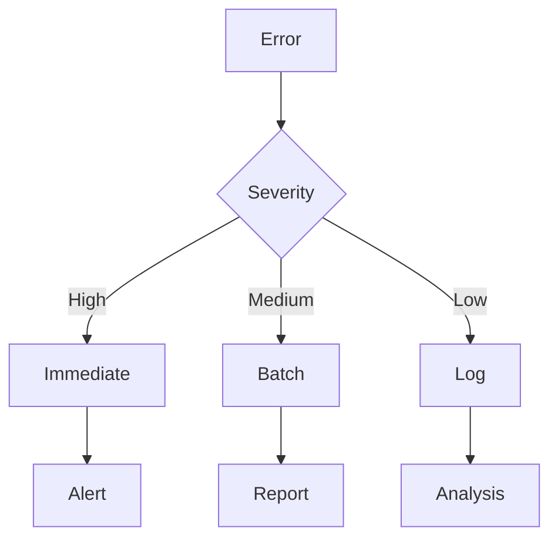

# Enterprise Frontend Checklist

A comprehensive guide for implementing and maintaining enterprise-grade frontend applications.

## Purpose

This checklist helps organizations implement robust frontend practices focusing on performance, accessibility, security, and maintainability.

## Rationale

Each section addresses critical frontend development concerns:

### Frontend Architecture



#### Real-World Example

A financial services company reduced page load time by 60% and increased user engagement by 40% through implementing performance optimizations and modern frontend architecture.

### Performance Optimization



#### Case Study: Performance Success

An e-commerce platform achieved a 45% increase in conversion rates by implementing advanced frontend optimizations and responsive design patterns.

## Implementation Guide

### Component Architecture



1. Component Design

   - Atomic design principles
   - Reusability patterns
   - Performance considerations
   - Accessibility requirements

2. State Management

   - Store architecture
   - Action patterns
   - Side effects
   - State persistence

3. Testing Strategy
   - Unit tests
   - Integration tests
   - E2E tests
   - Performance tests

### Performance Optimization

#### 1. Loading Performance



#### 2. Runtime Performance



## Best Practices

### 1. Code Organization

- Feature-based structure
- Clear separation of concerns
- Consistent naming conventions
- Documentation standards

### 2. Performance

- Lazy loading
- Code splitting
- Asset optimization
- Caching strategies

### 3. Accessibility

- WCAG compliance
- Semantic HTML
- ARIA attributes
- Keyboard navigation

### 4. Security


## Security Controls

- Input validation and output encoding for all user data
- Use Content Security Policy (CSP) to mitigate XSS
- Implement secure authentication flows (OAuth, SSO)
- Avoid exposing sensitive data in the frontend
- Use HTTPS for all communications
- Regularly update dependencies and scan for vulnerabilities
- Protect against clickjacking (X-Frame-Options)

## Automation Examples

### 1. Component Testing

```typescript
describe('UserComponent', () => {
  it('should render user details', () => {
    const user = {
      name: 'John Doe',
      email: 'john@example.com'
    };

    const { getByText } = render(<UserComponent user={user} />);

    expect(getByText(user.name)).toBeInTheDocument();
    expect(getByText(user.email)).toBeInTheDocument();
  });
});
```

### 2. Performance Testing

```typescript
describe("Performance", () => {
  it("should load within performance budget", async () => {
    const metrics = await measurePerformance("/dashboard");

    expect(metrics.fcp).toBeLessThan(1000);
    expect(metrics.lcp).toBeLessThan(2500);
    expect(metrics.tti).toBeLessThan(3500);
  });
});
```

## Monitoring & Analytics

### 1. Performance Metrics

- First Contentful Paint (FCP)
- Largest Contentful Paint (LCP)
- Time to Interactive (TTI)
- Cumulative Layout Shift (CLS)

### 2. User Analytics



## Build & Deployment

### 1. Build Pipeline



### 2. Deployment Strategy

- Blue-green deployment
- Canary releases
- Feature flags
- Rollback procedures

## Error Handling

### 1. Error Boundaries

```typescript
class ErrorBoundary extends React.Component {
  state = { hasError: false };

  static getDerivedStateFromError(error) {
    return { hasError: true };
  }

  componentDidCatch(error, errorInfo) {
    logError(error, errorInfo);
  }

  render() {
    if (this.state.hasError) {
      return <ErrorFallback />;
    }
    return this.props.children;
  }
}
```

### 2. Error Monitoring



## Documentation

### 1. Component Documentation

- Usage examples
- Props documentation
- State management
- Side effects

### 2. Architecture Documentation

- System design
- Data flow
- Integration points
- Dependencies

## Resources

- [Web.dev](https://web.dev/)
- [MDN Web Docs](https://developer.mozilla.org/)
- [React Documentation](https://reactjs.org/)
- [Performance Budgets](https://web.dev/performance-budgets-101/)
