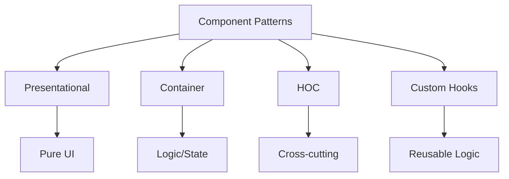

# Frontend Best Practices Guide

A comprehensive guide for implementing enterprise-grade frontend components and features.

## Component Architecture

### Component Design Patterns



### 1. Presentational Components

```typescript
// ✅ Good Practice
const UserCard: React.FC<UserCardProps> = ({ user, onAction }) => (
  <div className="user-card">
    <h3>{user.name}</h3>
    <p>{user.email}</p>
    <button onClick={() => onAction(user.id)}>
      View Profile
    </button>
  </div>
);

// ❌ Bad Practice
const UserCard: React.FC = () => {
  const [user, setUser] = useState<User>();

  useEffect(() => {
    fetchUser().then(setUser);
  }, []);

  return (/* ... */);
};
```

### 2. Container Components

```typescript
// ✅ Good Practice
const UserCardContainer: React.FC = () => {
  const { data: user, loading, error } = useUser();
  const { handleAction } = useUserActions();

  if (loading) return <Spinner />;
  if (error) return <ErrorMessage error={error} />;
  if (!user) return null;

  return <UserCard user={user} onAction={handleAction} />;
};

// ❌ Bad Practice
const UserCard: React.FC = () => {
  // Mixing business logic with presentation
  const [user, setUser] = useState<User>();
  const [loading, setLoading] = useState(true);
  const [error, setError] = useState<Error>();

  // Complex data fetching and state management
  useEffect(() => {/* ... */}, []);

  // Complex event handlers
  const handleAction = () => {/* ... */};

  return (/* ... */);
};
```

## State Management

### 1. Local State

```typescript
// ✅ Good Practice
const Counter: React.FC = () => {
  const [count, setCount] = useState(0);
  const increment = useCallback(() => setCount(c => c + 1), []);

  return (
    <button onClick={increment}>
      Count: {count}
    </button>
  );
};
```

### 2. Global State

```typescript
// ✅ Good Practice - Redux Slice
const userSlice = createSlice({
  name: 'user',
  initialState,
  reducers: {
    setUser: (state, action: PayloadAction<User>) => {
      state.data = action.payload;
    },
    clearUser: (state) => {
      state.data = null;
    },
  },
});

// ✅ Good Practice - Custom Hook
const useUser = () => {
  const dispatch = useDispatch();
  const user = useSelector(selectUser);

  const updateUser = useCallback(
    (userData: User) => {
      dispatch(setUser(userData));
    },
    [dispatch]
  );

  return { user, updateUser };
};
```

## Performance Optimization

### 1. Memoization

```typescript
// ✅ Good Practice
const ExpensiveComponent = React.memo(({ data }) => (
  <div>
    {/* Complex rendering logic */}
  </div>
), (prevProps, nextProps) => {
  return prevProps.data.id === nextProps.data.id;
});

// ✅ Good Practice - Callbacks
const UserActions: React.FC<UserActionsProps> = ({ userId }) => {
  const handleClick = useCallback(() => {
    // Handle click action
  }, [userId]);

  return <button onClick={handleClick}>Action</button>;
};
```

### 2. Code Splitting

```typescript
// ✅ Good Practice
const DashboardPage = React.lazy(() => import('./pages/Dashboard'));

const App: React.FC = () => (
  <Suspense fallback={<Spinner />}>
    <DashboardPage />
  </Suspense>
);
```

## Error Handling

### 1. Error Boundaries

```typescript
// ✅ Good Practice
class ErrorBoundary extends React.Component<Props, State> {
  state = { hasError: false, error: null };

  static getDerivedStateFromError(error: Error) {
    return { hasError: true, error };
  }

  componentDidCatch(error: Error, info: React.ErrorInfo) {
    logError(error, info);
  }

  render() {
    if (this.state.hasError) {
      return <ErrorFallback error={this.state.error} />;
    }

    return this.props.children;
  }
}
```

### 2. API Error Handling

```typescript
// ✅ Good Practice
const useApiCall = <T>(apiFunc: () => Promise<T>) => {
  const [state, setState] = useState<{
    data: T | null;
    loading: boolean;
    error: Error | null;
  }>({
    data: null,
    loading: false,
    error: null,
  });

  const execute = useCallback(async () => {
    try {
      setState((s) => ({ ...s, loading: true }));
      const data = await apiFunc();
      setState({ data, loading: false, error: null });
    } catch (error) {
      setState({ data: null, loading: false, error });
    }
  }, [apiFunc]);

  return { ...state, execute };
};
```

## Testing Strategies

### 1. Component Testing

```typescript
// ✅ Good Practice
describe('UserCard', () => {
  it('renders user information correctly', () => {
    const user = {
      id: '1',
      name: 'John Doe',
      email: 'john@example.com'
    };

    const { getByText } = render(<UserCard user={user} />);

    expect(getByText(user.name)).toBeInTheDocument();
    expect(getByText(user.email)).toBeInTheDocument();
  });

  it('handles click events', () => {
    const onAction = jest.fn();
    const user = { id: '1', name: 'John' };

    const { getByRole } = render(
      <UserCard user={user} onAction={onAction} />
    );

    fireEvent.click(getByRole('button'));
    expect(onAction).toHaveBeenCalledWith(user.id);
  });
});
```

### 2. Integration Testing

```typescript
// ✅ Good Practice
describe('UserDashboard', () => {
  it('loads and displays user data', async () => {
    const mockUser = { id: '1', name: 'John' };
    mockApi.getUser.mockResolvedValue(mockUser);

    const { getByText, findByText } = render(<UserDashboard />);

    expect(getByText('Loading...')).toBeInTheDocument();
    expect(await findByText(mockUser.name)).toBeInTheDocument();
  });
});
```

## Accessibility

### 1. Semantic HTML

```typescript
// ✅ Good Practice
const Article: React.FC = () => (
  <article>
    <header>
      <h1>Article Title</h1>
      <time dateTime="2024-02-13">February 13, 2024</time>
    </header>
    <main>
      <p>Article content...</p>
    </main>
    <footer>
      <nav aria-label="Article navigation">
        <a href="#prev">Previous</a>
        <a href="#next">Next</a>
      </nav>
    </footer>
  </article>
);
```

### 2. ARIA Attributes

```typescript
// ✅ Good Practice
const Dialog: React.FC = ({ title, isOpen, onClose, children }) => (
  <div
    role="dialog"
    aria-modal="true"
    aria-labelledby="dialog-title"
    aria-describedby="dialog-description"
  >
    <h2 id="dialog-title">{title}</h2>
    <div id="dialog-description">
      {children}
    </div>
    <button
      onClick={onClose}
      aria-label="Close dialog"
    >
      ×
    </button>
  </div>
);
```

## Security Best Practices

### 1. XSS Prevention

```typescript
// ✅ Good Practice
const UserContent: React.FC<{ html: string }> = ({ html }) => {
  const sanitizedHtml = DOMPurify.sanitize(html);
  return <div dangerouslySetInnerHTML={{ __html: sanitizedHtml }} />;
};

// ❌ Bad Practice
const UserContent: React.FC<{ html: string }> = ({ html }) => (
  <div dangerouslySetInnerHTML={{ __html: html }} />
);
```

### 2. CSRF Protection

```typescript
// ✅ Good Practice
const api = axios.create({
  headers: {
    'X-CSRF-Token': getCsrfToken(),
  },
});
```

## Performance Monitoring

### 1. Web Vitals

```typescript
// ✅ Good Practice
const reportWebVitals = (metric: WebVitalsMetric) => {
  switch (metric.name) {
    case 'FCP':
      logMetric('First Contentful Paint', metric.value);
      break;
    case 'LCP':
      logMetric('Largest Contentful Paint', metric.value);
      break;
    case 'CLS':
      logMetric('Cumulative Layout Shift', metric.value);
      break;
    case 'FID':
      logMetric('First Input Delay', metric.value);
      break;
    case 'TTFB':
      logMetric('Time to First Byte', metric.value);
      break;
  }
};
```

### 2. Performance Profiling

```typescript
// ✅ Good Practice
const withPerformanceTracking = <P extends object>(
  WrappedComponent: React.ComponentType<P>,
  componentName: string
) => {
  return class extends React.Component<P> {
    componentDidMount() {
      performance.mark(`${componentName}-mount-start`);
    }

    componentDidUpdate() {
      performance.mark(`${componentName}-update`);
    }

    componentWillUnmount() {
      performance.mark(`${componentName}-unmount`);
    }

    render() {
      return <WrappedComponent {...this.props} />;
    }
  };
};
```

## Resources

- [React Documentation](https://reactjs.org/docs/getting-started.html)
- [React Performance](https://reactjs.org/docs/optimizing-performance.html)
- [Web Vitals](https://web.dev/vitals/)
- [WCAG Guidelines](https://www.w3.org/WAI/standards-guidelines/wcag/)
- [Security Checklist](https://www.npmjs.com/package/react-security-checklist)
