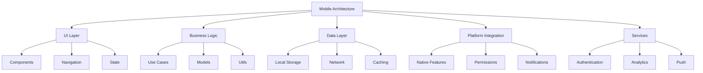
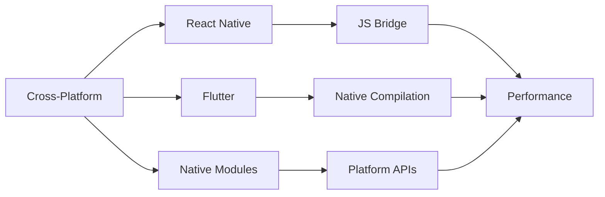
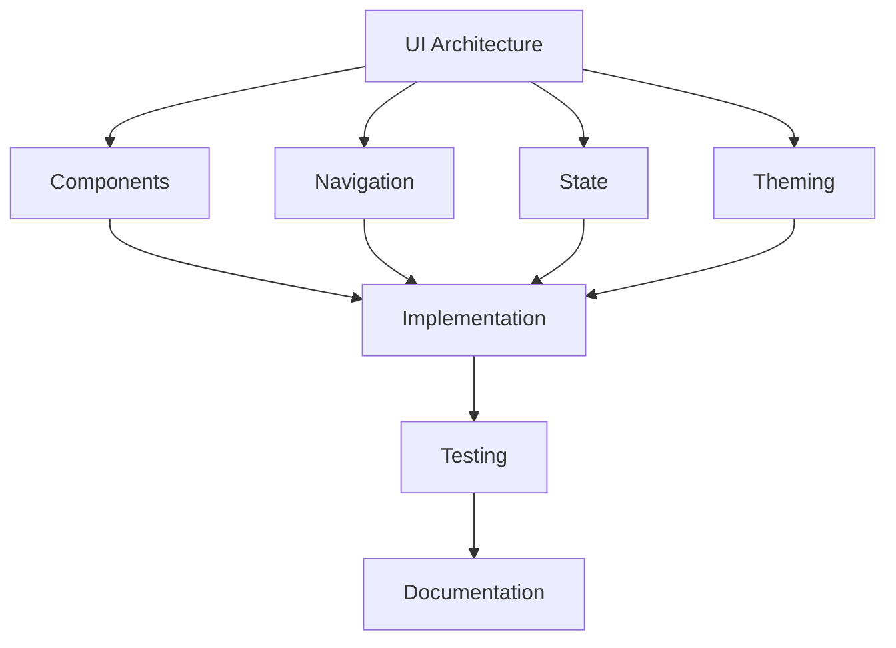
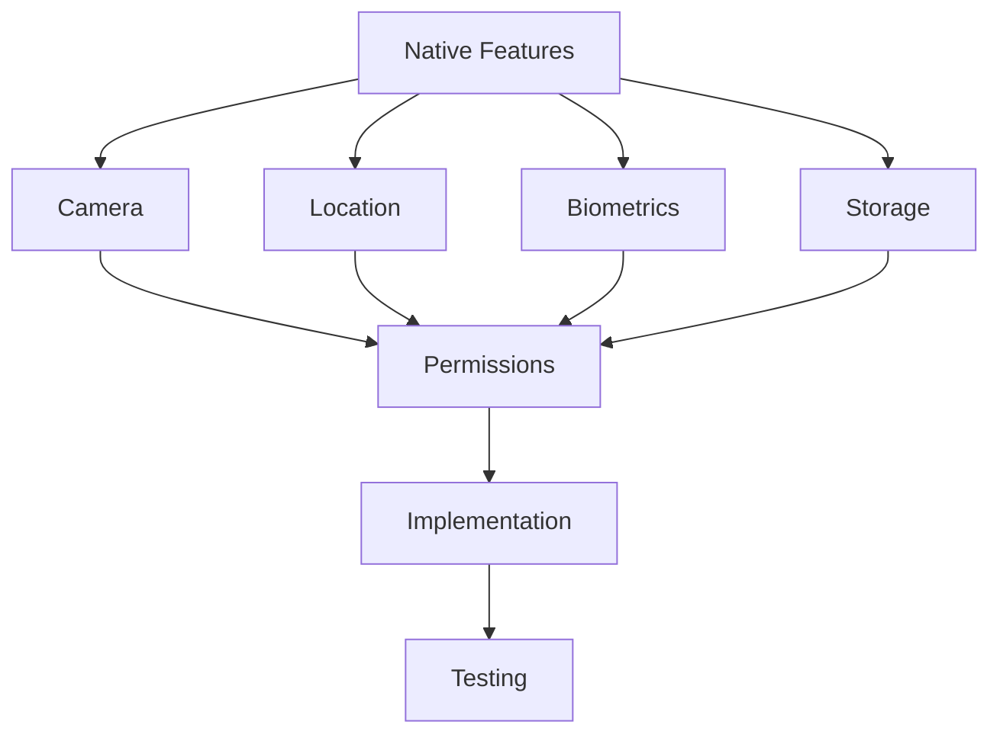
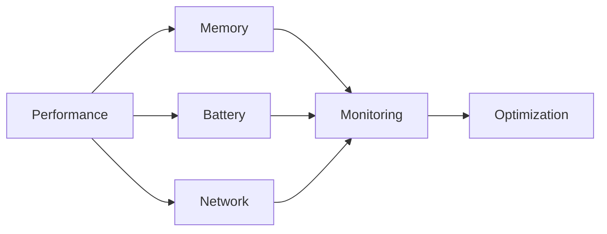

# Enterprise Mobile Development Checklist

A comprehensive guide for implementing and maintaining enterprise-grade mobile applications.

## Purpose

This checklist helps organizations implement robust mobile development practices focusing on cross-platform development, native integration, performance, and security.

## Rationale

Each section addresses critical mobile development concerns:

### Mobile Architecture



#### Real-World Example

A healthcare provider improved their mobile app performance by 70% and reduced crash rates by 90% through implementing robust architecture patterns and native optimizations.

### Cross-Platform Strategy



#### Case Study: Performance Success

A financial services company achieved 99.9% crash-free sessions and reduced app size by 40% through optimizing native integrations and implementing efficient state management.

## Implementation Guide

### UI Architecture



1. Component Design

   - Platform-specific adaptations
   - Responsive layouts
   - Performance optimization
   - Accessibility support

2. Navigation Strategy

   - Deep linking
   - State persistence
   - Screen transitions
   - Navigation patterns

3. Testing Strategy
   - Unit tests
   - Integration tests
   - E2E tests
   - Platform-specific tests

### Native Integration

#### 1. Platform Features



#### 2. Performance Optimization



## Best Practices

### 1. Code Organization

- Feature-based structure
- Platform-specific code
- Shared utilities
- Resource management

### 2. Performance

- Image optimization
- Memory management
- Battery efficiency
- Network handling

### 3. Security

## Security Controls

- Use secure storage for sensitive data (Keychain, Keystore)
- Enforce runtime permissions and least privilege
- Validate all inputs and outputs
- Protect against reverse engineering and tampering
- Use HTTPS for all network communications
- Regularly update dependencies and scan for vulnerabilities

- Implement runtime application self-protection (RASP) for mobile apps
- Use mobile app shielding and obfuscation tools
- Monitor for mobile-specific threats (e.g., root/jailbreak detection)
- Integrate mobile app security testing (MAST) in CI/CD pipelines
- Conduct regular penetration testing of mobile apps
- Implement security test cases for mobile features and APIs

#### Compliance Evidence Collection

- Store mobile app audit logs and compliance reports securely
- Automate evidence collection for app store and regulatory compliance
- Document remediation actions and incident response steps

#### Incident Response Testing

- Schedule regular incident response simulations for mobile app breaches
- Review and update mobile incident playbooks based on test outcomes

### 4. Testing

- Background states

## Automation Examples

### 1. Platform-Specific Tests

```typescript
describe("PlatformFeatures", () => {
  it("handles camera permissions correctly", async () => {
    const { result } = renderHook(() => useCameraPermission());

    await act(async () => {
      await result.current.requestPermission();
    });

    expect(result.current.hasPermission).toBe(true);
  });
});
```

### 2. Performance Testing

```typescript
describe("Performance", () => {
  it("loads within performance budget", async () => {
    const metrics = await measureAppStartup();

    expect(metrics.timeToInteractive).toBeLessThan(2000);
    expect(metrics.memoryUsage).toBeLessThan(100 * 1024 * 1024); // 100MB
  });
});
```

## Native Module Development

### 1. iOS Module

```swift
@objc(RNCamera)
class RNCamera: NSObject {
  @objc
  func checkPermission(_ resolve: RCTPromiseResolveBlock,
                      rejecter reject: RCTPromiseRejectBlock) {
    AVCaptureDevice.requestAccess(for: .video) { granted in
      resolve(granted)
    }
  }
}
```

### 2. Android Module

```kotlin
class RNCamera : ReactContextBaseJavaModule {
  override fun getName() = "RNCamera"

  @ReactMethod
  fun checkPermission(promise: Promise) {
    val activity = currentActivity
    if (activity == null) {
      promise.reject("NO_ACTIVITY", "No activity")
      return
    }

    if (ContextCompat.checkSelfPermission(activity,
        Manifest.permission.CAMERA) == PackageManager.PERMISSION_GRANTED) {
      promise.resolve(true)
    } else {
      promise.resolve(false)
    }
  }
}
```

## State Management

### 1. Local State

```typescript
const useDeviceState = () => {
  const [batteryLevel, setBatteryLevel] = useState(100);
  const [isCharging, setIsCharging] = useState(false);

  useEffect(() => {
    const subscription = BatteryManager.addListener(({ level, charging }) => {
      setBatteryLevel(level);
      setIsCharging(charging);
    });

    return () => subscription.remove();
  }, []);

  return { batteryLevel, isCharging };
};
```

### 2. Global State

```typescript
const appSlice = createSlice({
  name: "app",
  initialState,
  reducers: {
    setOnline: (state, action: PayloadAction<boolean>) => {
      state.isOnline = action.payload;
    },
    setLastSync: (state, action: PayloadAction<string>) => {
      state.lastSync = action.payload;
    },
  },
});
```

## Platform Integration

### 1. Push Notifications

```typescript
const configurePushNotifications = async () => {
  const authStatus = await messaging().requestPermission();

  if (authStatus === messaging.AuthorizationStatus.AUTHORIZED) {
    const token = await messaging().getToken();
    await registerDeviceToken(token);

    messaging().onMessage(async (remoteMessage) => {
      handleForegroundMessage(remoteMessage);
    });

    messaging().setBackgroundMessageHandler(async (remoteMessage) => {
      handleBackgroundMessage(remoteMessage);
    });
  }
};
```

### 2. Deep Linking

```typescript
const configureDeepLinking = () => {
  linking.addEventListener("url", ({ url }) => {
    const route = parseDeepLink(url);
    if (route) {
      navigation.navigate(route.screen, route.params);
    }
  });
};
```

## Security Implementation

### 1. Secure Storage

```typescript
const SecureStore = {
  async set(key: string, value: string) {
    return await Keychain.setGenericPassword(key, value);
  },

  async get(key: string) {
    const credentials = await Keychain.getGenericPassword(key);
    return credentials ? credentials.password : null;
  },

  async remove(key: string) {
    return await Keychain.resetGenericPassword(key);
  },
};
```

### 2. Network Security

```typescript
const api = axios.create({
  baseURL: API_URL,
  headers: {
    "Content-Type": "application/json",
    Accept: "application/json",
  },
  timeout: 30000,
});

api.interceptors.request.use(async (config) => {
  const token = await SecureStore.get("auth_token");
  if (token) {
    config.headers.Authorization = `Bearer ${token}`;
  }
  return config;
});
```

## Performance Monitoring

### 1. App Metrics

```typescript
const trackPerformanceMetrics = () => {
  Performance.mark("app_start");

  const unsubscribe = AppState.addEventListener("change", (nextState) => {
    if (nextState === "active") {
      Performance.measure("app_resume", "app_start");
    }
  });

  return () => unsubscribe();
};
```

### 2. Error Tracking

```typescript
const configureErrorTracking = () => {
  ErrorUtils.setGlobalHandler((error, isFatal) => {
    Analytics.logError(error, { isFatal });

    if (__DEV__) {
      console.error(error);
    } else {
      // Show user-friendly error screen
      navigation.navigate("ErrorScreen", {
        error: error.message,
      });
    }
  });
};
```

## Resources

- [React Native Documentation](https://reactnative.dev/)
- [Flutter Documentation](https://flutter.dev/docs)
- [iOS Development Guide](https://developer.apple.com/documentation/)
- [Android Development Guide](https://developer.android.com/guide)
- [Mobile Security Guide](https://owasp.org/www-project-mobile-security/)
