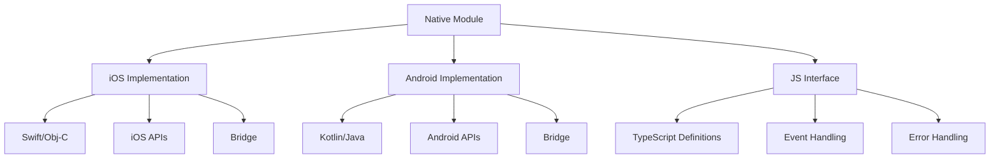
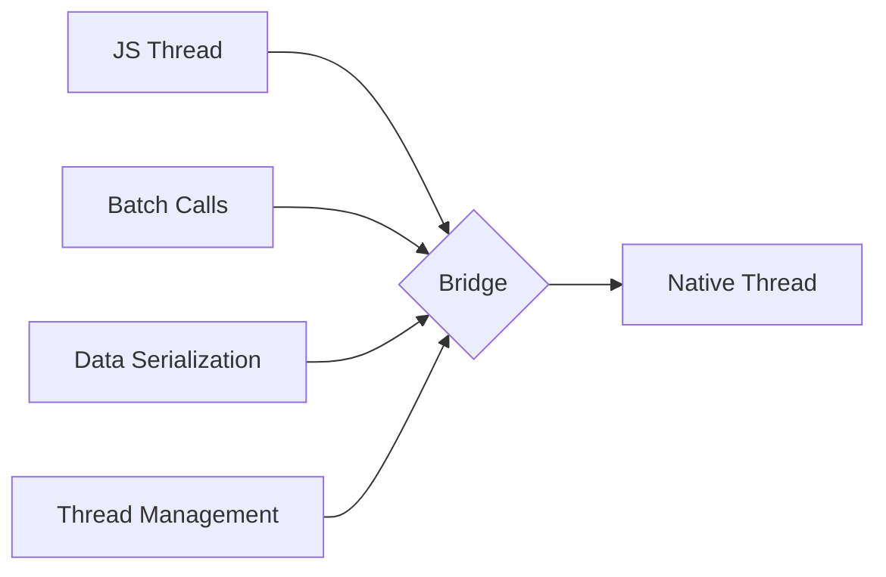

# Platform-Specific Development Guide

A comprehensive guide for implementing native modules and platform-specific features in enterprise mobile applications.

## Native Module Architecture

### Module Structure


## iOS Implementation

### 1. Swift Module Template
```swift
@objc(RNCustomModule)
class RNCustomModule: NSObject {
    // MARK: - Module Setup
    @objc
    static func requiresMainQueueSetup() -> Bool {
        return false
    }
    
    // MARK: - Module Methods
    @objc
    func methodWithPromise(_ resolve: @escaping RCTPromiseResolveBlock,
                          rejecter reject: @escaping RCTPromiseRejectBlock) {
        // Implementation
        do {
            let result = try performOperation()
            resolve(result)
        } catch let error {
            reject("ERROR_CODE", error.localizedDescription, error)
        }
    }
    
    @objc
    func methodWithCallback(_ callback: @escaping RCTResponseSenderBlock) {
        // Implementation
        callback([NSNull(), "result"])
    }
    
    // MARK: - Event Emitting
    private func sendEvent(_ name: String, body: Any?) {
        self.bridge?.eventDispatcher()?.sendEvent(
            withName: name,
            body: body
        )
    }
}

// MARK: - Module Export
@objc(RNCustomModuleManager)
class RNCustomModuleManager: RCTEventEmitter {
    override func supportedEvents() -> [String] {
        return ["onCustomEvent"]
    }
}
```

### 2. iOS Bridge Configuration
```objc
// RNCustomModule.m
#import <React/RCTBridgeModule.h>
#import <React/RCTEventEmitter.h>

@interface RCT_EXTERN_MODULE(RNCustomModule, NSObject)

RCT_EXTERN_METHOD(methodWithPromise:
                  (RCTPromiseResolveBlock)resolve
                  rejecter:(RCTPromiseRejectBlock)reject)

RCT_EXTERN_METHOD(methodWithCallback:(RCTResponseSenderBlock)callback)

@end
```

### 3. iOS Platform Features
```swift
// MARK: - Biometrics
class BiometricAuth {
    func authenticate() -> Promise<Bool> {
        return Promise { resolve, reject in
            let context = LAContext()
            var error: NSError?
            
            guard context.canEvaluatePolicy(.deviceOwnerAuthenticationWithBiometrics,
                                          error: &error) else {
                reject(error ?? NSError())
                return
            }
            
            context.evaluatePolicy(.deviceOwnerAuthenticationWithBiometrics,
                                 localizedReason: "Authentication required") { success, error in
                if let error = error {
                    reject(error)
                } else {
                    resolve(success)
                }
            }
        }
    }
}

// MARK: - Push Notifications
class PushNotificationManager {
    func requestPermission() -> Promise<Bool> {
        return Promise { resolve, reject in
            UNUserNotificationCenter.current()
                .requestAuthorization(options: [.alert, .sound, .badge]) { granted, error in
                    if let error = error {
                        reject(error)
                    } else {
                        resolve(granted)
                    }
                }
        }
    }
}
```

## Android Implementation

### 1. Kotlin Module Template
```kotlin
class CustomModule(reactContext: ReactApplicationContext) : 
    ReactContextBaseJavaModule(reactContext) {
    
    override fun getName() = "CustomModule"
    
    // Promise-based method
    @ReactMethod
    fun methodWithPromise(promise: Promise) {
        try {
            val result = performOperation()
            promise.resolve(result)
        } catch (e: Exception) {
            promise.reject("ERROR_CODE", e)
        }
    }
    
    // Callback-based method
    @ReactMethod
    fun methodWithCallback(callback: Callback) {
        try {
            val result = performOperation()
            callback.invoke(null, result)
        } catch (e: Exception) {
            callback.invoke(e.message)
        }
    }
    
    // Event emission
    private fun sendEvent(eventName: String, params: WritableMap?) {
        reactApplicationContext
            .getJSModule(DeviceEventManagerModule.RCTDeviceEventEmitter::class.java)
            .emit(eventName, params)
    }
}

// Module Package
class CustomPackage : ReactPackage {
    override fun createNativeModules(
        reactContext: ReactApplicationContext
    ): List<NativeModule> = listOf(CustomModule(reactContext))
    
    override fun createViewManagers(
        reactContext: ReactApplicationContext
    ): List<ViewManager<*, *>> = emptyList()
}
```

### 2. Android Platform Features
```kotlin
// Biometric Authentication
class BiometricAuth(private val activity: FragmentActivity) {
    fun authenticate(): Promise<Boolean> {
        return Promise { resolve, reject ->
            val biometricPrompt = BiometricPrompt(
                activity,
                object : BiometricPrompt.AuthenticationCallback() {
                    override fun onAuthenticationSucceeded(
                        result: BiometricPrompt.AuthenticationResult
                    ) {
                        resolve(true)
                    }
                    
                    override fun onAuthenticationError(
                        errorCode: Int,
                        errString: CharSequence
                    ) {
                        reject(Exception(errString.toString()))
                    }
                }
            )
            
            val promptInfo = BiometricPrompt.PromptInfo.Builder()
                .setTitle("Authentication Required")
                .setNegativeButtonText("Cancel")
                .build()
                
            biometricPrompt.authenticate(promptInfo)
        }
    }
}

// Push Notifications
class NotificationManager(private val context: Context) {
    fun createNotificationChannel() {
        if (Build.VERSION.SDK_INT >= Build.VERSION_CODES.O) {
            val channel = NotificationChannel(
                CHANNEL_ID,
                "Default",
                NotificationManager.IMPORTANCE_DEFAULT
            ).apply {
                description = "Default notification channel"
            }
            
            val notificationManager = context.getSystemService(
                Context.NOTIFICATION_SERVICE
            ) as NotificationManager
            
            notificationManager.createNotificationChannel(channel)
        }
    }
}
```

## JavaScript Interface

### 1. TypeScript Definitions
```typescript
interface CustomModule {
    // Promise-based methods
    methodWithPromise(): Promise<string>;
    
    // Callback-based methods
    methodWithCallback(callback: (error: Error | null, result?: string) => void): void;
    
    // Event listeners
    addListener(eventName: string, listener: (event: any) => void): void;
    removeListeners(count: number): void;
}

// Platform-specific types
interface PlatformFeatures {
    biometricAuth(): Promise<boolean>;
    requestNotificationPermission(): Promise<boolean>;
}
```

### 2. Module Usage
```typescript
// Module initialization
const CustomModule: CustomModule = NativeModules.CustomModule;
const PlatformFeatures: PlatformFeatures = NativeModules.PlatformFeatures;

// Event subscription
const eventEmitter = new NativeEventEmitter(CustomModule);
const subscription = eventEmitter.addListener(
    'onCustomEvent',
    (event) => {
        console.log('Event received:', event);
    }
);

// Cleanup
useEffect(() => {
    return () => subscription.remove();
}, []);
```

## Performance Considerations

### 1. Bridge Optimization


### 2. Memory Management
```typescript
// iOS Memory Management
class MemoryManagement {
    // Implement proper cleanup
    deinit {
        NotificationCenter.default.removeObserver(self)
    }
    
    // Handle memory warnings
    @objc func handleMemoryWarning() {
        // Cleanup resources
    }
}

// Android Memory Management
class MemoryManagement {
    override fun onLowMemory() {
        super.onLowMemory()
        // Cleanup resources
    }
    
    override fun onTrimMemory(level: Int) {
        super.onTrimMemory(level)
        // Handle different memory trim levels
    }
}
```

## Testing Strategies

### 1. Native Module Testing
```typescript
// iOS Unit Tests
class CustomModuleTests: XCTestCase {
    func testMethodWithPromise() {
        let expectation = self.expectation(description: "Promise resolved")
        let module = CustomModule()
        
        module.methodWithPromise { result in
            XCTAssertNotNil(result)
            expectation.fulfill()
        }
        
        waitForExpectations(timeout: 5)
    }
}

// Android Unit Tests
@RunWith(RobolectricTestRunner::class)
class CustomModuleTest {
    @Test
    fun testMethodWithPromise() {
        val module = CustomModule(mockContext)
        val promise = mock<Promise>()
        
        module.methodWithPromise(promise)
        
        verify(promise).resolve(any())
    }
}
```

### 2. Integration Testing
```typescript
describe('CustomModule Integration', () => {
    it('handles native method calls correctly', async () => {
        const result = await CustomModule.methodWithPromise();
        expect(result).toBeDefined();
    });
    
    it('handles native events correctly', (done) => {
        const subscription = eventEmitter.addListener(
            'onCustomEvent',
            (event) => {
                expect(event).toBeDefined();
                subscription.remove();
                done();
            }
        );
        
        // Trigger native event
        CustomModule.triggerEvent();
    });
});
```

## Resources

- [React Native Native Modules](https://reactnative.dev/docs/native-modules-intro)
- [iOS Development Guide](https://developer.apple.com/documentation/)
- [Android Development Guide](https://developer.android.com/guide)
- [TypeScript Documentation](https://www.typescriptlang.org/docs/)
