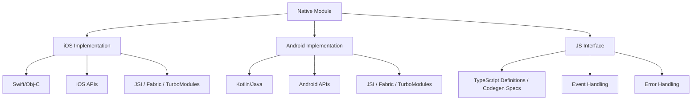
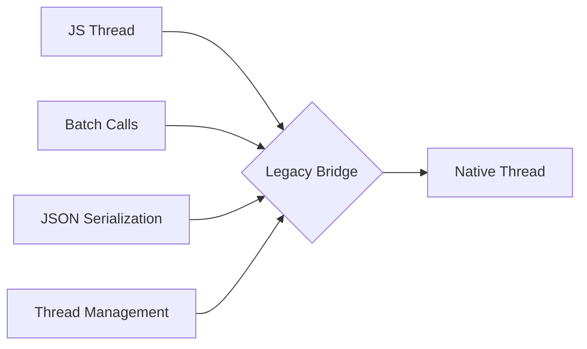
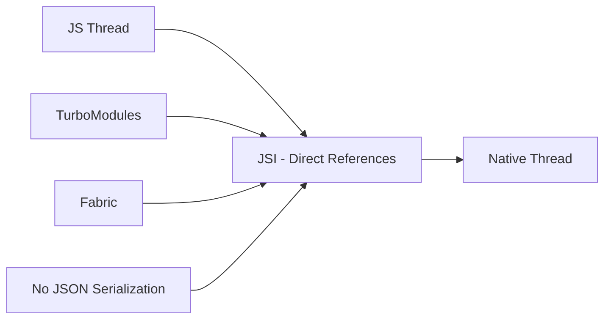

# Platform-Specific Development Guide

A comprehensive guide for implementing native modules and platform-specific features in enterprise mobile applications.

## Native Module Architecture

> **2026 update:** React Native's **New Architecture** (Fabric renderer + TurboModules + JSI) has been the
> default for new apps since RN 0.76 (late 2024). It replaces the legacy async bridge with **JSI
> (JavaScript Interface)** — a lightweight C++ layer that lets JS and native code hold direct references to
> each other and call synchronously, without serializing everything to JSON and batching it over a bridge.
> Native modules are now generated from typed specs via **Codegen** (TurboModules) and the renderer
> (**Fabric**) can mount and update native views synchronously with JS. Most teams now bootstrap and manage
> RN apps with **Expo** (Expo Modules API, EAS Build/Update, prebuild config plugins) rather than raw
> `react-native init`, even for New Architecture native modules. This guide shows the New Architecture
> pattern as the current recommended approach, clearly labeled, alongside the legacy bridge pattern for
> teams still maintaining apps that haven't migrated yet.

### Module Structure


```mermaid
graph TD
    A[Native Module] --> B[iOS Implementation]
    A --> C[Android Implementation]
    A --> D[JS Interface]

    B --> B1[Swift/Obj-C]
    B --> B2[iOS APIs]
    B --> B3[JSI / Fabric / TurboModules]

    C --> C1[Kotlin/Java]
    C --> C2[Android APIs]
    C --> C3[JSI / Fabric / TurboModules]

    D --> D1[TypeScript Definitions / Codegen Specs]
    D --> D2[Event Handling]
    D --> D3[Error Handling]
```

### Cross-Platform Architecture Options

When choosing how to share code across iOS and Android, React Native (New Architecture), Flutter, fully
native, and **Kotlin Multiplatform (KMP)** are the four options enterprise teams should evaluate:

- **React Native (New Architecture)** — JS/TypeScript business logic and UI, native modules via
  TurboModules/JSI, native views via Fabric. Best when the team is JS/TS-heavy and wants a single UI
  codebase.
- **Flutter** — Dart UI compiled to native, its own rendering engine. Best for pixel-consistent UI across
  platforms with a single codebase and team.
- **Kotlin Multiplatform (KMP)** — Shares business logic, networking, and data layers (Kotlin) while
  keeping **fully native UI** on each platform (SwiftUI on iOS, Jetpack Compose on Android). Best when
  native look-and-feel and platform API access matter most, but duplicate UI development is not
  desirable at the logic layer. Increasingly used by enterprises alongside or instead of React Native
  where SwiftUI/Compose are already the team's UI toolkits.
- **Fully Native (Swift/SwiftUI + Kotlin/Jetpack Compose)** — Maximum platform fidelity and performance,
  highest maintenance cost (two codebases, two teams).

## iOS Implementation

### 1a. TurboModule Template (New Architecture — Recommended)

TurboModules are defined from a typed JS/TypeScript spec and generated at build time via **Codegen**,
giving you compile-time-checked native method signatures instead of the old stringly-typed bridge calls.

```typescript
// NativeCustomModule.ts — Codegen spec (source of truth for the native interface)
import type { TurboModule } from "react-native";
import { TurboModuleRegistry } from "react-native";

export interface Spec extends TurboModule {
  methodWithPromise(): Promise<string>;
  methodWithCallback(callback: (error: string | null, result?: string) => void): void;
  readonly onCustomEvent: EventEmitter<{ payload: string }>;
}

export default TurboModuleRegistry.getEnforcing<Spec>("RNCustomModule");
```

```swift
// RNCustomModule.swift — TurboModule implementation (conforms to the Codegen-generated protocol)
@objc(RNCustomModule)
class RNCustomModule: NSObject, NativeCustomModuleSpec {
    // MARK: - Module Methods (JSI-backed, no bridge serialization)
    @objc
    func methodWithPromise(_ resolve: @escaping RCTPromiseResolveBlock,
                          rejecter reject: @escaping RCTPromiseRejectBlock) {
        do {
            let result = try performOperation()
            resolve(result)
        } catch let error {
            reject("ERROR_CODE", error.localizedDescription, error)
        }
    }

    @objc
    func methodWithCallback(_ callback: @escaping RCTResponseSenderBlock) {
        callback([NSNull(), "result"])
    }

    // Event emission via the Codegen-generated typed EventEmitter (no manual RCTEventEmitter subclass needed)
    func emitCustomEvent(payload: String) {
        emitOnCustomEvent(payload: payload)
    }

    static func moduleName() -> String! {
        return "RNCustomModule"
    }
}
```

> With the New Architecture, most teams create and manage this module structure via **Expo Modules API**
> (`npx create-expo-module`) or `expo prebuild`, which generates the Codegen spec wiring, podspec, and
> Gradle config automatically rather than hand-authoring them.

### 1b. Swift Module Template (Legacy Bridge — Old Architecture)

> Kept for teams maintaining apps still on the legacy bridge. New modules should use the TurboModule
> pattern above.

```swift
@objc(RNCustomModule)
class RNCustomModule: NSObject {
    // MARK: - Module Setup
    @objc
    static func requiresMainQueueSetup() -> Bool {
        return false
    }

    // MARK: - Module Methods
    @objc
    func methodWithPromise(_ resolve: @escaping RCTPromiseResolveBlock,
                          rejecter reject: @escaping RCTPromiseRejectBlock) {
        // Implementation
        do {
            let result = try performOperation()
            resolve(result)
        } catch let error {
            reject("ERROR_CODE", error.localizedDescription, error)
        }
    }

    @objc
    func methodWithCallback(_ callback: @escaping RCTResponseSenderBlock) {
        // Implementation
        callback([NSNull(), "result"])
    }

    // MARK: - Event Emitting
    private func sendEvent(_ name: String, body: Any?) {
        self.bridge?.eventDispatcher()?.sendEvent(
            withName: name,
            body: body
        )
    }
}

// MARK: - Module Export
@objc(RNCustomModuleManager)
class RNCustomModuleManager: RCTEventEmitter {
    override func supportedEvents() -> [String] {
        return ["onCustomEvent"]
    }
}
```

### 2. iOS Bridge Configuration (Legacy — Old Architecture)

> With the New Architecture, Codegen generates this Objective-C glue automatically from the TypeScript
> spec shown in section 1a — you no longer hand-write `RCT_EXTERN_MODULE`/`RCT_EXTERN_METHOD` declarations
> for new modules. Shown here for reference when working in a legacy-bridge codebase.

```objc
// RNCustomModule.m
#import <React/RCTBridgeModule.h>
#import <React/RCTEventEmitter.h>

@interface RCT_EXTERN_MODULE(RNCustomModule, NSObject)

RCT_EXTERN_METHOD(methodWithPromise:
                  (RCTPromiseResolveBlock)resolve
                  rejecter:(RCTPromiseRejectBlock)reject)

RCT_EXTERN_METHOD(methodWithCallback:(RCTResponseSenderBlock)callback)

@end
```

### 3. iOS Platform Features

```swift
// MARK: - Biometrics (UIKit-era imperative pattern)
class BiometricAuth {
    func authenticate() -> Promise<Bool> {
        return Promise { resolve, reject in
            let context = LAContext()
            var error: NSError?

            guard context.canEvaluatePolicy(.deviceOwnerAuthenticationWithBiometrics,
                                          error: &error) else {
                reject(error ?? NSError())
                return
            }

            context.evaluatePolicy(.deviceOwnerAuthenticationWithBiometrics,
                                 localizedReason: "Authentication required") { success, error in
                if let error = error {
                    reject(error)
                } else {
                    resolve(success)
                }
            }
        }
    }
}

// MARK: - Push Notifications
class PushNotificationManager {
    func requestPermission() -> Promise<Bool> {
        return Promise { resolve, reject in
            UNUserNotificationCenter.current()
                .requestAuthorization(options: [.alert, .sound, .badge]) { granted, error in
                    if let error = error {
                        reject(error)
                    } else {
                        resolve(granted)
                    }
                }
        }
    }
}
```

### 3b. SwiftUI Pattern (Modern iOS UI Approach)

SwiftUI is now the standard approach for new iOS UI (including for native screens embedded in an RN New
Architecture app via Fabric interop, or for KMP's native-UI layer). The same biometric flow above is
expressed declaratively as an `ObservableObject` driving view state, instead of an imperative
callback/Promise wrapper:

```swift
// MARK: - Biometrics (SwiftUI pattern)
@MainActor
final class BiometricAuthViewModel: ObservableObject {
    @Published private(set) var isAuthenticated = false
    @Published private(set) var errorMessage: String?

    func authenticate() async {
        let context = LAContext()
        var error: NSError?

        guard context.canEvaluatePolicy(.deviceOwnerAuthenticationWithBiometrics, error: &error) else {
            errorMessage = error?.localizedDescription ?? "Biometrics unavailable"
            return
        }

        do {
            isAuthenticated = try await context.evaluatePolicy(
                .deviceOwnerAuthenticationWithBiometrics,
                localizedReason: "Authentication required"
            )
        } catch {
            errorMessage = error.localizedDescription
        }
    }
}

struct BiometricGateView: View {
    @StateObject private var viewModel = BiometricAuthViewModel()

    var body: some View {
        VStack(spacing: 16) {
            if viewModel.isAuthenticated {
                Text("Unlocked").font(.headline)
            } else {
                Button("Authenticate") {
                    Task { await viewModel.authenticate() }
                }
                if let message = viewModel.errorMessage {
                    Text(message).foregroundStyle(.red).font(.footnote)
                }
            }
        }
        .task { await viewModel.authenticate() }
    }
}
```

## Android Implementation

### 1a. TurboModule Template (New Architecture — Recommended)

The Kotlin implementation now extends a Codegen-generated spec class (from the same TypeScript spec shown
in the iOS section) instead of the legacy `ReactContextBaseJavaModule`/`ReactPackage` pair, and is invoked
through JSI rather than the batched bridge:

```kotlin
class CustomModule(reactContext: ReactApplicationContext) :
    NativeCustomModuleSpec(reactContext) {

    override fun getName() = "CustomModule"

    // Promise-based method — JSI-backed, no serialization to the bridge's JSON message queue
    override fun methodWithPromise(promise: Promise) {
        try {
            val result = performOperation()
            promise.resolve(result)
        } catch (e: Exception) {
            promise.reject("ERROR_CODE", e)
        }
    }

    override fun methodWithCallback(callback: Callback) {
        try {
            val result = performOperation()
            callback.invoke(null, result)
        } catch (e: Exception) {
            callback.invoke(e.message)
        }
    }
}

// TurboReactPackage — registers the module for lazy, on-demand loading via TurboModuleManager
class CustomTurboPackage : TurboReactPackage() {
    override fun getModule(name: String, reactContext: ReactApplicationContext): NativeModule? =
        if (name == CustomModule.NAME) CustomModule(reactContext) else null

    override fun getReactModuleInfoProvider() = ReactModuleInfoProvider {
        mapOf(CustomModule.NAME to ReactModuleInfo(
            CustomModule.NAME, CustomModule.NAME, false, false, false, true /* isTurboModule */
        ))
    }
}
```

> As with iOS, most teams scaffold this via the **Expo Modules API** (`npx create-expo-module`) rather
> than hand-writing the TurboReactPackage registration.

### 1b. Kotlin Module Template (Legacy Bridge — Old Architecture)

> Kept for teams maintaining apps still on the legacy bridge. New modules should use the TurboModule
> pattern above.

```kotlin
class CustomModule(reactContext: ReactApplicationContext) :
    ReactContextBaseJavaModule(reactContext) {

    override fun getName() = "CustomModule"

    // Promise-based method
    @ReactMethod
    fun methodWithPromise(promise: Promise) {
        try {
            val result = performOperation()
            promise.resolve(result)
        } catch (e: Exception) {
            promise.reject("ERROR_CODE", e)
        }
    }

    // Callback-based method
    @ReactMethod
    fun methodWithCallback(callback: Callback) {
        try {
            val result = performOperation()
            callback.invoke(null, result)
        } catch (e: Exception) {
            callback.invoke(e.message)
        }
    }

    // Event emission
    private fun sendEvent(eventName: String, params: WritableMap?) {
        reactApplicationContext
            .getJSModule(DeviceEventManagerModule.RCTDeviceEventEmitter::class.java)
            .emit(eventName, params)
    }
}

// Module Package
class CustomPackage : ReactPackage {
    override fun createNativeModules(
        reactContext: ReactApplicationContext
    ): List<NativeModule> = listOf(CustomModule(reactContext))

    override fun createViewManagers(
        reactContext: ReactApplicationContext
    ): List<ViewManager<*, *>> = emptyList()
}
```

### 2. Android Platform Features

```kotlin
// Biometric Authentication (imperative View-based pattern)
class BiometricAuth(private val activity: FragmentActivity) {
    fun authenticate(): Promise<Boolean> {
        return Promise { resolve, reject ->
            val biometricPrompt = BiometricPrompt(
                activity,
                object : BiometricPrompt.AuthenticationCallback() {
                    override fun onAuthenticationSucceeded(
                        result: BiometricPrompt.AuthenticationResult
                    ) {
                        resolve(true)
                    }

                    override fun onAuthenticationError(
                        errorCode: Int,
                        errString: CharSequence
                    ) {
                        reject(Exception(errString.toString()))
                    }
                }
            )

            val promptInfo = BiometricPrompt.PromptInfo.Builder()
                .setTitle("Authentication Required")
                .setNegativeButtonText("Cancel")
                .build()

            biometricPrompt.authenticate(promptInfo)
        }
    }
}

// Push Notifications
class NotificationManager(private val context: Context) {
    fun createNotificationChannel() {
        if (Build.VERSION.SDK_INT >= Build.VERSION_CODES.O) {
            val channel = NotificationChannel(
                CHANNEL_ID,
                "Default",
                NotificationManager.IMPORTANCE_DEFAULT
            ).apply {
                description = "Default notification channel"
            }

            val notificationManager = context.getSystemService(
                Context.NOTIFICATION_SERVICE
            ) as NotificationManager

            notificationManager.createNotificationChannel(channel)
        }
    }
}
```

### 2b. Jetpack Compose Pattern (Modern Android UI Approach)

Jetpack Compose is now the standard approach for new Android UI (including native screens in an RN New
Architecture app, or KMP's native-UI layer). The same biometric flow is expressed as a composable driving
state through a `ViewModel`, instead of an imperative `Promise`/callback wrapper:

```kotlin
class BiometricAuthViewModel : ViewModel() {
    private val _isAuthenticated = mutableStateOf(false)
    val isAuthenticated: State<Boolean> = _isAuthenticated

    private val _errorMessage = mutableStateOf<String?>(null)
    val errorMessage: State<String?> = _errorMessage

    fun authenticate(activity: FragmentActivity) {
        val biometricPrompt = BiometricPrompt(
            activity,
            object : BiometricPrompt.AuthenticationCallback() {
                override fun onAuthenticationSucceeded(result: BiometricPrompt.AuthenticationResult) {
                    _isAuthenticated.value = true
                }

                override fun onAuthenticationError(errorCode: Int, errString: CharSequence) {
                    _errorMessage.value = errString.toString()
                }
            }
        )

        val promptInfo = BiometricPrompt.PromptInfo.Builder()
            .setTitle("Authentication Required")
            .setNegativeButtonText("Cancel")
            .build()

        biometricPrompt.authenticate(promptInfo)
    }
}

@Composable
fun BiometricGateScreen(
    activity: FragmentActivity,
    viewModel: BiometricAuthViewModel = viewModel()
) {
    val isAuthenticated by viewModel.isAuthenticated
    val errorMessage by viewModel.errorMessage

    Column(
        verticalArrangement = Arrangement.spacedBy(16.dp),
        modifier = Modifier.padding(16.dp)
    ) {
        if (isAuthenticated) {
            Text("Unlocked", style = MaterialTheme.typography.headlineSmall)
        } else {
            Button(onClick = { viewModel.authenticate(activity) }) {
                Text("Authenticate")
            }
            errorMessage?.let {
                Text(it, color = MaterialTheme.colorScheme.error, style = MaterialTheme.typography.bodySmall)
            }
        }
    }
}
```

## JavaScript Interface

> **New Architecture:** the `Spec` interface shown in section 1a _is_ the TypeScript definition — Codegen
> consumes it directly, so the interface below and the module-usage pattern are effectively unified into
> one typed source of truth. The legacy pattern (separate hand-written interface + untyped
> `NativeModules.X` lookup) is shown below for reference.

### 1. TypeScript Definitions (Legacy Pattern)

```typescript
interface CustomModule {
  // Promise-based methods
  methodWithPromise(): Promise<string>;

  // Callback-based methods
  methodWithCallback(callback: (error: Error | null, result?: string) => void): void;

  // Event listeners
  addListener(eventName: string, listener: (event: any) => void): void;
  removeListeners(count: number): void;
}

// Platform-specific types
interface PlatformFeatures {
  biometricAuth(): Promise<boolean>;
  requestNotificationPermission(): Promise<boolean>;
}
```

### 2. Module Usage

```typescript
// Legacy: untyped lookup via the bridge's module registry
const CustomModule: CustomModule = NativeModules.CustomModule;
const PlatformFeatures: PlatformFeatures = NativeModules.PlatformFeatures;

// New Architecture: import the Codegen-generated module directly — fully typed, JSI-backed
// import CustomModule from "./NativeCustomModule";

// Event subscription
const eventEmitter = new NativeEventEmitter(CustomModule);
const subscription = eventEmitter.addListener("onCustomEvent", (event) => {
  console.log("Event received:", event);
});

// Cleanup
useEffect(() => {
  return () => subscription.remove();
}, []);
```

## Performance Considerations

### 1. Bridge Optimization (Legacy) vs. JSI (New Architecture)

The legacy bridge batches and JSON-serializes every call between JS and native threads, which is the
dominant source of native-module overhead at scale:


```mermaid
graph LR
    A[JS Thread] --> B{Legacy Bridge}
    B --> C[Native Thread]

    D[Batch Calls] --> B
    E[JSON Serialization] --> B
    F[Thread Management] --> B
```

With the New Architecture, **JSI** gives JS and native code direct, synchronous references to each other's
objects/functions, removing the serialization step entirely for most calls:


```mermaid
graph LR
    A[JS Thread] --> B[JSI - Direct References]
    B --> C[Native Thread]

    D[TurboModules] --> B
    E[Fabric] --> B
    F[No JSON Serialization] --> B
```

### 2. Memory Management

```typescript
// iOS Memory Management
class MemoryManagement {
    // Implement proper cleanup
    deinit {
        NotificationCenter.default.removeObserver(self)
    }

    // Handle memory warnings
    @objc func handleMemoryWarning() {
        // Cleanup resources
    }
}

// Android Memory Management
class MemoryManagement {
    override fun onLowMemory() {
        super.onLowMemory()
        // Cleanup resources
    }

    override fun onTrimMemory(level: Int) {
        super.onTrimMemory(level)
        // Handle different memory trim levels
    }
}
```

## Testing Strategies

### 1. Native Module Testing

```typescript
// iOS Unit Tests
class CustomModuleTests: XCTestCase {
    func testMethodWithPromise() {
        let expectation = self.expectation(description: "Promise resolved")
        let module = CustomModule()

        module.methodWithPromise { result in
            XCTAssertNotNil(result)
            expectation.fulfill()
        }

        waitForExpectations(timeout: 5)
    }
}

// Android Unit Tests
@RunWith(RobolectricTestRunner::class)
class CustomModuleTest {
    @Test
    fun testMethodWithPromise() {
        val module = CustomModule(mockContext)
        val promise = mock<Promise>()

        module.methodWithPromise(promise)

        verify(promise).resolve(any())
    }
}
```

### 2. Integration Testing

```typescript
describe("CustomModule Integration", () => {
  it("handles native method calls correctly", async () => {
    const result = await CustomModule.methodWithPromise();
    expect(result).toBeDefined();
  });

  it("handles native events correctly", (done) => {
    const subscription = eventEmitter.addListener("onCustomEvent", (event) => {
      expect(event).toBeDefined();
      subscription.remove();
      done();
    });

    // Trigger native event
    CustomModule.triggerEvent();
  });
});
```

## Resources

- [React Native Native Modules](https://reactnative.dev/docs/native-modules-intro)
- [React Native New Architecture (Fabric, TurboModules, JSI)](https://reactnative.dev/docs/the-new-architecture/landing-page)
- [Expo Modules API](https://docs.expo.dev/modules/overview/)
- [SwiftUI Documentation](https://developer.apple.com/documentation/swiftui/)
- [Jetpack Compose Documentation](https://developer.android.com/jetpack/compose)
- [Kotlin Multiplatform](https://kotlinlang.org/docs/multiplatform.html)
- [iOS Development Guide](https://developer.apple.com/documentation/)
- [Android Development Guide](https://developer.android.com/guide)
- [TypeScript Documentation](https://www.typescriptlang.org/docs/)
