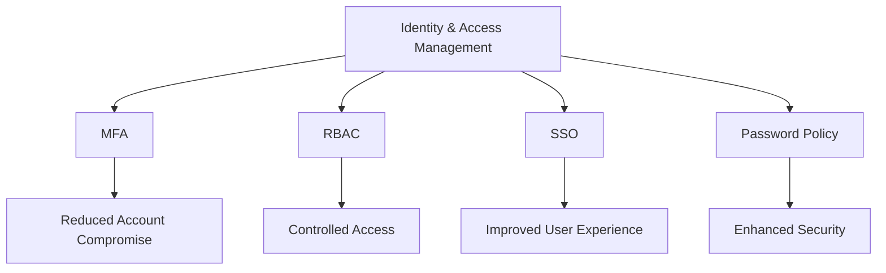
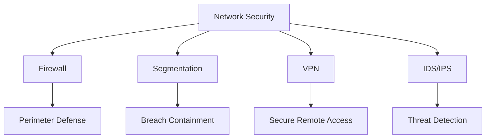
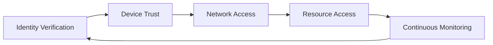
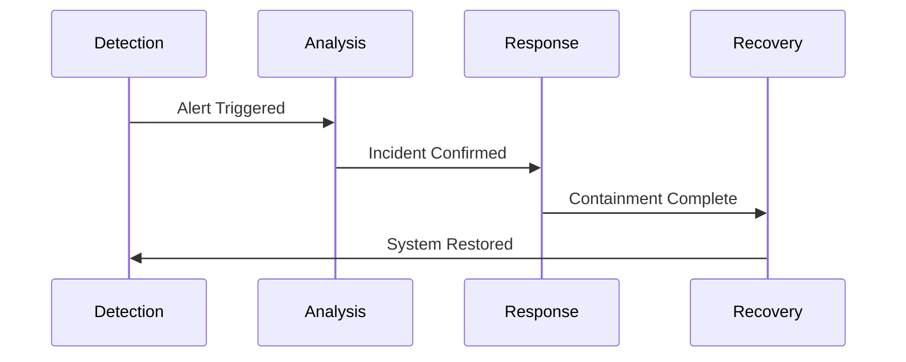

# Enterprise Security Checklist

A comprehensive guide for implementing and maintaining enterprise-grade security measures.

## Purpose

This checklist is designed to help organizations implement robust security practices across their infrastructure, applications, and processes. It covers critical areas from identity management to incident response, with a focus on practical implementation and compliance.

## Rationale

Each section of this checklist addresses specific security concerns:

### Identity & Access Management



#### Real-World Example

In 2019, a major healthcare provider prevented a data breach when their MFA system blocked unauthorized access attempts from a compromised admin account. The attack would have exposed 3.5M patient records.

### Network Security



#### Case Study: Network Segmentation Success

A retail company implemented network segmentation, which contained a POS malware infection to non-critical systems, preventing access to customer payment data and avoiding a potential multi-million dollar breach.

## Implementation Guide

### Zero Trust Architecture Implementation



1. Identity Verification

   - Implement strong authentication
   - Verify user identity continuously
   - Use context-aware access policies

2. Device Trust

   - Enforce device health checks
   - Require device certificates
   - Monitor device compliance

3. Network Access
   - Implement micro-segmentation
   - Use software-defined perimeters
   - Enable just-in-time access

### Automation Scripts

#### 1. Firewall Rule Validation

```bash
#!/bin/bash
# Validates firewall rules against security baseline
# Usage: ./validate_firewall.sh [config_file]

check_firewall_rules() {
    # Rule validation logic
    echo "Validating firewall rules..."
}

check_default_deny() {
    # Verify default deny policies
    echo "Checking default deny policies..."
}
```

#### 2. Security Compliance Check

```python
def check_compliance(framework):
    """
    Automated compliance checking for various frameworks
    Supports: HIPAA, SOC2, PCI DSS
    """
    compliance_status = {
        'passed': [],
        'failed': [],
        'na': []
    }
    return compliance_status
```

## Compliance Mapping

| Checklist Item | HIPAA              | SOC2  | PCI DSS | ISO 27001 |
| -------------- | ------------------ | ----- | ------- | --------- |
| MFA            | §164.312(d)        | CC6.1 | 8.3     | A.9.4.2   |
| Encryption     | §164.312(a)(2)(iv) | CC6.7 | 3.4     | A.10.1.1  |
| Access Control | §164.312(a)(1)     | CC6.3 | 7.1     | A.9.1.1   |
| Audit Logging  | §164.312(b)        | CC7.2 | 10.1    | A.12.4.1  |

## Incident Response Playbook

### 1. Detection & Analysis



1. Initial Detection

   - System alerts
   - User reports
   - Automated monitoring

2. Analysis Steps
   - Severity assessment
   - Impact evaluation
   - Scope determination

### 2. Containment & Eradication

- Immediate containment actions
- Evidence preservation
- Threat elimination

### 3. Recovery & Lessons Learned

- System restoration
- Verification steps
- Documentation
- Team debrief

## Disaster Recovery Procedures

### Testing Schedule

- Quarterly tabletop exercises
- Semi-annual technical recovery tests
- Annual full-scale DR simulation

### Recovery Time Objectives (RTO)

- Critical systems: 4 hours
- Important systems: 8 hours
- Non-critical systems: 24 hours

## Best Practices

1. Regular Updates

   - Review checklist quarterly
   - Update based on new threats
   - Incorporate lessons learned

2. Documentation

   - Maintain detailed logs
   - Document exceptions
   - Keep configuration records

3. Training
   - Annual security awareness
   - Quarterly technical training
   - Incident response drills

## Additional Critical Security Domains

### Secure Software Development Lifecycle (SSDLC) & DevSecOps

- Integrate security into all phases of development (requirements, design, implementation, testing, deployment, maintenance)
- Automate security testing in CI/CD pipelines (SAST, DAST, dependency scanning)
- Enforce code review for security issues
- Use secure coding standards (OWASP, SEI CERT)
- Track and remediate vulnerabilities in dependencies

### Secrets Management

- Store secrets in dedicated vaults (e.g., HashiCorp Vault, AWS Secrets Manager)
- Never hardcode secrets in code or config files
- Rotate secrets regularly
- Audit access to secrets

### Threat Modeling & Risk Assessment

- Perform regular threat modeling for new features and major changes
- Document attack surfaces and trust boundaries
- Assess and prioritize risks
- Mitigate identified threats before release

### Vendor & Third-Party Risk Management

- Assess security posture of vendors and third-party services
- Require security/compliance attestations (SOC2, ISO 27001)
- Monitor supply chain risks
- Review contracts for security requirements

### Privacy Engineering

- Apply data minimization and privacy by design principles
- Map personal data flows and implement controls
- Support data subject rights (access, deletion, correction)
- Document privacy impact assessments

### Security Governance & Awareness

- Define security policies and roles
- Conduct regular security awareness training
- Track policy exceptions and remediation
- Establish a security steering committee

## Checklist Mapping (Expanded)

| Checklist Item      | HIPAA              | SOC2  | PCI DSS | ISO 27001 |
| ------------------- | ------------------ | ----- | ------- | --------- |
| SSDLC/DevSecOps     | §164.308(a)(8)     | CC8.1 | 6.3     | A.14.2.1  |
| Secrets Management  | §164.312(a)(2)(iv) | CC6.6 | 3.5     | A.10.1.2  |
| Threat Modeling     | §164.308(a)(1)(ii) | CC1.2 | 12.2    | A.6.1.2   |
| Vendor Risk         | §164.308(b)(1)     | CC1.3 | 12.8    | A.15.1.1  |
| Privacy Engineering | §164.502(b)        | CC1.1 | 3.2     | A.18.1.4  |
| Governance/Training | §164.308(a)(5)     | CC2.2 | 12.6    | A.7.2.2   |

## Resources

- [NIST Cybersecurity Framework](https://www.nist.gov/cyberframework)
- [OWASP Top 10](https://owasp.org/www-project-top-ten/)
- [CIS Controls](https://www.cisecurity.org/controls/)
