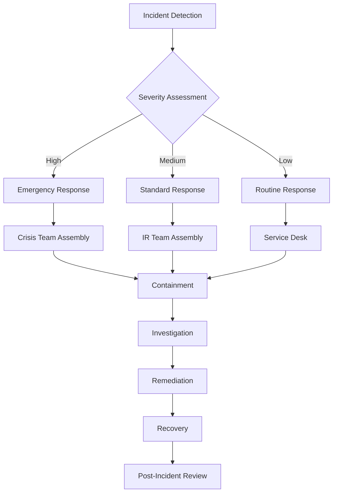
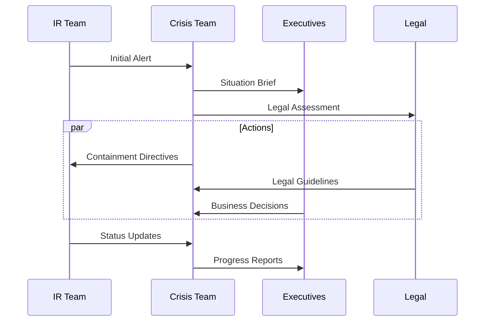
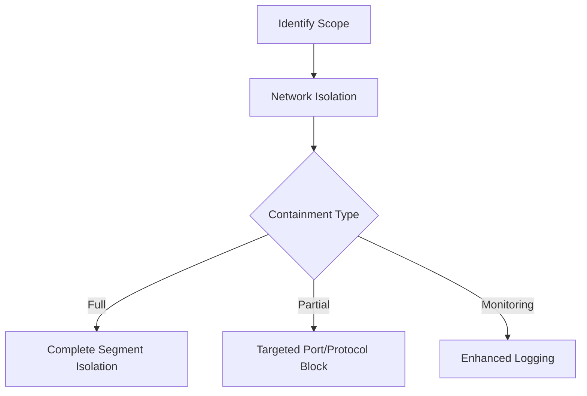
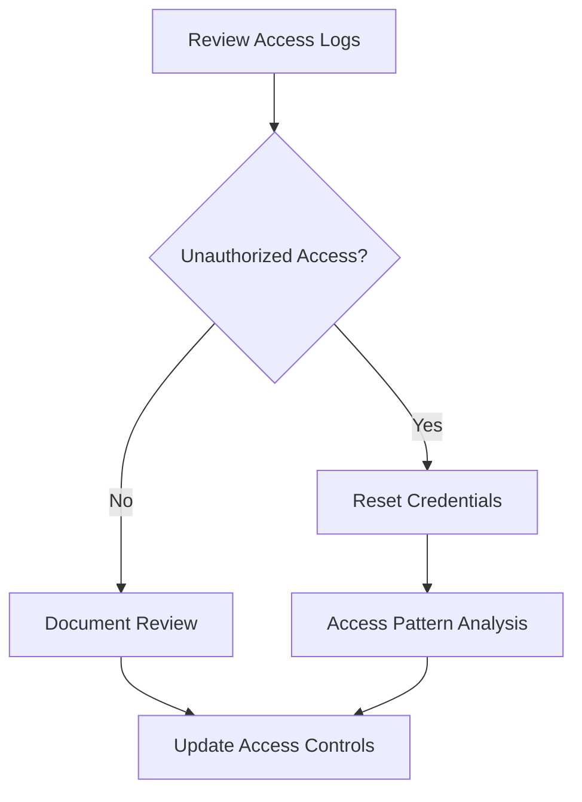
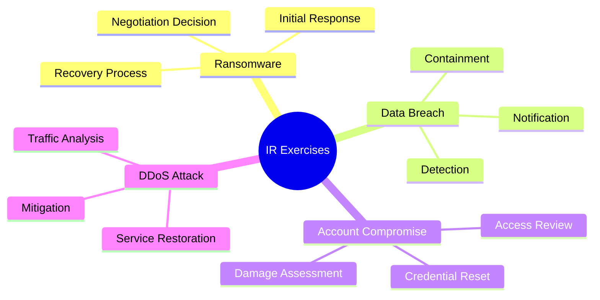
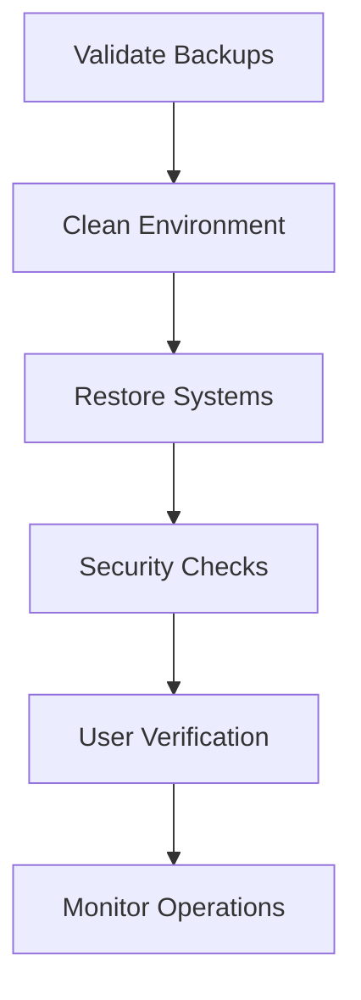

# Incident Response Playbook

A comprehensive guide for responding to security incidents in an enterprise environment.

## Incident Response Flow



## 1. Incident Detection & Triage

### Detection Sources
- SIEM Alerts
- EDR/XDR Alerts
- User Reports
- Automated Monitoring
- Third-party Notifications

### Initial Assessment Matrix

| Severity | Impact | Response Time | Escalation |
|----------|--------|---------------|------------|
| Critical | Business-stopping | Immediate | Executive Team |
| High | Major function impact | < 1 hour | IR Team Lead |
| Medium | Limited impact | < 4 hours | IR Team |
| Low | Minimal impact | < 24 hours | Service Desk |

## 2. Incident Response Procedures

### 2.1 Critical Incident Response


### 2.2 Containment Procedures

#### Immediate Actions
1. Isolate affected systems
2. Block malicious IPs/domains
3. Disable compromised accounts
4. Preserve evidence
5. Document all actions

#### Network Containment


## 3. Investigation Process

### 3.1 Evidence Collection

#### Digital Forensics Checklist
- [ ] Memory dumps
- [ ] System logs
- [ ] Network traffic captures
- [ ] Disk images
- [ ] Application logs

### 3.2 Analysis Procedure


## 4. Remediation Steps

### 4.1 System Recovery
1. Patch vulnerabilities
2. Update security controls
3. Restore from clean backups
4. Verify system integrity
5. Implement additional monitoring

### 4.2 Access Control Review


## 5. Post-Incident Activities

### 5.1 Lessons Learned
- Root cause analysis
- Control effectiveness review
- Procedure updates
- Team performance assessment
- Documentation updates

### 5.2 Reporting Requirements

#### Internal Reporting
- Executive summary
- Technical details
- Impact assessment
- Remediation actions
- Recommendations

#### External Reporting
- Regulatory notifications
- Customer communications
- Law enforcement reports
- Insurance claims

## 6. Training and Exercises

### 6.1 Training Schedule
- Quarterly tabletop exercises
- Annual full-scale simulation
- Monthly team training
- New employee orientation

### 6.2 Exercise Scenarios


## 7. Communication Templates

### 7.1 Internal Communications
```markdown
SECURITY INCIDENT NOTIFICATION
Severity: [Level]
Time Detected: [DateTime]
Systems Affected: [List]
Current Status: [Status]
Required Actions: [Actions]
Point of Contact: [Name/Contact]
```

### 7.2 External Communications
```markdown
INCIDENT DISCLOSURE
Date: [Date]
Incident Type: [Type]
Impact: [Description]
Actions Taken: [Summary]
Next Steps: [Plans]
Contact: [Information]
```

## 8. Recovery Procedures

### 8.1 System Restoration


### 8.2 Business Continuity
- Service prioritization
- Resource allocation
- Communication plans
- Progress tracking
- Success metrics

## Resources

- [NIST Incident Response Guide](https://www.nist.gov/incident-response)
- [SANS Incident Handler's Handbook](https://www.sans.org)
- [MITRE ATT&CK Framework](https://attack.mitre.org)
- [US-CERT Guidelines](https://www.us-cert.gov)
